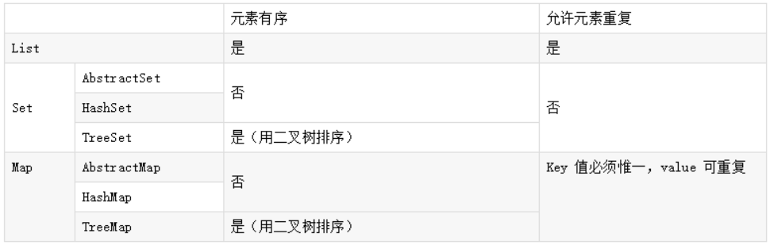

## 1.JDK 和 JRE 有什么区别？

- JDK：Java Development Kit 的简称，Java 开发工具包，提供了 Java 的开发环境和运行环境。
- JRE：Java Runtime Environment 的简称，Java 运行环境，为 Java 的运行提供了所需环境。

具体来说 JDK 其实包含了 JRE，同时还包含了编译 Java 源码的编译器 Javac，还包含了很多 Java 程序调试和分析的工具。简单来说：如果你需要运行 Java 程序，只需安装 JRE 就可以了，如果你需要编写 Java 程序，需要安装 JDK。

## 2.== 和 equals 的区别是什么？

==：

对于基本类型和引用类型 == 的作用效果是不同的，如下所示：

- 基本类型：比较的是值是否相同；
- 引用类型：比较的是引用是否相同；

```java
String x = "string";
String y = "string";
String z = new String("string");
System.out.println(x==y); // true
System.out.println(x==z); // false
System.out.println(x.equals(y)); // true
System.out.println(x.equals(z)); // true
```

因为 x 和 y 指向的是同一个引用，所以 == 也是 true，而 new String()方法则重写开辟了内存空间，所以 == 结果为 false，而 equals 比较的一直是值，所以结果都为 true。

equals：

equals 本质上就是 ==，只不过 String 和 Integer 等重写了 equals 方法

```java
//普通的
public boolean equals(Object obj) {
        return (this == obj);
}
//String的
public boolean equals(Object anObject) {
    if (this == anObject) {
        return true;
    }
    if (anObject instanceof String) {
        String anotherString = (String)anObject;
        int n = value.length;
        if (n == anotherString.value.length) {
            char v1[] = value;
            char v2[] = anotherString.value;
            int i = 0;
            while (n-- != 0) {
                if (v1[i] != v2[i])
                    return false;
                i++;
            }
            return true;
        }
    }
    return false;
}
```

## 3.两个对象的 hashCode() 相同，则 equals() 也一定为 true，对吗？

不对，两个对象的 hashCode() 相同，equals() 不一定 true。

```java
String str1 = "通话";
String str2 = "重地";
System. out. println(String. format("str1：%d | str2：%d",  str1. hashCode(),str2. hashCode()));
System. out. println(str1. equals(str2));
执行的结果：
str1：1179395 | str2：1179395
false
```

显然“通话”和“重地”的 hashCode() 相同，然而 equals() 则为 false，因为在散列表中，hashCode() 相等即两个键值对的哈希值相等，然而哈希值相等，并不一定能得出键值对相等。

## 4.final 在 Java 中有什么作用？

- final 修饰的类叫最终类，该类不能被继承。
- final 修饰的方法不能被重写。
- final 修饰的变量叫常量，常量必须初始化，初始化之后值就不能被修改。

## 5.Java 中的 Math. round(-1. 5) 等于多少？

等于 -1，因为在数轴上取值时，中间值（0.5）向右取整，所以正 0.5 是往上取整，负 0.5 是直接舍弃。

## 6. String 属于基础的数据类型吗？

String 不属于基础类型，基础类型有 8 种：byte、boolean、char、short、int、float、long、double，而 String 属于对象。

## 7. Java 中操作字符串都有哪些类？它们之间有什么区别？

操作字符串的类有：String、StringBuffer、StringBuilder。

String 和 StringBuffer、StringBuilder 的区别在于 **String 声明的是不可变的对象**，每次操作都会生成新的 String 对象，然后将指针指向新的 String 对象，而 StringBuffer、StringBuilder 可以在原有对象的基础上进行操作，所以在经常改变字符串内容的情况下最好不要使用 String。

StringBuffer 和 StringBuilder 最大的区别在于，StringBuffer 是线程安全的，而 StringBuilder 是非线程安全的，但 StringBuilder 的性能却高于 StringBuffer，所以在单线程环境下推荐使用 StringBuilder，多线程环境下推荐使用 StringBuffer。

## 8.String str="i"与 String str=new String("i")一样吗？

不一样，因为内存的分配方式不一样。String str="i"的方式，Java 虚拟机会将其分配到常量池中；而 String str=new String("i") 则会被分到堆内存中。

## 9.如何将字符串反转？

 StringBuilder 或者 stringBuffer 的 reverse() 方法。

```
// StringBuffer reverse
StringBuffer stringBuffer = new StringBuffer();
stringBuffer. append("abcdefg");
System. out. println(stringBuffer. reverse()); // gfedcba// StringBuilder reverse
StringBuilder stringBuilder = new StringBuilder();
stringBuilder. append("abcdefg");
System. out. println(stringBuilder. reverse()); // gfedcba
```

## 10.抽象类必须要有抽象方法吗？

不需要，抽象类不一定非要有抽象方法。

```java
abstract class Cat {
    public static void sayHi() {
        System. out. println("hi~");
    }
}
```

## 11.普通类和抽象类有哪些区别？

· 普通类不能包含抽象方法，抽象类可以包含抽象方法。

· 抽象类不能直接实例化，普通类可以直接实例化。

## 12.抽象类能使用 final 修饰吗？

不能，定义抽象类就是让其他类继承的，如果定义为 final 该类就不能被继承，这样彼此就会产生矛盾，所以 final 不能修饰抽象类

## 13.接口和抽象类有什么区别？

· 实现：抽象类的子类使用 extends 来继承；接口必须使用 implements 来实现接口。

· 构造函数：抽象类可以有构造函数；接口不能有。

· 实现数量：类可以实现很多个接口；但是只能继承一个抽象类。

· 访问修饰符：接口中的方法默认使用 public 修饰；抽象类中的方法可以是任意访问修饰符。

## 14.Java 中 IO 流分为几种？

按功能来分：输入流（input）、输出流（output）。

按类型来分：字节流和字符流。

字节流和字符流的区别是：字节流按 8 位传输以字节为单位输入输出数据，字符流按 16 位传输以字符为单位输入输出数据。

## 15.BIO、NIO、AIO 有什么区别？

- BIO：Block IO 同步阻塞式 IO，就是我们平常使用的传统 IO，它的特点是模式简单使用方便，并发处理能力低。
- NIO：Non IO 同步非阻塞 IO，是传统 IO 的升级，客户端和服务器端通过 Channel（通道）通讯，实现了多路复用。
- AIO：Asynchronous IO 是 NIO 的升级，也叫 NIO2，实现了异步非堵塞 IO ，异步 IO 的操作基于事件和回调机制。

##  16.Java 容器都有哪些？

Java 容器分为 Collection 和 Map 两大类，其下又有很多子类，如下所示：

- Collection
- List
  -  ArrayList
  - LinkedList
  - Vector
  - Stack
- Set

  -  HashSet
  -  LinkedHashSet
  -  TreeSet
-  Map
  - HashMap
  - LinkedHashMap
  - TreeMap
  -  ConcurrentHashMap
  -  Hashtable

## 17.Collection 和 Collections 有什么区别？

- Collection 是一个集合接口，它提供了对集合对象进行基本操作的通用接口方法，所有集合都是它的子类，比如 List、Set 等。
- Collections 是一个包装类，包含了很多静态方法，不能被实例化，就像一个工具类，比如提供的排序方法： Collections. sort(list)。

## 18.List、Set、Map 之间的区别是什么？



## 19. HashMap 和 Hashtable 有什么区别？

- 存储：**HashMap 允许 key 和 value 为 null，而 Hashtable 不允许。**
- 线程安全：Hashtable 是线程安全的，而 HashMap 是非线程安全的。
- 推荐使用：在 Hashtable 的类注释可以看到，Hashtable 是保留类不建议使用，推荐在单线程环境下使用 HashMap 替代，如果需要多线程使用则用 **ConcurrentHashMap** 替代。

## 22. 如何决定使用 HashMap 还是 TreeMap？

对于在 Map 中**插入、删除、定位一个元素这类操作，HashMap 是最好的选择**，因为相对而言 HashMap 的插入会更快，但如果你要**对一个 key 集合进行有序的遍历，那 TreeMap 是更好的选择**。

## 23.说一下 HashMap 的实现原理？

HashMap 基于 Hash 算法实现的，我们通过 put(key,value)存储，get(key)来获取。当传入 key 时，HashMap 会根据 key. hashCode() 计算出 hash 值，根据 hash 值将 value 保存在 bucket 里。当计算出的 hash 值相同时，我们称之为 hash 冲突，HashMap 的做法是用链表和红黑树存储相同 hash 值的 value。当 hash 冲突的个数比较少时，使用链表否则使用红黑树。

## 23. ArrayList 和 LinkedList 的区别是什么？

- 数据结构实现：ArrayList 是**动态数组**的数据结构实现，而 LinkedList 是**双向链表**的数据结构实现。
- 随机访问效率：ArrayList 比 LinkedList 在随机访问的时候效率要高，因为 LinkedList 是线性的数据存储方式，所以需要移动指针从前往后依次查找。
- 增加和删除效率：在非首尾的增加和删除操作，LinkedList 要比 ArrayList 效率要高，因为 ArrayList 增删操作要影响数组内的其他数据的下标。

综合来说，在需要频繁**读取集合中的元素时，更推荐使用 ArrayList，而在插入和删除操作较多时，更推荐使用 LinkedList。**

## 24. ArrayList 和 Vector 的区别是什么？

- 线程安全：Vector 使用了 **Synchronized** 来实现线程同步，是线程安全的，而 ArrayList 是非线程安全的。
- 性能：ArrayList 在性能方面要优于 Vector。
- 扩容：ArrayList 和 Vector 都会根据实际的需要动态的调整容量，**只不过在 Vector 扩容每次会增加 1 倍，而 ArrayList 只会增加 50%。**

##  25.Array 和 ArrayList 有何区别

- Array **可以存储基本数据类型和对象**，ArrayList 只能存储对象。
- Array 是指定固定大小的，而 ArrayList 大小是自动扩展的。
- Array 内置方法没有 ArrayList 多，比如 addAll、removeAll、iteration 等方法只有 ArrayList 有。

## 26.在 Queue 中 poll()和 remove()有什么区别？

- 相同点：都是返回第一个元素，并在队列中删除返回的对象。
- 不同点：如果没有元素 poll()会返回 null，而 remove()会直接抛出 NoSuchElementException 异常。

## 27.迭代器 Iterator 是什么？

Iterator 接口提供遍历任何 Collection 的接口。我们可以从一个 Collection 中使用迭代器方法来获取迭代器实例。迭代器取代了 Java 集合框架中的 Enumeration，迭代器允许调用者在迭代过程中移除元素。

```java
List<String> list = new ArrayList<>();
Iterator<String> it = list. iterator();
while(it. hasNext()){
  String obj = it. next();
  System. out. println(obj);
}	
```

Iterator 的特点是更加安全，因为它可以确保，在当前遍历的集合元素被更改的时候，就会抛出 ConcurrentModificationException 异常。

##  28.Iterator 和 ListIterator 有什么区别？

- Iterator 可以遍历 Set 和 List 集合，而 ListIterator 只能遍历 List。
- Iterator 只能单向遍历，而 ListIterator 可以双向遍历（向前/后遍历）。
- ListIterator 从 Iterator 接口继承，然后添加了一些额外的功能，比如添加一个元素、替换一个元素、获取前面或后面元素的索引位置。

## 29.怎么确保一个集合不能被修改？

使用 Collections. unmodifiableCollection(Collection c) 方法来创建一个只读集合

## 30.守护线程是什么？

守护线程是运行在后台的一种特殊进程。它独立于控制终端并且周期性地执行某种任务或等待处理某些发生的事件。在 Java 中垃圾回收线程就是特殊的守护线程。

## 31.创建线程有哪几种方式？

- 继承 Thread 重写 run 方法；
- 实现 Runnable 接口；
- 实现 Callable 接口。

## 33.说一下 runnable 和 callable 有什么区别？

runnable 没有返回值，**callable 可以拿到有返回值**，callable 可以看作是 runnable 的补充。

## 33.sleep() 和 wait() 有什么区别？

- 类的不同：sleep() 来自 Thread，wait() 来自 Object。
- 释放锁：sleep() 不释放锁；wait() 释放锁。
- 用法不同：sleep() 时间到会自动恢复；wait() 可以使用 notify()/notifyAll()直接唤醒。

## 34.notify() 和 notifyAll() 有什么区别？

**notifyAll() 会唤醒所有的线程，notify() 只会唤醒一个线程。**notifyAll() 调用后，会将全部线程由等待池移到锁池，然后参与锁的竞争，竞争成功则继续执行，如果不成功则留在锁池等待锁被释放后再次参与竞争。而 notify()只会唤醒一个线程，具体唤醒哪一个线程由虚拟机控制。

## 35.线程的 run() 和 start() 有什么区别？

run()相当于线程的任务处理逻辑的入口方法，它由Java虚拟机在运行相应线程时直接调用，而不是由应用代码进行调用。

而**start()的作用是启动相应的线程。**启动一个线程实际是请求Java虚拟机运行相应的线程，而这个线程何时能够运行是由线程调度器决定的。start()调用结束并不表示相应线程已经开始运行，这个线程可能稍后运行，也可能永远也不会运行。

## 36.线程池中 submit() 和 execute() 方法有什么区别？

· execute()：只能执行 Runnable 类型的任务。

· submit()：可以执行 Runnable 和 Callable 类型的任务。

Callable 类型的任务可以获取执行的返回值，而 Runnable 执行无返回值。

## 37.多线程中 synchronized 锁升级的原理是什么？

synchronized 锁升级原理：在锁对象的对象头里面有一个 **threadid** 字段，在第一次访问的时候 threadid 为空，**jvm 让其持有偏向锁**，并将 threadid 设置为其线程 id，**再次进入的时候会先判断 threadid 是否与其线程 id 一致，如果一致则可以直接使用此对象，如果不一致，则升级偏向锁为轻量级锁**，通过**自旋循环**一定次数来获取锁，执行一定次数之后，如果还没有正常获取到要使用的对象，此时就会把锁从轻量级**升级为重量级锁**，此过程就构成了 synchronized 锁的升级。

锁的升级的目的：锁升级是为了减低了锁带来的性能消耗。在 Java 6 之后优化 synchronized 的实现方式，使用了偏向锁升级为轻量级锁再升级到重量级锁的方式，从而减低了锁带来的性能消耗。

## 38.说一下 synchronized 底层实现原理？

是由一对 monitorenter/monitorexit 指令实现的，monitor 对象是同步的基本实现单元。在 Java 6 之前，monitor 的实现完全是依靠操作系统内部的互斥锁，因为需要**进行用户态到内核态的切换，所以同步操作是一个无差别的重量级操作**，性能也很低。但在 Java 6 的时候，Java 虚拟机 对此进行了大刀阔斧地改进，提供了三种不同的 monitor 实现，也就是常说的三种不同的锁：**偏向锁（Biased Locking）、轻量级锁和重量级锁**，大大改进了其性能。

## 39.synchronized 和 volatile 的区别是什么？

· volatile 是变量修饰符；synchronized 是修饰类、方法、代码段。

· volatile 仅能实现变量的修改可见性，不能保证原子性；而 synchronized 则可以保证变量的修改可见性和原子性。

· volatile 不会造成线程的阻塞；synchronized 可能会造成线程的阻塞。

## 40.synchronized 和 ReentrantLock 区别是什么？

· ReentrantLock 使用起来比较灵活，但是必须有释放锁的配合动作；

· ReentrantLock **必须手动获取与释放锁**，而 synchronized 不需要手动释放和开启锁；

· ReentrantLock **只适用于代码块锁**，而 synchronized 可用于修饰方法、代码块等。

## 41.atomic

利用 CAS (Compare And Wwap) 和 volatile 和 native 方法来保证原子操作，从而避免 synchronized 的高开销，执行效率大为提升。

## 42.什么是 Java 序列化？什么情况下需要序列化？

Java 序列化是为了保存各种对象在内存中的状态，并且可以把保存的对象状态再读出来。

- 想把的内存中的对象状态保存到一个文件中或者数据库中时候；

- 想用套接字在网络上传送对象的时候；

- 想通过RMI（远程方法调用）传输对象的时候。

## 43.怎么实现动态代理？

JDK 原生动态代理和 cglib 动态代理。JDK 原生动态代理是基于接口实现的，而 cglib 是基于继承当前类的子类实现的。

## 44.对象拷贝

· 实现 Cloneable 接口并重写 Object 类中的 clone() 方法。

· 实现 Serializable 接口，通过对象的序列化和反序列化实现克隆，可以实现真正的深度克隆。

· 浅克隆：当对象被复制时只复制它本身和其中包含的值类型的成员变量，而引用类型的成员对象并没有复制。

· 深克隆：除了对象本身被复制外，对象所包含的所有成员变量也将复制。