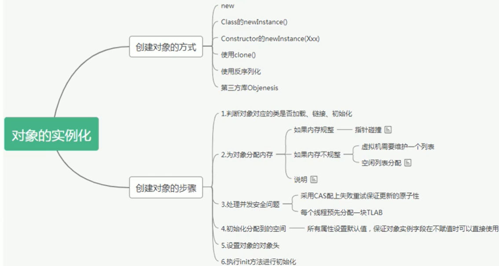
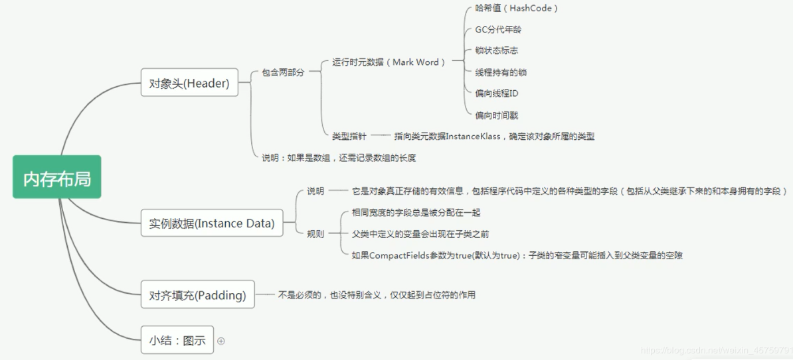
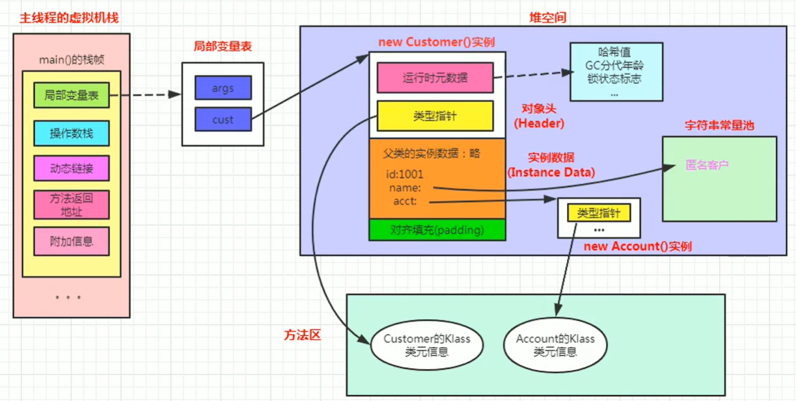
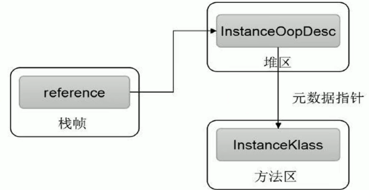
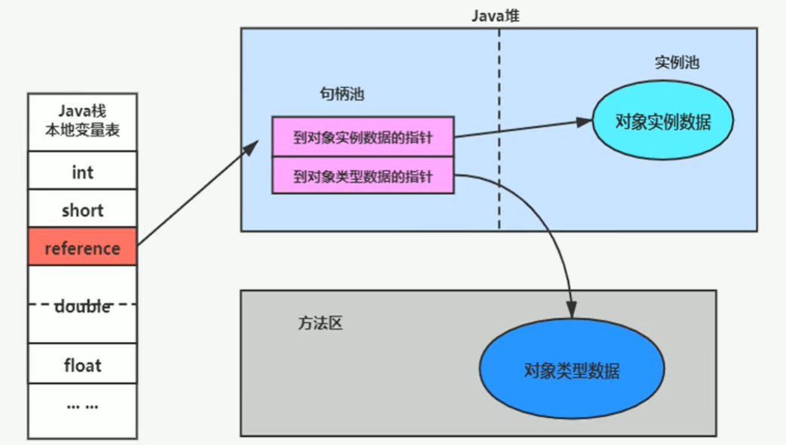
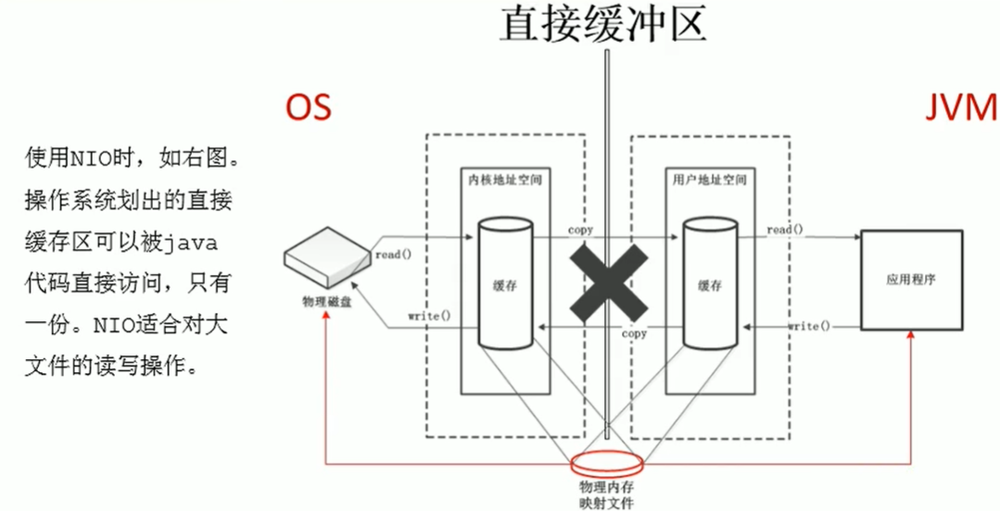
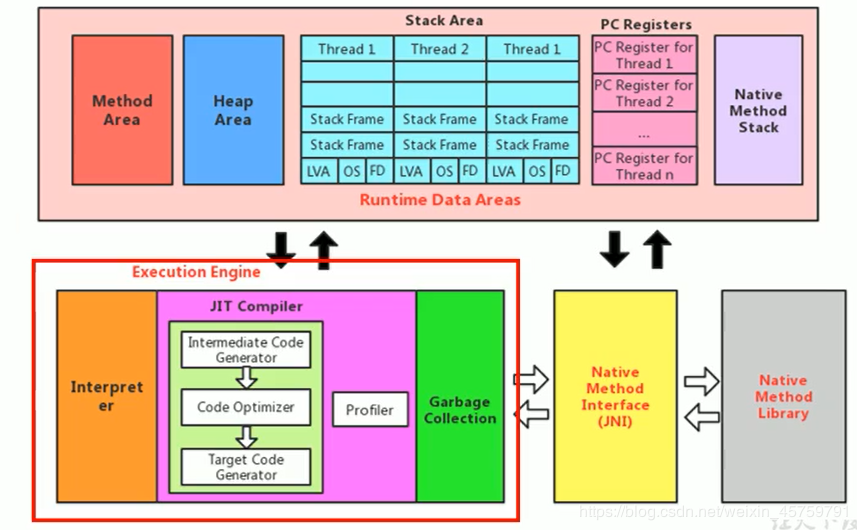
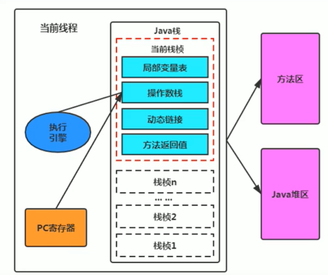
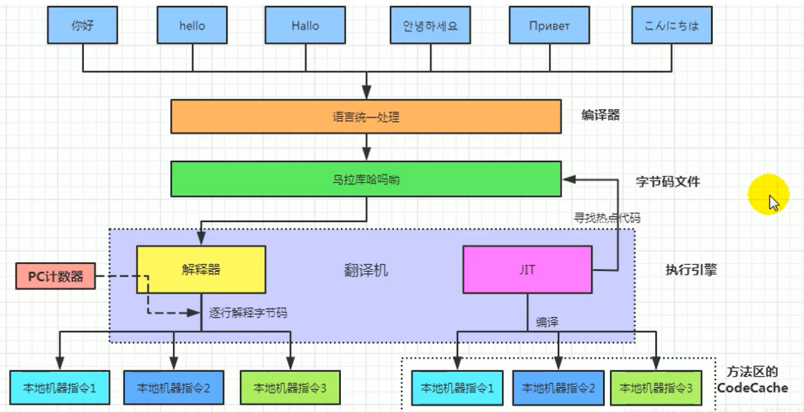

# 对象实例化

<!-- more -->

## 对象创建方式

- new：最常见的方式、单例类中调用getInstance的静态类方法，xxxbulider/XXXFactory的静态方法
- Class的newInstance方法：在JDK9里面被标记为**过时**的方法，因为**只能调用空参构造器**
- Constructor的newInstance(XXX)：反射的方式，**可以调用空参的，或者带参的构造器** 权限没有要求
- 使用clone()：不调用任何的构造器，要求当前的类需要**实现Cloneable接口中的clone接口**
- 使用序列化：序列化一般用于Socket的网络传输
- 第三方库 Objenesis
  

## 创建对象的步骤

**判断对象对应的类是否加载、链接、初始化**

首先去检查这个指令的参数能否在Metaspace的常量池中定位到一个类的符号引用，并且检查这个符号引用代表的类是**否已经被加载**，解析和初始化。（即判断类元信息是否存在）。如果没有，那么在双亲委派模式下，使用当前类加载器以ClassLoader + 包名 + 类名为key进行查找对应的 .class文件，如果没有找到文件，则抛出ClassNotFoundException异常，如果找到，则进行类加载，并生成对应的Class对象。

**为对象分配内存**

首先计算对象占用空间的大小，接着在堆中划分一块内存给新对象。如果实例成员变量是引用变量，仅分配引用变量空间即可，即4个字节大小

- 如果内存规整：指针碰撞
  - 意思是所有用过的内存在一边，空闲的内存放另外一边，中间放着一个指针作为分界点的指示器，分配内存就仅仅是把指针指向空闲那边挪动一段与对象大小相等的距离罢了。如果垃圾收集器选择的是Serial ，ParNew这种基于压缩算法的，虚拟机采用这种分配方式。一般使用带Compact（整理）过程的收集器时，使用指针碰撞。
- 如果内存不规整
  - 虚拟表需要维护一个列表
  - 空闲列表分配

**处理并发问题**

- 采用CAS配上失败重试保证更新的原子性
- 每个线程预先分配TLAB - 通过设置 -XX:+UseTLAB参数来设置（区域加锁机制）
  - 在Eden区给每个线程分配一块区域

**初始化分配到的内存**

给对象属性赋值的操作

- 属性的默认初始化
- 显示初始化
- 代码块中的初始化
- 构造器初始化

所有属性设置**默认值**，**保证对象实例字段在不赋值可以直接使用**

**设置对象的对象头**

将对象的所属类（即类的元数据信息）、对象的HashCode和对象的GC信息、锁信息等数据存储在对象的对象头中。这个过程的具体设置方式取决于JVM实现。

执行init**方法进行初始化**

在Java程序的视角看来，初始化才正式开始。初始化成员变量，执行实例化代码块，调用类的构造方法，并把堆内对象的首地址赋值给引用变量。

因此一般来说（由字节码中跟随invokespecial指令所决定），new指令之后会接着就是执行方法，把对象按照程序员的意愿进行初始化，这样一个真正可用的对象才算完成创建出来。
clinit 静态属性初始化

**所以总结在6步都执行完后才算对象创建完 ，new不算 ；**

## 对象内存布局

## 对象的访问定位

JVM是如何通过栈帧中的对象引用访问到其内部的对象实例呢？

通过栈上的reference 引用来访问

### 对象访问的两种方式

#### 句柄访问

句柄访问就是说栈的局部变量表中，记录的对象的引用，然后在堆空间中开辟了一块空间，也就是句柄池

**优点**：reference中存储稳定句柄地址，对象被移动（垃圾收集时移动对象很普遍）时只会改变句柄中实例数据指针即可，reference本身不需要被修改

#### 直接指针（HotSpot采用）

直接指针是局部变量表中的引用，直接指向堆中的实例，在对象实例中有类型指针，指向的是方法区中的对象类型数据

# 直接内存

不是虚拟机运行时数据区的一部分，也不是《Java虚拟机规范》中定义的内存区域。**元空间**

直接内存是在Java堆外的、直接向系统申请的内存区间。

来源于NIO，通过存在堆中的DirectByteBuffer操作Native内存

通常，访问直接内存的速度会优于Java堆。即**读写性能高。**

- 因此出于性能考虑，读写频繁的场合可能会考虑使用直接内存。
- Java的NIO库允许Java程序使用直接内存，用于数据缓冲区
  

|      IO       | NIO(new IO/Non-blocking IO) |
| :-----------: | :-------------------------: |
| byte[]/char[] |           Buffer            |
|    Stream     |           Channel           |

存在的问题
也可能导致outofMemoryError异常

由于直接内存在Java堆外，因此它的大小不会直接受限于-xmx指定的最大堆大小，但是系统内存是有限的，Java堆和直接内存的总和依然受限于操作系统能给出的最大内存。
缺点

- 分配回收成本较高

- 不受JVM内存回收管理

  直接内存大小可以通过MaxDirectMemorySize设置

如果不指定，默认与堆的最大值-xmx参数值一致

# 执行引擎

## 执行引擎概述

执行引擎属于JVM的下层，里面包括 解释器、及时编译器、垃圾回收器

执行引擎是Java虚拟机核心的组成部分之一。“虚拟机”是一个相对于“物理机”的概念，这两种机器都有代码执行能力，其区别是物理机的执行引擎是直接建立在处理器、缓存、指令集和操作系统层面上的，而**虚拟机的执行引擎则是由软件自行实现的**，因此可以不受物理条件制约地定制指令集与执行引擎的结构体系，**能够执行那些不被硬件直接支持的指令集格式。**

JVM的主要任务是**负责装载字节码 到其内部**，但字节码并不能够直接运行在操作系统之上，因为字节码指令并非等价于本地机器指令，它内部包含的仅仅只是一些能够被JVM所识别的字节码指令、符号表，以及其他辅助信息。
执行引擎（Execution Engine）的任务就是**将字节码指令解释/编译为对应平台上的本地机器指令才可以**。简单来说，JVM中的执行引擎充当了将**高级语言翻译为机器语言的译者。**

### 执行引擎的工作流程

- 执行引擎在执行的过程中究竟需要执行什么样的字节码指令完全依赖于PC寄存器。
- 每当执行完一项指令操作后，PC寄存器就会更新下一条需要被执行的指令地址。
- 当然方法在执行的过程中，执行引擎有可能会通过存储在局部变量表中的对象引用准确定位到存储在Java堆区中的对象实例信息，以及通过对象头中的元数据指针定位到目标对象的类型信息。
  

所有的Java虚拟机的执行引擎输入，输出都是一致的：输入的是字节码二进制流，处理过程是字节码解析执行的等效过程，输出的是执行过程。

## Java代码编译和执行过程

### 什么是解释器（Interpreter）

当Java虚拟机启动时会根据预定义的规范**对字节码采用逐行解释的方式执行**，将每条字节码文件中的内容“翻译”为对应平台的本地机器指令执行。

JIT（Just In Time Compiler）编译器：就是虚拟机将源代码直接编译成和本地机器平台相关的机器语言

### 为什么Java是半编译半解释型语言

**现在JVM在执行Java代码的时候，通常都会将解释执行与编译执行二者结合起来进行。**

**翻译成本地代码后，就可以做一个缓存操作，存储在方法区中**

## 字节码

字节码是一种中间状态（中间码）的二进制代码（文件），它比机器码更抽象，需要直译器转译后才能成为机器码

字节码主要为了实现特定软件运行和软件环境、与硬件环境无关。

字节码的实现方式是通过编译器和虚拟机器。编译器将源码编译成字节码，特定平台上的虚拟机器将字节码转译为可以直接执行的指令。

字节码典型的应用为：Java bytecode

## 解释器

JVM设计者们的初衷仅仅只是单纯地为了满足Java程序实现跨平台特性，因此避免采用静态编译的方式直接生成本地机器指令，从而诞生了实现解释器在运行时采用逐行解释字节码执行程序的想法。

### 解释器分类

在Java的发展历史里，一共有两套解释执行器，即古老的字节码解释器、现在普遍使用的模板解释器。

- 字节码解释器在执行时通过纯软件代码模拟字节码的执行，效率非常低下。
- 而模板解释器将每一条字节码和一个模板函数相关联，模板函数中直接产生这条字节码执行时的机器码，从而很大程度上提高了解释器的性能。

在HotSpot VM中，解释器主要由Interpreter模块和Code模块构成。

Interpreter模块：实现了解释器的核心功能
Code模块：用于管理HotSpot VM在运行时生成的本地机器指令

## JIT编译器

即时编译器

### HotSpot JVM执行方式

当虚拟机启动的时候，**解释器可以首先发挥作用**，而不必等待即时编译器全部编译完成再执行，这样可以**省去许多不必要的编译时间**。并且随着程序运行时间的推移，即时编译器逐渐发挥作用，根据热点探测功能，**将有价值的字节码编译为本地机器指令，以换取更高的程序执行效率**