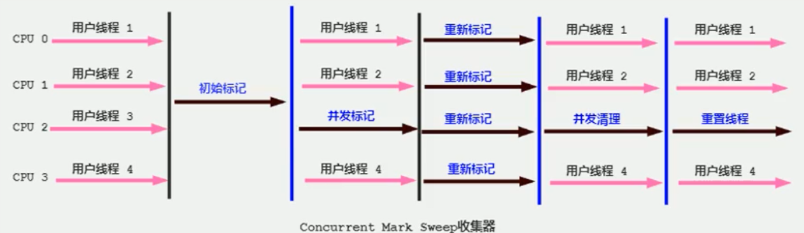

# 垃圾回收相关概念

<!--more-->

## System.gc()

会显式触发FullGC，同时对老年代和新生代进行回收，尝试释放被丢弃对象占用的内存。

然而system.gc() )调用附带一个免责声明，无法保证对垃圾收集器的调用。(不能确保立即生效)

无须手动触发。在一些特殊情况下，如我们正在编写一个性能基准，我们可以在运行之间调用System.gc()

- 如果调用**System.runFinalization()会强制调用**，并打印运行结果，但是不一定会触发销毁的方法，调用System.runFinalization()会强制调用 失去引用对象的finalize()

```java
/**
 * 局部变量回收
 */
public class LocalVarGC {

    /**
     * 触发Minor GC没有回收对象，然后在触发Full GC将该对象存入old区
     */
    public void localvarGC1() {
        byte[] buffer = new byte[10*1024*1024];
        System.gc();
    }

    /**
     * 触发YoungGC的时候，已经被回收了
     */
    public void localvarGC2() {
        byte[] buffer = new byte[10*1024*1024];
        buffer = null;
        System.gc();
    }

    /**
     * 不会被回收，因为它还存放在局部变量表索引为1的槽中
     */
    public void localvarGC3() {
        {
            byte[] buffer = new byte[10*1024*1024];
        }
        System.gc();
    }

    /**
     * 会被回收，因为它还存放在局部变量表索引为1的槽中，但是后面定义的value把这个槽给替换了
     */
    public void localvarGC4() {
        {
            byte[] buffer = new byte[10*1024*1024];
        }
        int value = 10;
        System.gc();
    }

    /**
     * localvarGC5中的数组已经被回收
     */
    public void localvarGC5() {
        localvarGC1();
        System.gc();
    }

    public static void main(String[] args) {
        LocalVarGC localVarGC = new LocalVarGC();
        localVarGC.localvarGC3();
    }
}

```

## 内存溢出

javadoc中对outofMemoryError的解释是，没有空闲内存，并且垃圾收集器也无法提供更多内存。

- Java虚拟机的堆内存设置不够。

比如：可能存在内存泄漏问题；也很有可能就是堆的大小不合理，比如我们要处理比较可观的数据量，但是没有显式指定JVM堆大小或者指定数值偏小。我们可以通过参数-Xms 、-Xmx来调整。

- 代码中创建了大量大对象，并且长时间不能被垃圾收集器收集（存在被引用）

我们不断添加新类型的时候，永久代出现OutOfMemoryError也非常多见，尤其是在运行时存在大量动态类型生成的场合；类似intern字符串缓存占用太多空间，也会导致OOM问题。对应的异常信息，会标记出来和永久代相关：“java.lang.OutOfMemoryError:PermGen space"。

随着元数据区的引入，方法区内存已经不再那么窘迫，所以相应的ooM有所改观，出现ooM，异常信息则变成了：“java.lang.OutofMemoryError:Metaspace"。直接内存不足，也会导致OOM。

**出OutofMemoryError之前，通常垃圾收集器会被触发**

```text
例如：在引用机制分析中，涉及到JVM会去尝试回收软引用指向的对象等。
在java.nio.BIts.reserveMemory（）方法中，我们能清楚的看到，System.gc（）会被调用，以清理空间。
```

**当然，也不是在任何情况下垃圾收集器都会被触发的**

比如，我们去分配一个超大对象，类似一个超大数组超过堆的最大值，JVM可以判断出垃圾收集并不能解决这个问题，所以直接抛出OutofMemoryError。

## 内存泄漏

**只有对象不会 再被程序用到了，但是GC又不能回收他们的情况，才叫内存泄漏。**

但实际情况很多时候一些不太好的实践（或疏忽）会导致对象的生命周期变得很长甚至导致00M，也可以叫做宽泛意义上的“内存泄漏”。

这里的存储空间并不是指物理内存，而是指虚拟内存大小，这个虚拟内存大小取决于磁盘交换区设定的大小。

例如：买房子：80平的房子，但是有10平是公摊的面积，我们是无法使用这10平的空间，这就是所谓的内存泄漏

/内存泄漏.png)

举例

- 单例模式
  单例的生命周期和应用程序是一样长的，所以单例程序中，如果持有对外部对象的引用的话，那么这个外部对象是不能被回收的，则会导致内存泄漏的产生。

- 一些提供close的资源未关闭导致内存泄漏
  数据库连接（dataSourse.getConnection() ），网络连接（socket）和io连接必须手动close，否则是不能被回收的。

  原文链接：https://blog.csdn.net/weixin_45759791/article/details/107336360

## Stop The World

指的是GC事件发生过程中，会产生应用程序的停顿。

可达性分析算法中枚举根节点（GC Roots）会导致所有Java执行线程停顿。

### 垃圾回收的并行与并发

- 并行（Paralle1）：指多条垃圾收集线程并行工作，但此时用户线程仍处于等待状态。如ParNew、Parallel Scavenge、Parallel old；
- 串行（Serial）
  - 相较于并行的概念，单线程执行。
  - 如果内存不够，则程序暂停，启动JM垃圾回收器进行垃圾回收。回收完，再启动程序的线程。


- 并发（Concurrent）：指**用户线程与垃圾收集线程**同时执行（但不一定是并行的，可能会交替执行），垃圾回收线程在执行时不会停顿用户程序的运行。>用户程序在继续运行，而垃圾收集程序线程运行于另一个CPU上；

\垃圾回收并发.png)

## 安全点与安全区域

### 安全点

程序执行时并非在所有地方都能停顿下来开始GC，只有在特定的位置才能停顿下来开始GC，这些位置称为“安全点（Safepoint）”。

如果太少可能导致GC等待的时间太长，如果太频繁可能导致运行时的性能问题。

大部分指令的执行时间都非常短暂，通常会根据“**是否具有让程序长时间执行的特征**”为标准。比如：选择一些执行时间较长的指令作为Safe Point，如**方法调用、循环跳转和异常跳转**等。

- **抢先式中断**：（目前没有虚拟机采用了）首先中断所有线程。如果还有线程不在安全点，就恢复线程，让线程跑到安全点。
- **主动式中断**：设置一个中断标志，各个线程运行到Safe Point的时候主动轮询这个标志，如果中断标志为真，则将自己进行中断挂起。（有轮询的机制）

### 安全区域

线程处于sleep-状态或Blocked 状态，这时候线程无法响应JVM的中断请求,需要安全区域（Safe Region）来解决。

**安全区域是指在一段代码片段中，对象的引用关系不会发生变化，在这个区域中的任何位置开始Gc都是安全的。我们也可以把Safe Region看做是被扩展了的Safepoint。**

- 当线程运行到Safe Region的代码时，首先标识已经进入了Safe Region，如果这段时间内发生GC，JVM会忽略标识为Safe Region状态的线程
- 当线程即将离开Safe Region时，会检查JVM是否已经完成GC，如果完成了，则继续运行，否则线程必须等待直到收到可以安全离开Safe Region的信号为止；
  

## 引用

我们希望能描述这样一类对象：当内存空间还足够时，则能保留在内存中；如果内存空间在进行垃圾收集后还是很紧张，则可以抛弃这些对象。

强引用、软引用、弱引用、虚引用有什么区别？具体使用场景是什么

- 强引用（Strong Reference）
- 软引用（Soft Reference）
- 弱引用（Weak Reference）
- 虚引用（Phantom Reference）

引用强度依次逐渐减弱

java.1ang.ref包中

### 强引用

使用new操作符创建一个新的对象，并将其赋值给一个变量的时候，这个变量就成为指向该对象的一个强引用。

**只要强引用关系还存在，垃圾收集器就永远不会回收掉被引用的对象。**

强引用是造成Java内存泄漏的主要原因之一。

### 软引用

内存足够是不会回收，内存不足就回收。

软引用通常用来实现内存敏感的缓存。比如：高速缓存就有用到软引用。如果还有空闲内存，就可以暂时保留缓存，当内存不足时清理掉，这样就保证了使用缓存的同时，不会耗尽内存。

```java
// 声明强引用
Object obj = new Object();
// 创建一个软引用
SoftReference<Object> sf = new SoftReference<>(obj);
obj = null; //销毁强引用，这是必须的，不然会存在强引用和软引用
```

### 弱引用

只能生存到下一次垃圾回收之前

**软引用、弱引用都非常适合来保存那些可有可无的缓存数据。**

三级缓存 ：内存缓存，本地缓存，网络缓存

```java
// 声明强引用
Object obj = new Object();
// 创建一个弱引用
WeakReference<Object> sf = new WeakReference<>(obj);
obj = null; //销毁强引用，这是必须的，不然会存在强引用和弱引用
```

弱引用对象与软引用对象的最大不同就在于，当GC在进行回收时，需要通过算法检查是否回收软引用对象，而对于弱引用对象，GC总是进行回收。**弱引用对象更容易、更快被GC回收。**

面试题：你开发中使用过WeakHashMap吗？

WeakHashMap用来存储图片信息，可以在内存不足的时候，及时回收，避免了OOM

### 虚引用

**为一个对象设置虚引用关联的唯一目的就是能在这个对象被收集器回收时收到一个系统通知。**跟踪垃圾回收过程

但是，由于垃圾回收器的线程通常优先级很低，因此，并不一定能很快地发现持有弱引用的对象。在这种情况下，弱引用对象可以存在较长的时间。

如果一个对象仅持有虚引用，那么它和没有引用几乎是一样的，随时都可能被垃圾回收器回收。

虚引用必须和引用队列一起使用。

```
// 声明强引用
Object obj = new Object();
// 声明引用队列
ReferenceQueue phantomQueue = new ReferenceQueue();
// 声明虚引用（还需要传入引用队列）
PhantomReference<Object> sf = new PhantomReference<>(obj, phantomQueue);
obj = null; 
```

```java
public class PhantomReferenceTest {
    // 当前类对象的声明
    public static PhantomReferenceTest obj;
    // 引用队列
    static ReferenceQueue<PhantomReferenceTest> phantomQueue = null;

    @Override
    protected void finalize() throws Throwable {
        super.finalize();
        System.out.println("调用当前类的finalize方法");
        obj = this;
    }

    public static void main(String[] args) {
        Thread thread = new Thread(() -> {
            while(true) {
                if (phantomQueue != null) {
                    PhantomReference<PhantomReferenceTest> objt = null;
                    try {
                        objt = (PhantomReference<PhantomReferenceTest>) phantomQueue.remove();
                    } catch (Exception e) {
                        e.getStackTrace();
                    }
                    if (objt != null) {
                        System.out.println("追踪垃圾回收过程：PhantomReferenceTest实例被GC了");
                    }
                }
            }
        }, "t1");
        thread.setDaemon(true);
        thread.start();

        phantomQueue = new ReferenceQueue<>();
        obj = new PhantomReferenceTest();
        // 构造了PhantomReferenceTest对象的虚引用，并指定了引用队列
        PhantomReference<PhantomReferenceTest> phantomReference = new PhantomReference<>(obj, phantomQueue);
        try {
            System.out.println(phantomReference.get());
            // 去除强引用
            obj = null;
            // 第一次进行GC，由于对象可复活，GC无法回收该对象
            System.out.println("第一次GC操作");
            System.gc();
            Thread.sleep(1000);
            if (obj == null) {
                System.out.println("obj 是 null");
            } else {
                System.out.println("obj 不是 null");
            }
            System.out.println("第二次GC操作");
            obj = null;
            System.gc();
            Thread.sleep(1000);
            if (obj == null) {
                System.out.println("obj 是 null");
            } else {
                System.out.println("obj 不是 null");
            }
        } catch (Exception e) {
            e.printStackTrace();
        } finally {

        }
    }
}
null
第一次GC操作
调用当前类的finalize方法
obj 不是 null
第二次GC操作
追踪垃圾回收过程：PhantomReferenceTest实例被GC了
obj 是 null
```

从上述运行结果我们知道，第一次尝试获取虚引用的值，发现无法获取的，这是因为虚引用是无法直接获取对象的值，然后进行第一次gc，因为会调用finalize方法，将对象复活了，所以对象没有被回收，但是调用第二次gc操作的时候，因为finalize方法只能执行一次，所以就触发了GC操作，将对象回收了，同时将会触发第二个操作就是 将回收的值存入到引用队列中。

### 终结器引用

它用于实现对象的finalize() 方法，也可以称为终结器引用

无需手动编码，其内部配合引用队列使用

在GC时，终结器引用入队。由Finalizer线程通过终结器引用找到被引用对象调用它的finalize()方法，第二次GC时才回收被引用的对象

# 垃圾回收器

## GC分类与性能指标

垃圾收集器没有在规范中进行过多的规定，可以由不同的厂商、不同版本的JVM来实现。

```text
Java不同版本新特性
语法层面：Lambda表达式、switch、自动拆箱装箱、enum
API层面：Stream API、新的日期时间、Optional、String、集合框架
底层优化：JVM优化、GC的变化、元空间、静态域、字符串常量池位置变化
```

### 垃圾收集器分类

#### **按线程数分**

**按线程数分**（垃圾回收线程数），可以分为串行垃圾回收器和并行垃圾回收器。

- 串行回收指的是在同一时间段内只允许有一个CPU用于执行垃圾回收操作，此时工作线程被暂停，直至垃圾收集工作结束。

  在诸如单CPU处理器或者较小的应用内存等硬件平台不是特别优越的场合，串行回收器的性能表现可以超过并行回收器和并发回收器。所以，**串行回收默认被应用在客户端的Client模式下的JVM中**
  在并发能力比较强的CPU上，并行回收器产生的停顿时间要短于串行回收器。

- 和串行回收相反，并行收集可以运用多个CPU同时执行垃圾回收，因此提升了应用的吞吐量，不过并行回收仍然与串行回收一样，采用独占式，使用了“stop-the-world”机制。

#### 按工作模式分

- 并发式垃圾回收器与应用程序线程交替工作，以尽可能减少应用程序的停顿时间。
- 独占式垃圾回收器（Stop the world）一旦运行，就停止应用程序中的所有用户线程，直到垃圾回收过程完全结束。

#### 按碎片处理方式分

- 压缩式垃圾回收器会在回收完成后，对存活对象进行压缩整理，消除回收后的碎片。 指针碰撞
- 非压缩式的垃圾回收器不进行这步操作。空闲列表

### 评估GC的性能指标

- **吞吐量**：运行用户代码的时间占总运行时间的比例（总运行时间 = 程序的运行时间 + 内存回收的时间）
- **暂停时间**：执行垃圾收集时，程序的工作线程被暂停的时间。（重要）
- **内存占用**：Java堆区所占的内存大小。

一款优秀的收集器通常最多同时满足其中的两项。

### 吞吐量

吞吐量=运行用户代码时间 /（运行用户代码时间+垃圾收集时间）

- 比如：虚拟机总共运行了100分钟，其中垃圾收集花掉1分钟，那吞吐量就是99%。

### 暂停时间

指一个时间段内应用程序线程暂停，让Gc线程执行的状态

### 7种经典的垃圾收集器

- 串行回收器：Serial、Serial old
- 并行回收器：ParNew、Parallel Scavenge、Parallel old
- 并发回收器：CMS、G11


### 7款经典收集器与垃圾分代之间的关系

新生代收集器：Serial、ParNew、Paralle1 Scavenge；

老年代收集器：Serial old、Parallel old、CMS；

整堆收集器：G1

### 垃圾收集器的组合关系

/组合关系.png)

- （红色虚线）由于维护和兼容性测试的成本，在JDK 8时将Serial+CMS、ParNew+Serial old这两个组合声明为废弃（JEP173），并在JDK9中完全取消了这些组合的支持（JEP214），即：移除。
- （绿色虚线）JDK14中：弃用Paralle1 Scavenge和Serialold GC组合（JEP366）
- （青色虚线）JDK14中：删除CMs垃圾回收器（JEP363）
  

因为Java的使用场景很多，移动端，服务器等。所以就需要针对不同的场景，提供不同的垃圾收集器，提高垃圾收集的性能。

### 如何查看默认垃圾收集器

-XX:+PrintcommandLineFlags：（包含使用的垃圾收集器）

使用命令行指令：jinfo -flag 相关垃圾回收器参数 进程ID

## Serial和Serial Old 回收器:并行

这个收集器是一个单线程的收集器，但它的“单线程”的意义并不仅仅说明它只会使用一个CPU或一条收集线程去完成垃圾收集工作，更重要的是在它进行垃圾收集时，必须暂停其他所有的工作线程，直到它收集结束（Stop The World）

-XX：+UseSerialGC参数可以指定年轻代和老年代都使用串行收集器。

## ParNew回收器:并行

Par是Parallel的缩写，New：只能处理的是新生代

ParNew收集器在年轻代中同样也是采用复制算法、"stop-the-World"机制。

除Serial外，目前只有ParNew GC能与CMS收集器配合工作

-XX：+UseParNewGC"

-XX:ParallelGCThreads限制线程数量

## Parallel回收器：吞吐量优先

也采用了复制算法、并行回收和"Stop the World"机制。

- 达到一个可控制的吞吐量
- 自适应调节策略

**高吞吐量则可以高效率地利用CPU时间**，主要适合在后台运算而不需要太多交互的任务。因此，常见在服务器环境中使用。例如，那些执行批量处理、订单处理、工资支付、科学计算的应用程序。

Parallel old收集器采用了标记-压缩算法，但同样也是基于并行回收和"stop-the-World"机制。

/Parallel.png)

在Java8中，默认是此垃圾收集器。

###  参数配置

- -XX：+UseParallelGC 年轻代
- -XX：+UseParalleloldcc 老年代
  - 上面两个参数，默认开启一个，另一个也会被开启。（互相激活）
- -XX:ParallelGcrhreads线程数,最好与CPU数量相等
  - 在默认情况下，当CPU数量小于8个，ParallelGcThreads的值等于CPU数量。
  - 当CPU数量大于8个，ParallelGCThreads的值等于3+[5*CPU Count]/8]
- -XX:MaxGCPauseMillis 暂停时间
- -XX:GCTimeRatio垃圾收集时间占总时间的比例
- -XX:+UseAdaptivesizepplicy 设置Parallel scavenge收集器具有自适应调节策略

##  CMS回收器：低延迟

Concurrent-Mark-Sweep

**实现了让垃圾收集线程与用户线程同时工作**。

**目前很大一部分的Java应用集中在互联网站或者B/S系统的服务端上，这类应用尤其重视服务的响应速度，希望系统停顿时间最短，以给用户带来较好的体验。**CMS收集器就非常符合这类应用的需求。

CMS的垃圾收集算法采用**标记-清除算法**，并且也会"stop-the-world"



- **初始标记**（Initial-Mark）阶段：程序中所有的工作线程都将会因为“stop-the-world”机制而出现短暂的暂停，这个阶段的主要任务仅仅只是**标记出GCRoots能直接关联到的对象**。一旦标记完成之后就会恢复之前被暂停的所有应用线程。由于直接关联对象比较小，所以这里的**速度非常快**。
- **并发标记**（Concurrent-Mark）阶段：**从GG Roots的直接关联对象开始遍历整个对象图的过程**，这个过程**耗时较长但是不需要停顿用户线程**，可以与垃圾收集线程一起并发运行。
- **重新标记**（Remark）阶段：由于在并发标记阶段中，程序的工作线程会和垃圾收集线程同时运行或者交叉运行，因此为了**修正并发标记期间，因用户程序继续运作而导致标记产生变动的那一部分对象的标记记录**，这个阶段的停顿时间通常会比初始标记阶段稍长一些，但也远比并发标记阶段的时间短。
- **并发清除**（Concurrent-Sweep）阶段：此阶段**清理删除掉标记阶段判断的已经死亡的对象，释放内存空间。**由于不需要移动存活对象，所以这个阶段也是可以与用户线程同时并发的

**在CMS回收过程中，还应该确保应用程序用户线程有足够的内存可用。**当堆内存使用率达到某一阈值时，便开始进行回收，以确保应用程序在CMS工作过程中依然有足够的空间支持应用程序运行。要是CMS运行期间预留的内存无法满足程序需要，就会出现一次“Concurrent Mode Failure” 失败

**标记清除算法**采用空闲列表

###  CMS为什么不使用标记整理算法

因为当并发清除的时候，用Compact整理内存的话，**原来的用户线程使用的内存还怎么用呢**？要保证用户线程能继续执行，前提的它运行的资源不受影响嘛。Mark Compact更适合“stop the world” 这种场景下使用

###  优点

- 并发收集
- 低延迟

### 缺点

- **会产生内存碎片**，无法分配大对象的情况下，不得不提前触发FullGC。
- **CMS收集器对CPU资源非常敏感。**在并发阶段，会因为占用了一部分线程而导致应用程序变慢，总吞吐量会降低。
- **CMS收集器无法处理浮动垃圾。**可能出现“Concurrent Mode Failure"失败而导致另一次Full GC的产生。在并发标记阶段由于程序的工作线程和垃圾收集线程是同时运行或者交叉运行的，**那么在并发标记阶段如果产生新的垃圾对象，CMS将无法对这些垃圾对象进行标记，最终会导致这些新产生的垃圾对象没有被及时回收**，从而只能在下一次执行GC时释放这些之前未被回收的内存空间。

###  设置的参数

- -XX：+UseConcMarkSweepGC 使用   自动ParNew

- -XX:CMSInitiatingoccupanyFraction 设置堆内存使用率的阈值

  JDK6及以上版本默认值为92%，该选项便可以有效降低Ful1Gc的执行次数。

##  小结

- 如果你想要最小化地使用内存和并行开销，请选Serial GC；
- 如果你想要最大化应用程序的吞吐量，请选Parallel GC；
- 如果你想要最小化GC的中断或停顿时间，请选CMs GC。

**JDK9**   CMS标记废弃

JDK14 删除CMS

##  G1回收器：区域化分代式

**在延迟可控的情况下获得尽可能高的吞吐量，所以才担当起“全功能收集器”的重任与期望**。

它把堆内存分割为很多不相关的区域（Region），每次根据允许的收集时间，优先回收价值最大的Region。垃圾优先（Garbage First）。

### 优点

- **并行与并发**
  - 并行性：G1在回收期间，可以有多个GC线程同时工作，有效利用多核计算能力。此时用户线程STW
  - 并发性：G1拥有与应用程序交替执行的能力，部分工作可以和应用程序同时执行
- **分代收集**、
  - G1依然属于分代型垃圾回收器，它不要求整个Eden区、年轻代或者老年代都是连续的，也不再坚持固定大小和固定数量。
  - 同时兼顾年轻代和老年代。

/G1分区.png)

- **空间整合**
   - CMS：“标记-清除”算法、内存碎片、若干次Gc后进行一次碎片整理
   - G1内存的回收是以region作为基本单位的。**Region之间是复制算法**，但**整体上实际可看作是标记-压缩（Mark-Compact）算法**，两种算法都可以避免内存碎片。这种特性有利于程序长时间运行，分配大对象时不会因为无法找到连续内存空间而提前触发下一次GC。
   
- **可预测的停顿时间模型**

   能建立可预测的停顿时间模型，能让使用者明确指定在一个长度为M毫秒的时间片段内，消耗在垃圾收集上的时间不得超过N毫秒。

   - G1可以只选取部分区域进行内存回收，这样缩小了回收的范围
   - 每次根据允许的收集时间，优先回收价值最大的Region
   - 相比于CMS GC，G1未必能做到CMS在最好情况下的延时停顿，但是最差情况要好很多。

### 缺点

- G1无论是为了垃圾收集产生的内存占用（Footprint）还是程序运行时的额外执行负载（overload）都要比CMS要高。
- 从经验上来说，在小内存应用上CMS的表现大概率会优于G1，而G1在大内存应用上则发挥其优势。平衡点在6-8GB之间。

###  G1参数设置

- -XX:+UseG1GC  使用
- -XX:G1HeapRegionSize设置每个Region的大小。值是2的幂，范围是1MB到32MB之间，目标是根据最小的Java堆大小划分出约2048个区域。默认是堆内存的1/2000。
- -XX:MaxGCPauseMillis 设置期望达到的最大Gc停顿时间指标（JVM会尽力实现，但不保证达到）。默认值是200ms
- -XX:+ParallelGcThread 设置STW工作线程数的值。最多设置为8
- -XX:ConcGCThreads 设置并发标记的线程数。将n设置为并行垃圾回收线程数（ParallelGcThreads）的1/4左右。
- -XX:InitiatingHeapoccupancyPercent 设置触发并发Gc周期的Java堆占用率阈值。超过此值，就触发GC。默认值是45。

- 第一步：开启G1垃圾收集器
- 第二步：设置堆的最大内存
- 第三步：设置最大的停顿时间

/G1流程.png)

 （如果需要，单线程、独占式、高强度的Fu11GC还是继续存在的。它针对GC的评估失败提供了一种失败保护机制，即强力回收。）

### Remembered Set（记忆集）

一个对象被不同区域引用的问题

**解决方法：**

每个Region都有一个对应的Remembered Set；每次Reference类型数据写操作时，都会产生一个Write Barrier暂时中断操作；

/RS.png)

### G1回收过程-年轻代GC

当Eden空间耗尽时，G1会启动一次年轻代垃圾回收过程。

/年轻代GC.png)

第一阶段，扫描根

第二阶段，更新RSet,RSet可以准确的反映老年代对所在的内存分段中对象的引用。

第三阶段，处理RSet

第四阶段，复制对象。

第五阶段，处理引用

###  G1回收过程-并发标记过程

- **初始标记阶段**：标记从根节点直接可达的对象。这个阶段是sTw的，并且会触发一次年轻代GC。
- **根区域扫描（**Root Region Scanning）：G1 Gc扫描survivor区直接可达的老年代区域对象，并标记被引用的对象。这一过程必须在youngGC之前完成。
- **并发标记**（Concurrent Marking）：在整个堆中进行并发标记（和应用程序并发执行），此过程可能被youngGC中断。在并发标记阶段，若**发现区域对象中的所有对象都是垃圾，那这个区域会被立即回收。**同时，并发标记过程中，会计算每个区域的对象活性（区域中存活对象的比例）。
- 再次标记（Remark）：由于应用程序持续进行，需要修正上一次的标记结果。是STW的。G1中采用了比CMS更快的初始快照算法：snapshot-at-the-beginning（SATB）。
- 独占清理（cleanup，STW）：计算各个区域的存活对象和GC回收比例，并进行排序，识别可以混合回收的区域。为下阶段做铺垫。是sTw的。这个阶段并不会实际上去做垃圾的收集
- 并发清理阶段：识别并清理完全空闲的区域。

###  G1回收过程 - 混合回收


除了回收整个Young Region，还会回收一部分的old Region。

###  G1回收的优化建议

年轻代大小

- 避免使用-Xmn或-XX:NewRatio等相关选项显式设置年轻代大小

- 固定年轻代的大小会覆盖暂停时间目标

暂停时间目标不要太过严苛

- G1 GC的吞吐量目标是90%的应用程序时间和10%的垃圾回收时间
- 评估G1GC的吞吐量时，暂停时间目标不要太严苛。目标太过严苛表示你愿意承受更多的垃圾回收开销，而这些会直接影响到吞吐量。

## 总结

/总结.png)

##  GC日志分析

- -XX:+PrintGc输出GC日志。类似：-verbose:gc
- -XX:+PrintGcDetails输出Gc的详细日志
- -XX:+PrintGcTimestamps 输出Gc的时间戳（以基准时间的形式）
- -XX:+PrintGCDatestamps 输出Gc的时间戳（以日期的形式，如2013-05-04T21：53：59.234+0800）
- -XX:+PrintHeapAtGC在进行Gc的前后打印出堆的信息
- -Xloggc:../logs/gc.1og日志文件的输出路径

/gc图片.png)

/cg参数.png)

###  Young GC

/YoungGC.png)

###  Full GC

/FullGC.png)