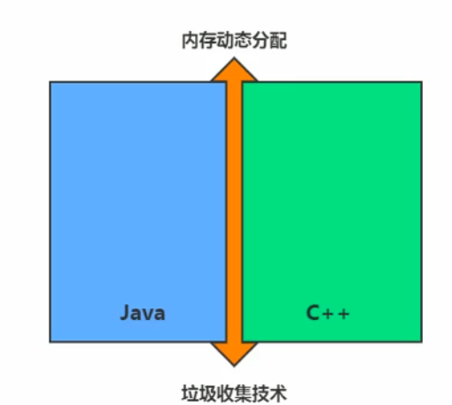
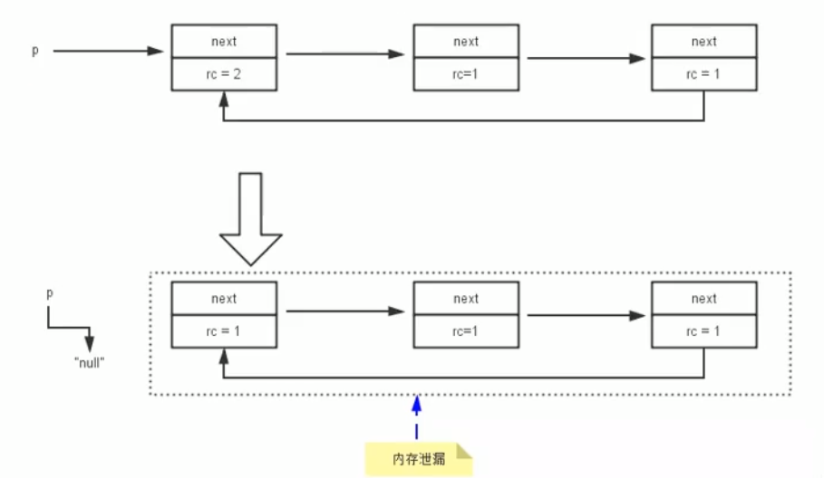

# 垃圾回收概述

<!--- more-->

## 什么是垃圾



### 什么是垃圾？

垃圾是指在运行程序中没有任何指针指向的对象，这个对象就是需要被回收的垃圾。

如果不及时对内存中的垃圾进行清理，那么，这些垃圾对象所占的内存空间会一直保留到应用程序的结束，被保留的空间无法被其它对象使用，**甚至可能导致内存溢出**。

## 为什么需要GC

- 内存迟早都会被消耗完
- 垃圾回收可以清除内存里的记录碎片。碎片整理将所占用的堆内存移到堆的一端，**以便JVM将整理出的内存分配给新的对象。**
- 随着应用程序所应付的业务越来越庞大、复杂，用户越来越多，**没有GC就不能保证应用程序的正常进行**

## Java垃圾回收机制

### 优点

自动内存管理，无需开发人员手动参与内存的分配与回收，**这样降低内存泄漏和内存溢出的风险**

可以更专心地专注于业务开发

https://docs.oracle.com/javase/8/docs/technotes/guides/vm/gctuning/toc.html


### 担忧

弱化Java开发人员在程序出现内存溢出时定位问题和解决问题的能力。

### GC主要关注的区域

 方法区 和堆

Java堆是垃圾收集器的工作重点

- 频繁收集Young区
- 较少收集Old区
- 基本不收集Perm区（元空间）

# 垃圾回收相关算法

## 标记阶段（重要）

在堆里存放着几乎所有的Java对象实例，在GC执行垃圾回收之前，首先需要区分出内存中哪些是存活对象，哪些是已经死亡的对象。只有被标记为己经死亡的对象，GC才会在执行垃圾回收时，释放掉其所占用的内存空间，因此这个过程我们可以称为垃圾标记阶段。

那么在JVM中究竟是如何标记一个死亡对象呢？简单来说，**当一个对象已经不再被任何的存活对象继续引用时，就可以宣判为已经死亡。**

判断对象存活一般有两种方式：**引用计数算法和可达性分析算法**。

### 引用计数算法

引用计数算法（Reference Counting）比较简单，对**每个对象保存一个整型的引用计数器属性。用于记录对象被引用的情况。**

对于一个对象A，只要有任何一个对象引用了A，则A的引用计数器就加1；当引用失效时，引用计数器就减1。只要对象A的引用计数器的值为0，即表示对象A不可能再被使用，可进行回收。

优点：实现简单，垃圾对象便于辨识；判定效率高，回收没有延迟性。

缺点：

- 它需要单独的字段存储计数器，这样的做法**增加了存储空间的开销**。
- 每次赋值都需要更新计数器，伴随着加法和减法操作，这**增加了时间开销。**
- **无法处理循环引用的情况。这是一条致命缺陷，导致在Java的垃圾回收器中没有使用这类算法。**

#### 循环引用



java中不会出现这种内存泄露

```java
public class RefCountGC {
    // 这个成员属性的唯一作用就是占用一点内存
    private byte[] bigSize = new byte[5*1024*1024];
    // 引用
    Object reference = null;

    public static void main(String[] args) {
        RefCountGC obj1 = new RefCountGC();
        RefCountGC obj2 = new RefCountGC();
        obj1.reference = obj2;
        obj2.reference = obj1;
        obj1 = null;
        obj2 = null;
        // 显示的执行垃圾收集行为，判断obj1 和 obj2是否被回收？
        System.gc();
    }
}

[GC (System.gc()) [PSYoungGen: 15490K->808K(76288K)] 15490K->816K(251392K), 0.0061980 secs] [Times: user=0.00 sys=0.00, real=0.36 secs] 
[Full GC (System.gc()) [PSYoungGen: 808K->0K(76288K)] [ParOldGen: 8K->672K(175104K)] 816K->672K(251392K), [Metaspace: 3479K->3479K(1056768K)], 0.0045983 secs] [Times: user=0.00 sys=0.00, real=0.00 secs] 
Heap
 PSYoungGen      total 76288K, used 655K [0x000000076b500000, 0x0000000770a00000, 0x00000007c0000000)
  eden space 65536K, 1% used [0x000000076b500000,0x000000076b5a3ee8,0x000000076f500000)
  from space 10752K, 0% used [0x000000076f500000,0x000000076f500000,0x000000076ff80000)
  to   space 10752K, 0% used [0x000000076ff80000,0x000000076ff80000,0x0000000770a00000)
 ParOldGen       total 175104K, used 672K [0x00000006c1e00000, 0x00000006cc900000, 0x000000076b500000)
  object space 175104K, 0% used [0x00000006c1e00000,0x00000006c1ea8070,0x00000006cc900000)
 Metaspace       used 3486K, capacity 4496K, committed 4864K, reserved 1056768K
  class space    used 385K, capacity 388K, committed 512K, reserved 1048576K

                                 
//gc         
PSYoungGen: 15490K->808K(76288K)] 15490K->816K(251392K)
                        
```

Python，它更是同时支持引用计数和垃圾收集机制。

```java
手动解除：很好理解，就是在合适的时机，解除引用关系。
使用弱引用weakref，weakref是Python提供的标准库，旨在解决循环引用。
```

### 可达性分析算法

根搜索算法、追踪性垃圾收集

同样具备实现简单和执行高效等特点**，更重要的是该算法可以有效地解决在引用计数算法中循环引用的问题，防止内存泄漏的发生。**

相较于引用计数算法，这里的可达性分析就是Java、C#选择的。这种类型的垃圾收集通常也叫作**追踪性垃圾收集**（Tracing Garbage Collection）

#### 思路

所谓"GCRoots”根集合就是一组必须活跃的引用。

基本思路：

- 可达性分析算法是以根对象集合（GCRoots）为起始点，按照从上至下的方式**搜索被根对象集合所连接的目标对象是否可达。**
- 使用可达性分析算法后，内存中的存活对象都会被根对象集合直接或间接连接着，搜索所走过的路径称为**引用链**（Reference Chain）
- 如果目标对象没有任何引用链相连，则是不可达的，就意味着该对象己经死亡，可以标记为垃圾对象。
- 在可达性分析算法中，只有能够被根对象集合直接或者间接连接的对象才是存活对象。


#### GC Roots可以是哪些？

- **虚拟机栈中引用的对象**
  - 比如：各个线程被调用的方法中使用到的参数、局部变量等。
- **本地方法栈内JNI（通常说的本地方法）**
- **引用的对象方法区中类静态属性引用的对象**
  - 比如：Java类的引用类型静态变量
- **方法区中常量引用的对象**
- 比如：字符串常量池（string Table）里的引用
- 所有被同步锁synchronized持有的对象
- Java虚拟机内部的引用。
  - 基本数据类型对应的Class对象，一些常驻的异常对象（如：Nu11PointerException、outofMemoryError），系统类加载器。
- 反映java虚拟机内部情况的JMXBean、JVMTI中注册的回调、本地代码缓存等。

总结一句话就是，除了堆空间外的一些结构，比如 虚拟机栈、本地方法栈、方法区、字符串常量池 等地方对堆空间进行引用的，都可以作为GC Roots进行可达性分析

除了这些固定的GC Roots集合以外，根据用户所选用的垃圾收集器以及当前回收的内存区域不同，**还可以有其他对象“临时性”地加入**，共同构成完整GC Roots集合。比如：**分代收集和局部回收（PartialGC）。**

#### 小技巧

由于Root采用栈方式存放变量和指针，所以如果一个指针，**它保存了堆内存里面的对象，但是自己又不存放在堆内存里面，**那它就是一个Root。

注意
如果要使用可达性分析算法来判断内存是否可回收，那么分析工作必须在一个能保障一致性的快照中进行。这点不满足的话分析结果的准确性就无法保证。

这点也是导致GC进行时必须“stop The World”的一个重要原因。

即使是号称（几乎）不会发生停顿的CMS收集器中，**枚举根节点时也是必须要停顿的。**


## 对象的finalization机制

允许开发人员提供对象被销毁之前的自定义处理逻辑。

当垃圾回收器发现没有引用指向一个对象，即：垃圾回收此对象之前，总会先调用这个对象的finalize()方法。

finalize() 方法允许在子类中被重写，**用于在对象被回收时进行资源释放。**通常在这个方法中进行一些**资源释放和清理的工作，比如关闭文件、套接字和数据库连接等。**

### 注意

- 永远**不要主动调用某个对象的finalize()**方法I应该交给垃圾回收机制调用。理由包括下面三点：

  - 在finalize（）时可能**会导致对象复活**。

  - finalize（）方法的**执行时间是没有保障的**，它完全由GC线程决定，极端情况下，若不发生GC，则finalize（）方法将没有执行机会。
    因为优先级比较低，即使主动调用该方法，也不会因此就直接进行回收

  - 一个糟糕的finalize（）会严重影响Gc的性能。

从功能上来说，finalize（）方法与c++中的析构函数比较相似，但是Java采用的是基于垃圾回收器的自动内存管理机制，所以finalize（）方法在本质上不同于C++中的析构函数。

由于finalize（）方法的存在，虚拟机中的对象一般处于**三种可能的状态。**

**一个无法触及的对象有可能在某一个条件下“复活”自己**

- 可触及的：从根节点开始，可以到达这个对象。
- 可复活的：对象的所有引用都被释放，但是对象有可能在finalize（）中复活。
- 不可触及的：对象的finalize（）被调用，并且没有复活，那么就会进入不可触及状态。不可触及的对象不可能被复活，因为**finalize()只会被调用一次**。

### 具体过程

- 如果对象objA到GC Roots没有引用链，则进行第一次标记。
- 进行筛选，判断此对象**是否有必要执行finalize（）**方法
  - 如果对象objA没有重写finalize（）方法，或者finalize（）方法已经被虚拟机调用过，则虚拟机视为“没有必要执行”，objA被判定为不可触及的。
  - 如果对象objA重写了finalize（）方法，且还未执行过，那么objA会被插入到F-Queue队列中，由一个虚拟机自动创建的、低优先级的Finalizer线程触发其finalize（）方法执行。
  - **finalize（）方法是对象逃脱死亡的最后机会**，稍后GC会对F-Queue队列中的对象进行第二次标记。如果objA在finalize（）方法中与引用链上的任何一个对象建立了联系，那么在第二次标记时，objA会被移出“即将回收”集合。之后，对象会再次出现没有引用存在的情况。finalize方法不会被再次调用，对象会直接变成不可触及的状态。

## MAT与JProfiler的GC Roots溯源

### MAT

MAT是Memory Analyzer的简称，它是一款功能强大的Java堆内存分析器。用于查找内存泄漏以及查看内存消耗情况。

http://www.eclipse.org/mat/ 下载

### 命令行使用 jmap

```text
jps 查看进程id
jmap -dump:format=b,live,file=test1.bin 进程id
```

### 使用JVIsualVM

监视-dump-save as

使用MAT 或Jprofiler查看GC root

### 检查OOM

```text
-XX:HeapDumpOnOutOfMemoryError  //设定自动生成dump
```

然后用MAT或Jprofiler打开

## 清除阶段（重要）

### 标记-清除算法（Mark-Sweep）

#### 执行过程

当堆中的有效内存空间（available memory）被耗尽的时候，就会停止整个程序（也被称为**stop the world**），然后进行两项工作，第一项则是标记，第二项则是清除

- 标记：Collector从引用根节点开始遍历，**标记所有被引用的对象（不是垃圾）。**一般是在对象的Header中记录为可达对象。
  - **标记的是引用的对象，不是垃圾！！**
- **清除**：Collector对堆内存从头到尾进行线性的遍历，如果发现某个对象在其Header中没有标记为可达对象，则将其回收


#### 缺点

- 标记清除算法的效率不算高
- 在进行GC的时候，需要停止整个应用程序，用户体验较差
- 这种方式清理出来的空闲内存是不连续的，产生内碎片，需要维护一个空闲列表

#### 什么是清除？

这里所谓的清除并不是真的置空，而是把需要清除的对象地址保存在空闲的地址列表里。下次有新对象需要加载时，判断垃圾的位置空间是否够，如果够，就存放覆盖原有的地址。

### 复制算法

将活着的内存空间分为两块，每次只使用其中一块，在垃圾回收时将正在使用的内存中的存活对象复制到未被使用的内存块中，之后清除正在使用的内存块中的所有对象，交换两个内存的角色，最后完成垃圾回收


#### 优点

- 没有标记和清除过程，实现简单，运行高效
- 复制过去以后保证空间的连续性，不会出现“碎片”问题。

#### 缺点

- 此算法的缺点也是很明显的，就是需要两倍的内存空间。
- 对于G1这种分拆成为大量region的GC，复制而不是移动，意味着GC需要维护region之间对象引用关系，不管是内存占用或者时间开销也不小

#### 注意

如果系统中的垃圾对象很多，复制算法需要复制的存活对象数量并不会太大，或者说非常低才行（老年代大量的对象存活，那么复制的对象将会有很多，效率会很低）

在新生代，对常规应用的垃圾回收，一次通常可以回收70% - 99% 的内存空间。回收性价比很高。所以现在的商业虚拟机都是用这种收集算法回收新生代。

### 标记-整理算法

基于老年代垃圾回收的特性，需要使用其他的算法。


第一阶段和标记清除算法一样，从根节点开始标记所有被引用对象

第二阶段将所有的存活对象压缩到内存的一端，按顺序排放。之后，清理边界外所有的空间

#### 优点

- 消除了内存区域分散的缺点，我们需要给新对象分配内存时，JVM只需要持有一个内存的起始地址即可。
- 消除了复制算法当中，内存减半的高额代价。

#### 缺点

- 从效率上来说，标记-整理算法要低于复制算法。
- 移动对象的同时，如果对象被其他对象引用，则还需要调整引用的地址
- 移动过程中，需要全程暂停用户应用程序。即：STW

### 小结

|              | 标记清除           | 标记整理         | 复制                                  |
| ------------ | ------------------ | ---------------- | ------------------------------------- |
| **速率**     | 中等               | 最慢             | 最快                                  |
| **空间开销** | 少（但会堆积碎片） | 少（不堆积碎片） | 通常需要活对象的2倍空间（不堆积碎片） |
| **移动对象** | 否                 | 是               | 是                                    |

## 分代收集算法

在HotSpot中，基于分代的概念，GC所使用的内存回收算法必须结合年轻代和老年代各自的特点。

- 年轻代（Young Gen）
  年轻代特点：**区域相对老年代较小，对象生命周期短、存活率低，回收频繁。**

这种情况**复制算法**的回收整理，速度是最快的。复制算法的效率只和当前存活对象大小有关，因此很适用于年轻代的回收。而复制算法内存利用率不高的问题，**通过hotspot中的两个survivor的设计得到缓解。**


- 老年代（Tenured Gen）
  老年代特点：**区域较大，对象生命周期长、存活率高，回收不及年轻代频繁。**

这种情况存在大量存活率高的对象，复制算法明显变得不合适。一般是由**标记-清除或者是标记-清除与标记-整理的混合实现。**

- Mark阶段的开销与存活对象的数量成正比。
- Sweep阶段的开销与所管理区域的大小成正相关。
- compact阶段的开销与存活对象的数据成正比。
  

以HotSpot中的CMS回收器为例，**CMS是基于Mark-Sweep实现的**，对于对象的回收效率很高。而对于碎片问题，CMS采用基于Mark-Compact算法的Serial old回收器作为补偿措施：当内存回收不佳（碎片导致的Concurrent Mode Failure时），将采用serial old执行FullGC以达到对老年代内存的整理。


## 增量收集算法

解决stop the World

可以让垃圾收集线程和应用程序线程交替执行。每次，**垃圾收集线程只收集一小片区域的内存空间，接着切换到应用程序线程。依次反复，直到垃圾收集完成。**

总的来说，增量收集算法的基础仍是传统的标记-清除和复制算法。**增量收集算法通过对线程间冲突的妥善处理，允许垃圾收集线程以分阶段的方式完成标记、清理或复制工作**


### 缺点

因为线程切换和上下文转换的消耗，会使得垃圾回收的总体成本上升，造成系统吞吐量的下降

## 分区算法

一次Gc时所需要的时间就越长，有关GC产生的停顿也越长。

将一块大的内存区域分割成多个小块，根据目标的停顿时间，每次合理地回收若干个小区间，而不是整个堆空间，从而减少一次GC所产生的停顿。