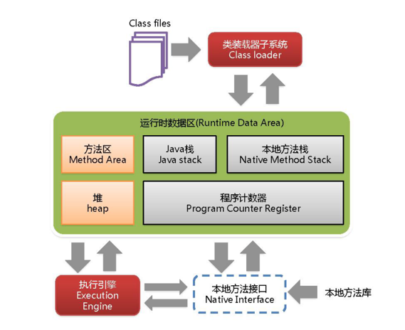
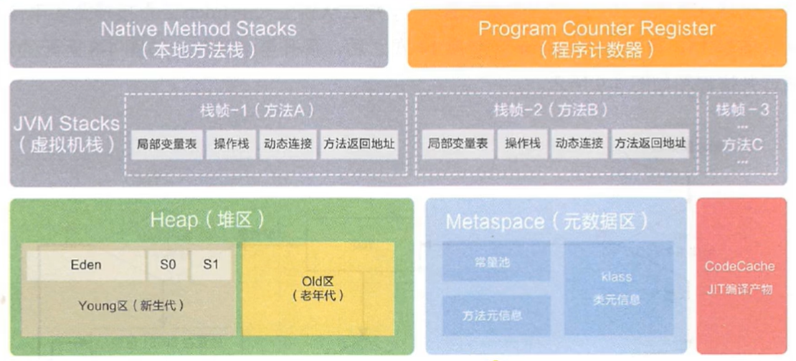
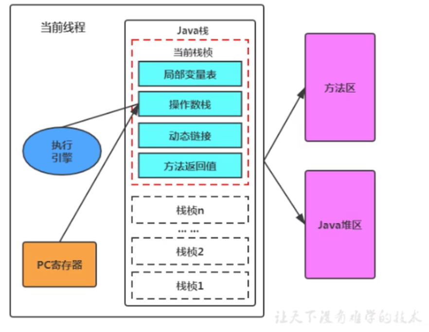
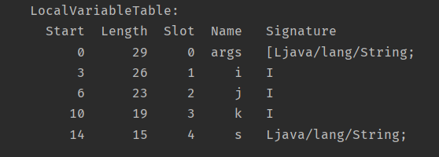
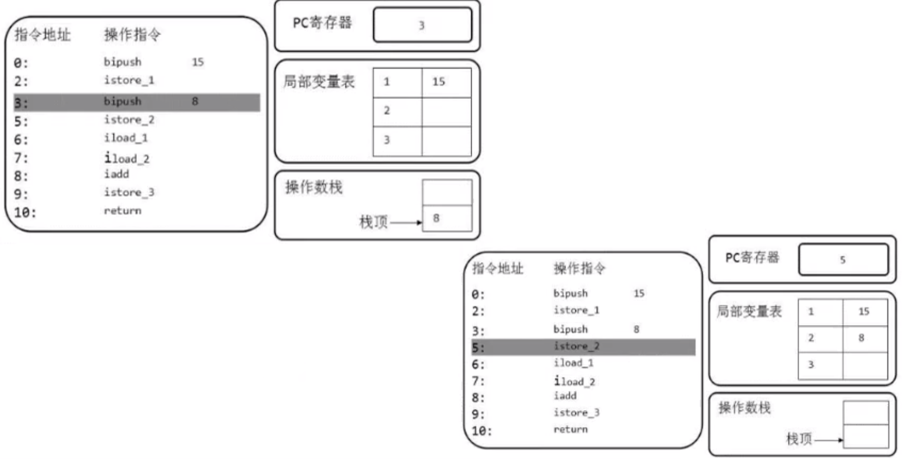

<!-- more -->

## 运行时数据区内部结构




java虚拟机定了了若干种程序运行期间会使用到的运行时数据区，其中有一些会随着虚拟机启动而创建，随着虚拟机退出而销毁。另外一些则是与县城一一对应的，这些与线程对应的数据区域会随着线程开始和结束而创建和销毁。
如图，**灰色的区域为单独线程私有的，红色的为多个线程共享**的

1.每个线程：独立包括程序计数器、栈、本地栈

2.线程间共享：堆、堆外内存（方法区、永久代或元空间、代码缓存）

一般来说，jvm优化95%是优化堆区，5%优化的是方法区，至于栈区无非出入栈操作优化较少

每个Java应用程序都有一个Runtime类的实例，该实例允许该应用程序与运行该应用程序的环境进行交互。 当前运行时可以从getRuntime方法获得。

#### 线程

1.线程是一个程序里的运行单元，JVM允许一个程序有多个线程并行的执行；

2.在HotSpot JVM，每个线程都与操作系统的本地线程直接映射。

　　当一个java线程准备好执行以后，此时一个操作系统的本地线程也同时创建。java线程执行终止后。本地线程也会回收。

3.操作系统负责所有线程的安排调度到任何一个可用的CPU上。一旦本地线程初始化成功，它就会调用java线程中的run（）方法.

##### JVM系统线程分类

如果你使用jconsole或者任何一个调试工具，都能看到在后台有许多线程在运行。这些后台线程不包括调用main方法的main线程以及所有这个main线程自己创建的线程；

这些主要的后台系统线程在HotSpot JVM里主要是以下几个：

- 虚拟机线程：这种线程的操作时需要JVM达到安全点才会出现。这些操作必须在不同的线程中发生的原因是他们都需要JVM达到安全点，这样堆才不会变化。这种线程的执行包括“stop-the-world”的垃圾收集，线程栈收集，线程挂起以及偏向锁撤销
- 周期任务线程：这种线程是时间周期事件的提现（比如中断），他们一般用于周期性操作的调度执行。
- GC线程：这种线程对于JVM里不同种类的垃圾收集行为提供了支持
- 编译线程：这种线程在运行时会降字节码编译成本地代码
- 信号调度线程：这种线程接收信号并发送给JVM,在它内部通过调用适当的方法进行处理。

### PC寄存器

JVM中的程序计数寄存器（Program Counter Register）中，Register的命名源于CPU的寄存器，寄存器存储指令相关的现场信息。CPU只有把数据装载到寄存器才能够运行。**JVM中的PC寄存器是对物理PC寄存器的一种抽象模拟。**

一个线程对应一个 JVM Stack。JVM Stack 中包含一组 Stack Frame。当 JVM 调用一个 Java 方法时，它从对应类的类型信息中得到此方法的局部变量区和操作数栈的大小，并据此分配栈帧内存，然后压入 JVM 栈中。

在活动线程中，只有位于栈顶的栈帧才是有效的，称为当前栈帧，与这个栈帧相关联的方法称为当前方法。



##### 作用

PC寄存器是用来存储指向下一条指令的地址，也即将将要执行的指令代码。由执行引擎读取下一条指令。

1.它是一块很小的内存空间，几乎可以忽略不计。也是运行速度最快的存储区域

2.在jvm规范中，每个线程都有它自己的程序计数器，是线程私有的，生命周期与线程的生命周期保持一致

3.任何时间一个线程都只有一个方法在执行，也就是所谓的**当前方法**。程序计数器会存储当前线程正在执行的java方法的JVM指令地址；或者，如果实在执行native方法，则是未指定值（undefined）,因为程序计数器不负责本地方法栈。

4.它是程序控制流的指示器，分支、循环、跳转、异常处理、线程恢复等基础功能都需要依赖这个计数器来完成

5.字节码解释器工作时就是通过改变这个计数器的值来选取吓一跳需要执行的字节码指令

6.它是唯一一个在java虚拟机规范中**没有规定任何OOM（Out Of Memery）情况**的区域,而且没有垃圾回收

##### 举例

```JAVA
public class PCRegister {
    public static void main(String[] args) {
        int i = 10;
        int j = 20;
        int k = i+j;
        String s = "abc";
        System.out.println(i);
        System.out.println(k);
    }
}
```


指令地址+操作地址

这些指令在PC寄存器中 ，

执行引擎会将其取出，操作局部变量表、操作数栈，翻译成机器指令送给CPU

##### 问题

1.**使用PC寄存器存储字节码指令地址有什么用呢（为什么使用PC寄存器记录当前线程的执行地址呢）**

（1）多线程宏观上是并行（多个事件在同一时刻同时发生）的，但实际上是并发交替执行的

（2）因为CPU需要不停的切换各个线程，这时候切换回来以后，就得知道接着从哪开始继续执行
（3）JVM的字节码解释器就需要通过改变PC寄存器的值来明确下一条应该执行什么样的字节码指令

所以，众多线程在并发执行过程中，任何一个确定的时刻，一个处理器或者多核处理器中的一个内核，只会执行某个线程中的一条指令。这样必然导致经常中断或恢复，如何保证分毫无差呢？每个线程在创建后，都会产生自己的程序计数器和栈帧，程序计数器在各个线程之间互不影响。
2.**PC寄存器为什么会设定为线程私有？**
（1）我们都知道所谓的多线程在一个特定的时间段内只会执行其中某一个线程的方法，CPU会不停滴做任务切换，这样必然会导致经常中断或恢复，如何保证分毫无差呢？

（2）为了能够准确地记录各个线程正在执行的当前字节码指令地址，最好的办法自然是**为每一个线程都分配一个PC寄存器,**这样一来各个线程之间便可以进行独立计算，从而不会出现相互干扰的情况。


### 虚拟机栈

根据栈设计的**优点是跨平台，指令集小，编译器容易实现，缺点是性能下降，实现同样的功能需要更多的指令。**

**栈是运行时的单位，而堆是存储的单位**
1.栈解决程序的运行问题，即程序如何执行，或者说如何处理数据。堆解决的是数据存储的问题，即数据怎么放、放在哪儿。

2.一般来讲，对象主要都是放在堆空间的，是运行时数据区比较大的一块

3.栈空间存放 基本数据类型的局部变量，以及引用数据类型的对象的引用

#### Java虚拟机栈的特点

1.java虚拟机栈（Java Virtual Machine Stack），早期也叫Java栈。 每个线程在创建时都会创建一个虚拟机栈，其内部保存一个个的栈帧（Stack Frame），对应这个一次次的java方法调用。它是线程私有的

2.生命周期和线程是一致的

3.栈是一种快速有效的分配存储方式，访问速度仅次于PC寄存器（程序计数器）

4.作用：主管java程序的运行，它保存方法的局部变量、8种基本数据类型、对象的引用地址、部分结果，并参与方法的调用和返回。

- 局部变量：相较于成员变量（成员变量或称属性）
- 基本数据变量：8种基本数据类型
- 引用类型变量：类，数组，接口

5.JVM直接对java栈的操作只有两个

（1）每个方法执行，伴随着进栈（入栈，压栈）

（2）执行结束后的出栈工作

6.对于栈来说不存在垃圾回收问题，但是肯定存在OOM异常


#### 栈中可能出现的异常

ava虚拟机规范允许**Java栈的大小是动态的或者是固定不变的**

- 如果采用固定大小的Java虚拟机栈，那每一个线程的java虚拟机栈容量可以在线程创建的时候独立选定。如果线程请求分配的栈容量超过java虚拟机栈允许的最大容量，java虚拟机将会抛出一个 **StackOverFlowError**异常
- 如果java虚拟机栈可以动态拓展，并且在尝试拓展的时候无法申请到足够的内存，或者在创建新的线程时没有足够的内存去创建对应的虚拟机栈，那java虚拟机将会抛出一个 **OutOfMemoryError异常**

#### 设置栈的内存大小

我们可以使用参数-Xss选项来设置线程的最大栈空间，栈的大小直接决定了函数调用的最大可达深度。 （IDEA设置方法：Run-EditConfigurations-VM options 填入指定栈的大小**-Xss256k**）

#### 存储结构和运行原理

**存储结构**

- 每个线程都有自己的栈，栈中的数据都是以**栈帧(Stack Frame)**的格式存在
- 在这个线程上正在执行的每个方法都对应各自的一个栈帧
- 栈帧是一个内存区块，是一个数据集，维系着方法执行过程中的各种数据信息

**运行原理**

- 不同线程中所包含的栈帧是不允许相互引用的，即不可能在另一个栈帧中引用另外一个线程的栈帧
- 如果当前方法调用了其他方法，方法返回之际，当前栈帧会传回此方法的执行结果给前一个栈帧，接着，虚拟机会丢弃当前栈帧，使得前一个栈帧重新成为当前栈帧
- Java方法有两种返回函数的方式，**一种是正常的函数返回，使用return指令；另外一种是抛出异常。不管使用哪种方式，都会导致栈帧被弹出。**

#### 栈帧

##### **1.局部变量表**（Local Variables）

- **定义为一个数字数组，主要用于存储方法参数和定义在方法体内的局部变量**这些数据类型包括各类基本数据类型、对象引用（reference），以及returnAddress类型
- 由于局部变量表是建立在线程的栈上，是线程私有的数据，因此**不存在数据安全问题**
- **局部变量表所需的容量大小是在编译期确定下来的**,并保存在方法的Code属性的maximum local variables数据项中。在方法运行期间是不会改变局部变量表的大小的
- **方法嵌套调用的次数由栈的大小决定。一般来说，栈越大，方法嵌套调用次数越多。**对一个函数而言，他的参数和局部变量越多，使得局部变量表膨胀，它的栈帧就越大，以满足方法调用所需传递的信息增大的需求。进而函数调用就会占用更多的栈空间。
- **局部变量表中的变量只在当前方法调用中有效。**在方法执行时，虚拟机通过使用局部变量表完成参数值到参数变量列表的传递过程。**当方法调用结束后，随着方法栈帧的销毁，局部变量表也会随之销毁。**

###### 查看帧的局部变量表

利用javap命令对字节码文件进行解析查看main()方法对应栈帧的局部变量表



也可以在IDEA 上安装jclasslib byte viewcoder插件查看方法内部字节码信息剖析

###### 变量槽slot的理解与演示

- 局部变量表，**最基本的存储单元是Slot(变量槽)**

- 局部变量表中存放编译期可知的各种基本数据类型（8种），引用类型（reference），returnAddress类型的变量。

- 在局部变量表里，**32位以内的类型只占用一个slot（包括returnAddress类型），64位的类型（long和double）占用两个slot。**

  - byte、short、char、float在存储前被转换为int，boolean也被转换为int，0表示false，非0表示true；
  - long和double则占据两个slot。

  

- 如果当前帧是由构造方法或者实例方法创建的（意思是当前帧所对应的方法是构造器方法或者是普通的实例方法），那么**该对象引用this将会存放在index为0的slot处**,其余的参数按照参数表顺序排列。

- 静态方法中不能引用this，是因为静态方法所对应的栈帧当中的局部变量表中不存在this

###### slot的重复利用

栈帧中的局部变量表中的槽位是可以重复利用的，如果一个局部变量过了其作用域，那么在其作用域之后申明的新的局部变量就很有可能会复用过期局部变量的槽位，从而达到节省资源的目的。

```java
private void test2() {
        int a = 0;
        {
            int b = 0;
            b = a+1;
        }
        //变量c使用之前以及经销毁的变量b占据的slot位置
        int c = a+1;
    }
```

3个变量

###### 静态变量与局部变量的对比

变量的分类：

- 按照数据类型分：
  - ①基本数据类型;
  - ②引用数据类型；
- 按照在类中声明的位置分：
  - ①成员变量：在使用前，都经历过默认初始化赋值
    - static修饰：类变量：类加载链接的准备prepare阶段给类变量默认赋0值——>初始化阶段initialization给类变量显式赋值即静态代码块赋值；
    - 不被static修饰：实例变量：随着对象的创建，会在堆空间分配实例变量空间，并进行默认赋值
  - ②局部变量：在使用前，**必须要进行显式赋值的**！否则，编译不通过

**补充**

- 在栈帧中，与性能调优关系最为密切的部分就是局部变量表。在方法执行时，虚拟机使用局部变量表完成方法的传递
- **局部变量表中的变量也是重要的垃圾回收根节点，只要被局部变量表中直接或间接引用的对象都不会被回收**

##### 2.操作数栈

（Operand Stack）(或表达式栈)

- 每一个独立的栈帧中除了包含局部变量表以外，还包含一个后进先出的操作数栈，也可以成为表达式栈
- **操作数栈，在方法执行过程中，根据字节码指令，往栈中写入数据或提取数据，即入栈（push）或出栈（pop）**
  - 某些字节码指令将值压入操作数栈，其余的字节码指令将操作数取出栈，使用他们后再把结果压入栈。（如字节码指令bipush操作）
  - 比如：执行复制、交换、求和等操作

###### 代码追踪

①15入栈；②存储15，15进入局部变量表


③压入8；④8出栈，存储8进入局部变量表；




⑤从局部变量表中把索引为1和2的是数据取出来，放到操作数栈；⑥iadd相加操作


⑦iadd操作结果23出栈⑧将23存储在局部变量表索引为3的位置上istore_3

只用了两个栈的空间

###### 栈顶缓存技术ToS

（Top-of-Stack Cashing）

- 基于栈式架构的虚拟机所使用的零地址指令（即不考虑地址，单纯入栈出栈）更加紧凑，但完成一项操作的时候必然需要使用更多的入栈和出栈指令，这同时也就意味着将需要更多的指令分派（instruction dispatch）次数和内存读/写次数
- 由于操作数是存储在内存中的，因此频繁地执行内存读/写操作必然会影响执行速度。为了解决这个问题，HotSpot JVM的设计者们提出了栈顶缓存技术，**将栈顶元素全部缓存在物理CPU的寄存器中，以此降低对内存的读/写次数，提升执行引擎的执行效率**

##### 3.动态链接

（Dynamic Linking）(或执行"运行时常量池"的方法引用)----深入理解Java多态特性必读！！

1.运行时常量池位于方法区（注意： JDK1.7 及之后版本的 JVM 已经将运行时常量池从方法区中移了出来，在 Java 堆（Heap）中开辟了一块区域存放运行时常量池。）

2.每一个栈帧内部都**包含一个指向运行时常量池Constant pool或该栈帧所属方法的引用**。包含这个引用的目的就是为了支持当前方法的代码能够实现动态链接。比如invokedynamic指令

3.在Java源文件被编译成字节码文件中时，所有的变量和方法引用都作为符号引用（symbolic Refenrence）保存在class字节码文件（javap反编译查看）的常量池里。比如：描述一个方法调用了另外的其他方法时，就是通过常量池中指向方法的符号引用来表示的，那么**动态链接的作用就是为了将这些符号引用（#）最终转换为调用方法的直接引用。**

##### 4.方法返回地址

（Return Adress）（或方法正常退出或者异常退出的定义）

- 一个方法的结束，有两种方式：
  - 正常执行完成
  - 出现未处理的异常，非正常退出
- 无论通过哪种方式退出，在方法退出后都返回到该方法被调用的位置。方法正常退出时，**调用者（方法的调用者可能也是一个方法）的pc计数器的值作为返回地址，即调用该方法的指令的下一条指令的地址。**而通过异常退出时，返回地址是要通过异常表来确定，栈帧中一般不会保存这部分信息。
- 本质上，方法的退出就是当前栈帧出栈的过程。此时，需要恢复上层方法的局部变量表、操作数栈、将返回值入调用者栈帧的操作数栈、设置PC寄存器值等，让调用者方法继续执行下去。
- **正常完成出口和异常完成出口的区别在于：通过异常完成出口退出的不会给他的上层调用者产生任何的返回值。**

执行引擎遇到任意一个方法返回的字节码指令（return），会有返回值传递给上层的方法调用者，简称正常完成出口；

- 一个方法在正常调用完成之后究竟需要使用哪一个返回指令还需要根据方法返回值的实际数据类型而定
- 在字节码指令中，返回指令包含ireturn（当返回值是boolena、byte、char、short和int类型时使用）、lreturn、freturn、dreturn以及areturn(引用类型的)
- 另外还有一个return指令供声明为void的方法、实例初始化方法、类和接口的初始化方法使用

在方法执行的过程中遇到了异常（Exception），并且这个异常没有在方法内进行处理，也就是只要在本方法的异常表中没有搜素到匹配的异常处理器，就会导致方法退出，简称**异常完成出口**
方法执行过程中抛出异常时的异常处理，存储在一个异常处理表，方便在发生异常的时候找到处理异常的代码。

##### 5.一些附加信息


## 方法的调用

在JVM中，将符号引用转换为调用方法的直接引用与方法的绑定机制相关

- **静态链接**
  当一个 字节码文件被装载进JVM内部时，如果被调用的目标方法在**编译期**可知，且运行期保持不变时。这种情况下将调用方法的符号引用转换为直接引用的过程称之为静态链接。
- **动态链接**
  如果被调用的方法在**编译期无法被确定**下来，也就是说，只能够在程序运行期将调用方法的符号引用转换为直接引用，由于这种引用转换过程具备动态性，因此也就被称之为动态链接。

对应的方法的绑定机制为：早起绑定（Early Binding）和晚期绑定（Late Bingding）。绑定是一个字段、方法或者类在符号引用被替换为直接引用的过程，这仅仅发生一次。

- **早期绑定**
  早期绑定就是指被调用的目标方法如果在编译期可知，且运行期保持不变时，即可将这个方法与所属的类型进行绑定，这样一来，由于明确了被调用的目标方法究竟是哪一个，因此也就可以使用静态链接的方式将符号引用转换为直接引用。
- **晚期绑定**
  如果被调用的方法在编译期无法被确定下来，只能够在程序运行期根据实际的类型绑定相关的方法，这种绑定方式也就被称之为晚期绑定。 **例如传参为接口，方法**不知道实例的到底是哪个，体现出了多态的特性。

字节码文件中，构造器和方法都在method中

语言都支持封装，集成和多态等面向对象特性，既然这一类的编程语言具备多态特性，**那么自然也就具备早期绑定和晚期绑定两种绑定方式。**
Java中任何一个普通的方法其实都具备虚函数的特征，它们相当于C++语言中的虚函数（C++中则需要使用关键字virtual来显式定义）。如果在Java程序中不希望某个方法拥有虚函数的特征时，则可以使用关键字**final**来标记这个方法。

## 虚方法和非虚方法

```text
子类对象的多态性使用前提：实际开发编写代码中用的接口，实际执行是导入的的三方jar包已经实现的功能
①类的继承关系（父类的声明）②方法的重写（子类的实现）
```

非虚方法

- 如果方法在编译器就确定了具体的调用版本，这个版本在运行时是不可变的。这样的方法称为非虚方法
- **静态方法、私有方法、final方法、实例构造器（实例已经确定，this()表示本类的构造器）、父类方法（super调用）都是非虚方法**

其他所有体现多态特性的方法称为虚方法

- 普通调用指令：
  	1.invokestatic：调用静态方法，解析阶段确定唯一方法版本；
    	2.invokespecial:调用<init>方法、私有及父类方法，解析阶段确定唯一方法版本；
    	3.invokevirtual调用所有虚方法；
    	4.invokeinterface：调用接口方法；
- 动态调用指令（Java7新增）：
  	5.invokedynamic：动态解析出需要调用的方法，然后执行 .
  前四条指令固化在虚拟机内部，方法的调用执行不可人为干预，而invokedynamic指令则支持由用户确定方法版本。

**其中invokestatic指令和invokespecial指令调用的方法称为非虚方法**

**其中invokevirtual（final修饰的除外，JVM会把final方法调用也归为invokevirtual指令，但要注意final方法调用不是虚方法）、invokeinterface指令调用的方法称称为虚方法。**

但是java7中并没有提供直接生成invokedynamic指令的方法，需要借助ASM这种底层字节码工具来产生invokedynamic指令.**直到Java8的Lambda表达式的出现，invokedynamic指令的生成，在java中才有了直接生成方式**

## 动态类型语言和静态类型语言

- 动态类型语言和静态类型语言两者的却别就在于对类型的检查是在编译期还是在运行期，满足前者就是静态类型语言，反之则是动态类型语言。
- 直白来说 **静态语言是判断变量自身的类型信息；动态类型语言是判断变量值的类型信息，变量没有类型信息，变量值才有类型信息**,这是动态语言的一个重要特征
- Java是静态类型语言（尽管lambda表达式为其增加了动态特性），js，python是动态类型语言.

```java
Java：String info = "aaa";//静态语言

JS：var name = "aaa“；var name = 10;//动态语言

Python: info = 130;//更加彻底的动态语言
```

## 方法重写的本质

- 1 找到操作数栈的第一个元素所执行的对象的实际类型，记作C。
- 2.如果在类型C中找到与常量池中的描述符、简单名称都相符的方法，则进行访问权限校验，如果通过则返回这个方法的直接引用，查找过程结束；如果不通过，则返回java.lang.IllegalAccessError异常。
- 3.否则，按照继承关系从下往上依次对c的各个父类进行第二步的搜索和验证过程。
- 4.如果始终没有找到合适的方法，则抛出java.lang.AbstractMethodError异常。 **IllegalAccessError介绍** 程序视图访问或修改一个属性或调用一个方法，这个属性或方法，你没有权限访问。一般的，这个会引起编译器异常。这个错误如果发生在运行时，就说明一个类发生了不兼容的改变。

## 虚方法表

- 在面向对象编程中，会很频繁期使用到动态分派，如果在每次动态分派的过程中都要重新在累的方法元数据中搜索合适的目标的话就可能影响到执行效率。因此，为了提高性能，jvm采用在类的方法区建立一个虚方法表（virtual method table）（非虚方法不会出现在表中）来实现。使用索引表来代替查找。
- 每个类中都有一个虚方法表，表中存放着各个方法的实际入口。
- 那么虚方法表什么时候被创建？ 虚方法表会在类加载的**链接阶段**被创建 并开始初始化，类的变量初始值准备完成之后，jvm会把该类的虚方法表也初始化完毕


## 面试题

- 举例栈溢出的情况？

  - -Xss设置栈的大小

- 调制栈大小，就能保证不溢出吗？

  - 不能，只能出现的时间晚一些

- 分配的栈内存越大越好吗？

  - 线程数会变小

- 垃圾回收是否会涉及虚拟机栈？

  - 不会

- 方法中定义的局部变量是否是线程安全的

  具体问题具体分析

  线程安全：

  - 如果只有一个线程才可以操作此数据，则必线程安全
  - 如果多个线程操作此数据，则此数据时共享数据，如果不考虑同步机制，会存在线程安全问题

  