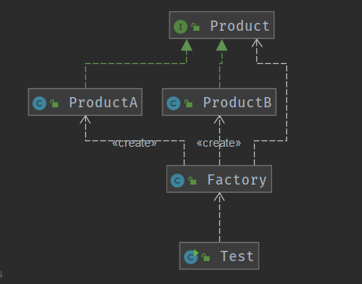

## 简单工厂模式

- 简单工厂模式是属于创建型模式，是工厂模式的一种。**简单工厂模式是由一个工厂对象决定创建出哪一种产品类的实例**。简单工厂模式是工厂模式家族中最简单实用的模式

- 简单工厂模式：定义了一个创建对象的类，由这个类来**封装实例化对象的行为**(代码)

- 在软件开发中，当我们会用到大量的创建某种、某类或者某批对象时，就会使用到工厂模式.

  1.创建产品接口和对象

  ```java
  public interface Product {
      //共同的方法
  }
  public class ProductA implements Product {
      public ProductA(){
          System.out.println("ProductA");
      }
  }
  public class ProductB implements Product {
      public ProductB(){
          System.out.println("ProductB");
      }
  }
  ```

  2.创建简单工厂

  ```java
  public class Factory {
  
      public static Product create(String str){
          if (str.equals("ProductA")){
              return new ProductA();
          }else if (str.equals("ProductB")){
              return new ProductB();
          }
          return null;
      }
  
  }
  ```

  3.调用

  ```java
  public class Test {
      public static void main(String[] args) {
          Factory.create("ProductA");
          Factory.create("ProductB");
      }
  }
  /*
  ProductA
  ProductB
  */
  ```




**应用实例：**

1、您需要一辆汽车，可以直接从工厂里面提货，**而不用去管这辆汽车是怎么做出来的，以及这个汽车里面的具体实现**

2、Hibernate 换数据库只需换方言和驱动就可以

**优点：**

1、一个调用者想创建一个对象，**只要知道其名称就可以了**

2、扩展性高，**如果想增加一个产品，只要扩展一个工厂类就可以**

3、屏蔽产品的具体实现，**调用者只关心产品的接口**

**缺点：**

每次增加一个产品时，都需要增加一个具体类和对象实现工厂，使得系统中类的个数成倍增加，**在一定程度上增加了系统的复杂度，同时也增加了系统具体类的依赖**

这并不是什么好事

**使用场景：**

1、**日志记录器**：记录可能记录到本地硬盘、系统事件、远程服务器等，用户可以选择记录日志到什么地方

2、**数据库访问**，当用户不知道最后系统采用哪一类数据库，以及数据库可能有变化时

3、**设计一个连接服务器的框架**，需要三个协议，”**POP3**″、”**IMAP**”、”**HTTP**”，可以把这三个**作为产品类，共同实现一个接口**


## 工厂方法模式

所有工厂模式都用来封装对象创建，工厂方法模式通过让子类决定该创建的对象是什么，来达到将对象创建的过程封装的目的。

**工厂方法模式**定义了一个创建对象的接口，但由子类决定要实例化的类是哪一个，**工厂方法让类把实例化推迟到子类**

1. 创建产品接口和产品

   ```java
   public interface Product {
       //共同的方法
   }
   public class ProductA implements Product {
       public ProductA(){
           System.out.println("ProductA");
       }
   }
   public class ProductB implements Product {
       public ProductB(){
           System.out.println("ProductB");
       }
   }
   ```

2. 创建工厂接口，具体产品的工厂类

   ```java
   public interface Factory {
   
       public  Product create();
   }
   public class FactoryA implements Factory{
   
       @Override
       public Product create() {
           return new ProductA();
       }
   }
   public class FactoryB implements Factory {
   
       @Override
       public Product create() {
           return new ProductB();
       }
   }
   ```

3. 测试

   ```java
   public class Test {
       public static void main(String[] args) {
          Factory factory;
          factory = new FactoryA();
          factory.create();
          factory = new FactoryB();
          factory.create();
       }
   }
   /*ProductA
   ProductB*/
   ```


简单工厂和工厂方法之间的差异？

简单工厂是在一个地方把所有的事都处理完了，然而工厂方法却是创建一个框架，让子类决定要如何实现。简单工厂的做法，可以将对象的创建封装起来，但是简单工厂不具备工厂方法的弹性，因为简单工厂不能变更正在创建的产品。

## 抽象工厂模式

**抽象工厂模式：定义了一个interface用于创建相关或有依赖关系的对象簇，而无需指明具体的类**

- 抽象工厂模式可以将**简单工厂模式**和**工厂方法模式**进行整合。
- 从设计层面看，抽象工厂模式就是对简单工厂模式的改进(或者称为进一步的抽象)。 将工厂抽象成两层，AbsFactory(抽象工厂) 和 具体实现的工厂子类。程序员可以
- 根据创建对象类型使用对应的工厂子类。这样将单个的简单工厂类变成了**工厂簇**，更利于代码的维护和扩展。

案例

1. 创建Product产品类

   ```java
   public interface Product {
       //共同的方法
   }
   public class ProductA implements Product {
       public ProductA(){
           System.out.println("ProductA");
       }
   }
   public class ProductB implements Product {
       public ProductB(){
           System.out.println("ProductB");
       }
   }
   ```

2. 创建Gift产品类

   ```java
   public interface Gift {
   }
   public class GiftA implements Gift {
       public GiftA() {
           System.out.println("GiftA");
       }
   }
   public class GiftB implements Gift {
       public GiftB() {
           System.out.println("GiftB");
       }
   }
   
   ```

3. 创建抽象工厂

   ```java
   public interface Factory {
   
       public Product createProduct();
       public Gift createGift();
   }
   ```

4. 创建A,B两个工厂实现类

   ```java
   public class FactoryA implements Factory {
   
       @Override
       public Product createProduct() {
           return new ProductA();
       }
   
       @Override
       public Gift createGift() {
           return new GiftA();
       }
   }
   
   public class FactoryB implements Factory {
   
       @Override
       public Product createProduct() {
           return new ProductA();
       }
   
       @Override
       public Gift createGift() {
           return new GiftA();
       }
   }
   ```

5. 测试

   ```java
   public class Test {
       public static void main(String[] args) {
           Factory factory;
           factory = new FactoryA();
           factory.createProduct();
           factory.createGift();
           factory = new FactoryB();
           factory.createProduct();
           factory.createGift();
       }
   }
   /*ProductA
   GiftA
   ProductB
   GiftA*/
   ```

   

   

**缺点：**

产品族**扩展非常困难**，要增加一个系列的某一产品，既要在抽象的 Creator 里加代码，又要在具体的里面加代码

**使用场景：**

1、QQ 换皮肤，一整套一起换

2、生成不同操作系统的程序

 **注意事项：**

产品族难扩展，产品等级易扩展

区别：

工厂方法模式： 一个抽象产品类，可以派生出多个具体产品类。 一个抽象工厂类，可以派生出多个具体工厂类。  每个具体工厂类只能创建一个具体产品类的实例。

抽象工厂模式： 多个抽象产品类，每个抽象产品类可以派生出多个具体产品类。  一个抽象工厂类，可以派生出多个具体工厂类。  每个具体工厂类可以创建多个具体产品类的实例。    

区别： 工厂方法模式只有一个抽象产品类，而抽象工厂模式有多个。  工厂方法模式的具体工厂类只能创建一个具体产品类的实例，而抽象工厂模式可以创建多个


在service层中

```java
Dao userDao = new UserDao
```

这个代码导致了Service层和Dao层紧密结合


## 如何选择

- 从设计原则来说，简单工厂模式不符合开闭原则。但是很神奇，在实际场景中，简单工厂模式确实用的最多的。个人觉得有以下这些原因
  - 相对实现方式比较简单，维护起来也不困难。
  - 实际场景中需要工厂模式创建的对象数量一般也不会特别多。
  - 可以通过**反射+外部配置文件**的手段解决开闭原则的问题。
- 工厂方法模式是专门用于解决单个对象创建工作，本身模式没问题，也符合开闭原则。但是**存在工厂类数量膨胀的问题。**如果需要创建的工厂类不是很多，是一种不错的选择。
- 抽象工厂模式天生就是为**生产产品族**而生的。所以如果你需要创建的对象非常之多，但是对象之间存在明显产品族特征，那么这个时候用抽象工厂模式非常合适。

## JDK中的工厂模式

**JDK-Calendar**

```java
private static Calendar createCalendar(TimeZone zone,
                                       Locale aLocale)
{
    CalendarProvider provider =
        LocaleProviderAdapter.getAdapter(CalendarProvider.class, aLocale)
                             .getCalendarProvider();
    if (provider != null) {
        try {
            return provider.getInstance(zone, aLocale);
        } catch (IllegalArgumentException iae) {
            // fall back to the default instantiation
        }
    }

    Calendar cal = null;

    if (aLocale.hasExtensions()) {
        String caltype = aLocale.getUnicodeLocaleType("ca");
        if (caltype != null) {
            switch (caltype) {
            case "buddhist":
            cal = new BuddhistCalendar(zone, aLocale);
                break;
            case "japanese":
                cal = new JapaneseImperialCalendar(zone, aLocale);
                break;
            case "gregory":
                cal = new GregorianCalendar(zone, aLocale);
                break;
            }
        }
    }
    if (cal == null) {
        // If no known calendar type is explicitly specified,
        // perform the traditional way to create a Calendar:
        // create a BuddhistCalendar for th_TH locale,
        // a JapaneseImperialCalendar for ja_JP_JP locale, or
        // a GregorianCalendar for any other locales.
        // NOTE: The language, country and variant strings are interned.
        if (aLocale.getLanguage() == "th" && aLocale.getCountry() == "TH") {
            cal = new BuddhistCalendar(zone, aLocale);
        } else if (aLocale.getVariant() == "JP" && aLocale.getLanguage() == "ja"
                   && aLocale.getCountry() == "JP") {
            cal = new JapaneseImperialCalendar(zone, aLocale);
        } else {
            cal = new GregorianCalendar(zone, aLocale);
        }
    }
    return cal;
}
```

除了日历类还有JDBC，当我们需要MySQL数据库的驱动时，我们就传MySQL的参数，用Oracle的就传相应的参数