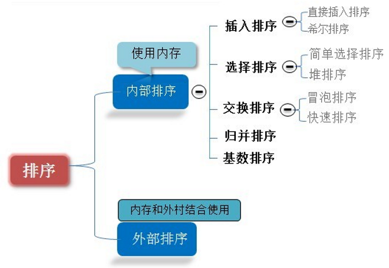
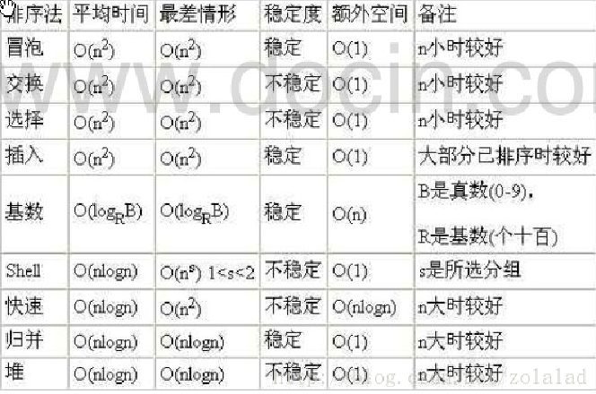
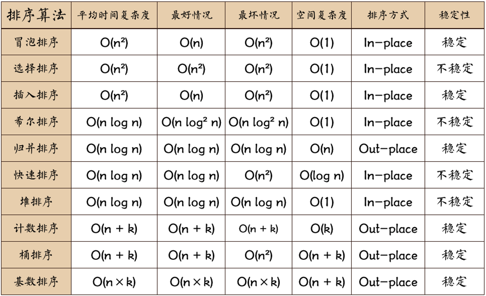
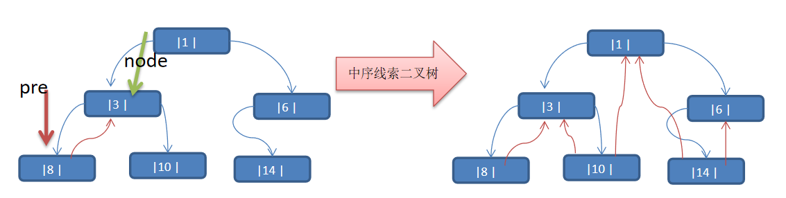

## 线性结构和非线性结构

<!--more-->

线性结构常见的有：数组、队列、链表和栈

非线性结构包括：二维数组，多维数组，广义表，树结构，图结构

## 稀疏数组

当一个数组中大部分元素为０，或者为同一个值的数组时，可以使用稀疏数组来保存该数组。

稀疏数组的处理方法是:
记录数组一共有几行几列，有多少个不同的值
把具有不同值的元素的行列及值记录在一个小规模的数组中，从而缩小程序的规模

- 使用稀疏数组，来保留类似前面的二维数组(棋盘、地图等等)
  把稀疏数组存盘，并且可以从新恢复原来的二维数组数

## 队列

循环队列

rear = （rear+1）%maxSize ；front = （front+1）%maxSize ；公式进行指针计算。

队空状态的条件为：front = rear。而如果整个队列全部存满数据那么，队满的条件也是front = rear；所以循环队列需要损失一个存储空间

队列内个数（rear+maxSize-front）%maxSize;

## 链表

```java
public class Node {

    public Object data;
    public Node next;

    public Node(Object e){
        this.data=e;
    }

}
```

#### 双向链表

添加 

- 找到最好的一个节点temp
- temp.next = newnode
- newnode.pre = temp

删除

- 找到这个节点temp
- temp.pre.next = temp.next
- temp.next.pre = temp.pre

#### 约瑟夫问题

单向环形列表

Josephu  问题为：设编号为1，2，… n的n个人围坐一圈，约定编号为**k**（1<=k<=n）的人从1开始报数，数到**m** 的那个人出列，它的下一位又从1开始报数，数到m的那个人又出列，依次类推，直到所有人出列为止，由此产生一个出队编号的序列。

用一个不带头结点的循环链表来处理Josephu 问题：**先构成一个有n个结点的单循环链表，然后由k结点起从1开始计数，计到m时，对应结点从链表中删除，然后再从被删除结点的下一个结点又从1开始计数，直到最后一个结点从链表中删除算法结束。**

构建一个单向环形链表

- 创建第一个节点，让first指向该点，并形成环形。
- 每创建一个新的节点，就把该节点，加入到已有的环形链表中即可

遍历

- 让辅助指针指向curboy,指向first
- while循环遍历直到curBoy.next=first

根据用户的输入

- n=5 5个人
- k=1 从第一个人开始报数
- m=2 输两下

解决

- 创建一个辅助指针helper ,指向链表的最后一个节点
- 报数前，让first和helper移动 k-1
- 当报数时，first个helper同时移动m-1;
- first指向的小孩出圈
  - first = first.next
  - helper.next = first

5个小孩出圈顺序 2->4->1->5->3

## 栈

先入后出

#### 应用

- 子程序的调用：在跳往子程序前，会先将下个指令的地址存到堆栈中，直到子程序执行完后再将地址取出，以回到原来的程序中。 	
- 处理递归调用：和子程序的调用类似，只是除了储存下一个指令的地址外，也将参数、区域变量等数据存入堆栈中。
- 表达式的转换[中缀表达式转后缀表达式]与求值(实际解决)。
- 二叉树的遍历。
- 图形的深度优先(depth一first)搜索法

#### 计算器实现

1. 遍历表达式
2. 数字如数栈
3. 符号
   1. 栈空就入栈
   2. 不为空，就比较优先级，**如果当前操作符的优先级小于，就需要从数栈中pop两个数**，在pop一个符号，将结果入数栈，然后将操作符如入符号栈，**如果当前操作符大于栈中的操作符， 加载直接入符**号栈
4. 扫描完毕，就顺序从数栈和符号栈中pop出相应的数和符号，并运行
5. 只有一个数字，就是结果

#### 前缀、中缀、后缀表达式(逆波兰表达式)

前缀表达式(波兰表达式)

- 前缀表达式又称波兰式，前缀表达式的运算符位于操作数之前
  举例说明： (3+4)×5-6 对应的前缀表达式就是 - × + 3 4 5 6

  前缀表达式的计算机求值

  **从右至左扫描表达式**，遇到数字时，将数字压入堆栈，遇到运算符时，弹出栈顶的两个数，用运算符对它们做相应的计算（栈顶元素 和 次顶元素），并将结果入栈；重复上述过程直到表达式最左端，最后运算得出的值即为表达式的结果

  例如: (3+4)×5-6 对应的前缀表达式就是 - × + 3 4 5 6 , 针对前缀表达式求值步骤如下:

  
  
  - 从右至左扫描，将6、5、4、3压入堆栈
  
  - 遇到+运算符，因此弹出3和4（3为栈顶元素，4为次顶元素），计算出3+4的值，得7，再将7入栈
  
  - 接下来是×运算符，因此弹出7和5，计算出7×5=35，将35入栈
  - 最后是-运算符，计算出35-6的值，即29，由此得出最终结果


后缀表达式

```txt
后缀表达式又称逆波兰表达式,与前缀表达式相似，只是运算符位于操作数之后
中举例说明： (3+4)×5-6 对应的后缀表达式就是 3 4 + 5 × 6 –
```
**从左至右**扫描表达式，遇到数字时，将数字压入堆栈，遇到运算符时，弹出栈顶的两个数，用运算符对它们做相应的计算（次顶元素 和 栈顶元素），并将结果入栈；重复上述过程直到表达式最右端，最后运算得出的值即为表达式的结果

##### 中缀表达式转后缀表达式

1)初始化两个栈:运算符栈s1和储存中间结果的栈s2;

2)从左至右扫描中缀表达式;

3)遇到操作数时，将其压s2;

4)遇到运算符时，比较其与s1栈顶运算符的优先级:

​	1.如果s1为空，或栈顶运算符为左括号“”，则直接将此运算符入栈;

​	2.否则，若优先级比栈顶运算符的高，也将运算符压入s1;

​	3.否则，将s1栈顶的运算符弹出并压入到s2中，再次转到(4-1)与s1中新的栈顶运算符相比较;

5)遇到括号时:

​	(1)如果是左括号“(”，则直接压入s1

​	(2)如果是右括号“)”，则依次弹出s1栈顶的运算符，并压入s2，直到遇到左括号为止，此时将这一-对括号丢弃

6)重复步骤2至5，直到表达式的最右边

7)将s1中剩余的运算符依次弹出并压入s2

8)依次弹出s2中的元素并输出，结果的逆即为中缀表达式对应的后缀表达式

## 递归

### 迷宫问题

### 八皇后问题(回溯算法)

任意两个皇后都不能处于同一行、同一列或同一斜线上，问有多少种摆法。

- 第一个皇后先放第一行第一列
- 第二个皇后放在第二行第一列、然后判断是否OK， 如果不OK，继续放在第二列、第三列、依次把所有列都放完，找到一个合适
- 继续第三个皇后，还是第一列、第二列……直到第8个皇后也能放在一个不冲突的位置，算是找到了一个正确解
- 当得到一个正确解时，在栈回退到上一个栈时，就会开始回溯，即将第一个皇后，放到第一列的所有正确解，全部得到.
- 然后回头继续第一个皇后放第二列，后面继续循环执行 1,2,3,4的步骤 

## 排序算法







- n: 数据规模
- k: “桶”的个数
- In-place: 占用常数内存，不占用额外内存
- Out-place: 占用额外内存

稳定的排序算法：冒泡排序、插入排序、归并排序和基数排序

不是稳定的排序算法：选择排序、快速排序、希尔排序、堆排序

Ο(1)＜Ο(log2n)＜Ο(n)＜Ο(nlog2n)＜Ο(n2)＜Ο(n3)＜ Ο(nk) ＜Ο(2n) 

[https://github.com/CyC2018/CS-Notes/blob/master/notes/%E7%AE%97%E6%B3%95%20-%20%E6%8E%92%E5%BA%8F.md](https://github.com/CyC2018/CS-Notes/blob/master/notes/算法 - 排序.md)

### 冒泡排序

对待排序序列从前向后（从下标较小的元素开始）,依次比较相邻元素的值，若发现逆序则交换，使值较大的元素逐渐从前移向后部，就象水底下的气泡一样逐渐向上冒。

**如果一趟比较下来没有进行过交换，就说明序列有序**

```java
//冒泡排序算法,O(n*n)
public static void bubbleSort(int[] arr) {
    int temp = 0; // 临时变量
    boolean flag = false; // 标识变量，表示是否进行过交换
    for (int i = 0; i < arr.length - 1; i++) {

        for (int j = 0; j < arr.length - 1 - i; j++) {
            // 如果前面的数比后面的数大，则交换
            if (arr[j] > arr[j + 1]) {
                flag = true;
                temp = arr[j];
                arr[j] = arr[j + 1];
                arr[j + 1] = temp;
            }
        }
        if (!flag) { // 在一趟排序中，一次交换都没有发生过
            break;
        } else {
            flag = false; // 重置flag!!!, 进行下次判断
        }
    }
}
//8w数据 13066ms
```

### 选择排序

从数组中选择最小元素，将它与数组的第一个元素交换位置。再从数组剩下的元素中选择出最小的元素，将它与数组的第二个元素交换位置。不断进行这样的操作，直到将整个数组排序。

```java
public static void selectSort(int arr[]){
    //选择排序时间复杂度是 O(n^2)
    for (int i = 0; i < arr.length - 1; i++) {
        int minIndex = i;
        int min = arr[i];
        for (int j = i + 1; j < arr.length; j++) {
            if (min > arr[j]) { // 说明假定的最小值，并不是最小
                min = arr[j]; // 重置min
                minIndex = j; // 重置minIndex
            }
        }
        // 将最小值，放在arr[0], 即交换
        if (minIndex != i) {
            arr[minIndex] = arr[i];
            arr[i] = min;
        }
    }
}
//8w数据 2363ms
```

### 插入排序

每次都将当前元素插入到左侧已经排序的数组中，使得插入之后左侧数组依然有序。

插入排序的时间复杂度取决于数组的初始顺序，如果数组已经部分有序了，那么逆序较少，需要的交换次数也就较少，时间复杂度较低。

- 平均情况下插入排序需要 ~N2/4 比较以及 ~N2/4 次交换；
- 最坏的情况下需要 ~N2/2 比较以及 ~N2/2 次交换，最坏的情况是数组是倒序的；
- 最好的情况下需要 N-1 次比较和 0 次交换，最好的情况就是数组已经有序了。

```java
public static void insertSort(int[] arr) {
    int insertVal = 0;
    int insertIndex = 0;
    //使用for循环来把代码简化
    for(int i = 1; i < arr.length; i++) {
        //定义待插入的数
        insertVal = arr[i];
        insertIndex = i - 1; // 即arr[1]的前面这个数的下标

        // 给insertVal 找到插入的位置
        // 说明
        // 1. insertIndex >= 0 保证在给insertVal 找插入位置，不越界
        // 2. insertVal < arr[insertIndex] 待插入的数，还没有找到插入位置
        // 3. 就需要将 arr[insertIndex] 后移
        while (insertIndex >= 0 && insertVal < arr[insertIndex]) {
            arr[insertIndex + 1] = arr[insertIndex];// arr[insertIndex]
            insertIndex--;
        }
        // 当退出while循环时，说明插入的位置找到, insertIndex + 1
        // 举例：理解不了，我们一会 debug
        //这里我们判断是否需要赋值
        if(insertIndex + 1 != i) {
            arr[insertIndex + 1] = insertVal;
        }
    }
}
//8w数据 680ms
```

当需要插入的数是较小的数时，后移的次数明显增多，对效率有影响.

### 希尔排序

缩小增量排序

对于大规模的数组，插入排序很慢，因为它只能交换相邻的元素，每次只能将逆序数量减少 1。希尔排序的出现就是为了解决插入排序的这种局限性，它通过交换不相邻的元素，每次可以将逆序数量减少大于 1。

```java
public static void shellSort(int[] arr) {

    int temp = 0;
    // 根据前面的逐步分析，使用循环处理
    for (int gap = arr.length / 2; gap > 0; gap /= 2) {
        for (int i = gap; i < arr.length; i++) {
            // 遍历各组中所有的元素(共gap组，每组有个元素), 步长gap
            temp = arr[i];
            int j;
            for (j = i - gap; j >= 0 && arr[j] > temp; j -= gap) {
                // 如果当前元素大于加上步长后的那个元素，说明交换
                arr[j+gap] = arr[j];
            }
            arr[j+gap] = temp;
        }
    }
}
//8w数据 17ms  80w 220 800w 2949
```

### 快速排序

快速排序（Quicksort）是对冒泡排序的一种改进。基本思想是：通过一趟排序将要排序的数据分割成独立的两部分，其中一部分的所有数据都比另外一部分的所有数据都要小，然后再按此方法对这两部分数据分别进行快速排序，整个排序过程可以递归进行，以此达到整个数据变成有序序列

```java
public static void quickSort(int[] array, int left, int right) {
    if(left > right) {
        return;
    }
    // base中存放基准数
    int base = array[left];   //选择要比较的数据
    int i = left, j = right;
    while(i != j) {
        // 顺序很重要，先从右边开始往左找，直到找到比base值小的数
        while(array[j] >= base && i < j) {
            j--;
        }

        // 再从左往右边找，直到找到比base值大的数
        while(array[i] <= base && i < j) {
            i++;
        }

        // 上面的循环结束表示找到了位置或者(i>=j)了，交换两个数在数组中的位置
        if(i < j) {
            int tmp = array[i];
            array[i] = array[j];
            array[j] = tmp;
        }
    }

    // 将基准数放到中间的位置（基准数归位）
    array[left] = array[i];
    array[i] = base;

    // 递归，继续向基准的左右两边执行和上面同样的操作
    // i的索引处为上面已确定好的基准值的位置，无需再处理
    quickSort(array, left, i - 1);
    quickSort(array, i + 1, right);
}

//8w 40ms 80w 147ms 800w 1298 
```

空间换时间 综合上比希尔排序快

最坏的情况下，第一次从最小的元素切分，第二次从第二小的元素切分，如此这般。因此最坏的情况下需要比较 N2/2。为了防止数组最开始就是有序的，在进行快速排序时需要随机打乱数组。

### 归并排序

利用归并的思想实现的排序方法

- 申请空间，使其大小为两个已经排序序列之和，该空间用来存放合并后的序列；
- 设定两个指针，最初位置分别为两个已经排序序列的起始位置；
- 比较两个指针所指向的元素，选择相对小的元素放入到合并空间，并移动指针到下一位置；
- 重复步骤     3 直到某一指针达到序列尾；
- 将另一序列剩下的所有元素直接复制到合并序列尾。

```java
//分
public static void  mergeSort(int arr[], int left, int right, int temp[]){
    if (left <right){
        int mid = (left+right)/2;
        mergeSort(arr,left,mid,temp);
        mergeSort(arr,mid+1,right,temp);
        //合并
        merge(arr,left,mid,right,temp);
    }
}

//合并
public static void merge(int arr[], int left, int mid, int right,int temp[]){
    int i = left; //右边索引
    int j = mid+1; //左边索引
    int t = 0; //执行temp数组的当前索引

    //先把左右两边的数据填充到temp ,直到左右两边的有序序列，有一边处理完毕为止
    while (i<=mid && j<=right){
        //把昨天的数组拷贝到temp
        if (arr[i] <= arr[j]){
            temp[t++] = arr[i++];
        }else { //将右边有序序列填充
            temp[t++] = arr[j++];
        }
    }

    //把有剩余数据的一边，填充到temp
    while ( i <= mid){
        temp[t++] = arr[i++];
    }

    while ( j<= right){
        temp[t++] = arr[j++];
    }

    //把temp拷贝到arr
    //不是每次都拷贝所有
    t = 0;
    int tempLeft = left;
    while ( tempLeft <= right){
        arr[tempLeft++] = temp[t++];
    }
}
//8w 34ms 80w 177 800w 1765
```


（1）稳定性
     　归并排序是一种**稳定的排序**。
（2）存储结构要求
    　可用顺序存储结构。也易于在链表上实现。
（3）时间复杂度
    　对长度为n的文件，需进行趟二路归并，每趟归并的时间为O(n)，故其时间复杂度无论是在最好情况下还是在最坏情况下均是**O(nlogn)**。
（4）空间复杂度
   　 需要一个辅助向量来暂存两有序子文件归并的结果，故其辅助空间复杂度为O(n)，显然它不是就地排序。

### 基数排序

- 稳定性的排序
- 桶排序的扩展
- 将整数按位数切割成不同的数字，然后按每个位数分别比较。

将所有待比较数值统一为同样的数位长度，数位较短的数前面补零。然后，从最低位开始，依次进行一次排序。这样从最低位排序一直到最高位排序完成以后, 数列就变成一个有序序列。

```java
public static void radixSort(int arr[]){
    //1. 得到数组中最大的数的位数
    int max = arr[0]; //假设第一数就是最大数
    for(int i = 1; i < arr.length; i++) {
        if (arr[i] > max) {
            max = arr[i];
        }
    }
    //得到最大数是几位数
    int maxLength = (max + "").length();


    //定义一个二维数组，表示10个桶, 每个桶就是一个一维数组
    //说明
    //1. 二维数组包含10个一维数组
    //2. 为了防止在放入数的时候，数据溢出，则每个一维数组(桶)，大小定为arr.length
    //3. 名明确，基数排序是使用空间换时间的经典算法
    int[][] bucket = new int[10][arr.length];

    //为了记录每个桶中，实际存放了多少个数据,我们定义一个一维数组来记录各个桶的每次放入的数据个数
    //可以这里理解
    //比如：bucketElementCounts[0] , 记录的就是  bucket[0] 桶的放入数据个数
    int[] bucketElementCounts = new int[10];


    //这里我们使用循环将代码处理

    for(int i = 0 , n = 1; i < maxLength; i++, n *= 10) {
        //(针对每个元素的对应位进行排序处理)， 第一次是个位，第二次是十位，第三次是百位..
        for(int j = 0; j < arr.length; j++) {
            //取出每个元素的对应位的值
            int digitOfElement = arr[j] / n % 10;
            //放入到对应的桶中
            bucket[digitOfElement][bucketElementCounts[digitOfElement]++] = arr[j];
        }
        //按照这个桶的顺序(一维数组的下标依次取出数据，放入原来数组)
        int index = 0;
        //遍历每一桶，并将桶中是数据，放入到原数组
        for(int k = 0; k < bucketElementCounts.length; k++) {
            //如果桶中，有数据，我们才放入到原数组
            if(bucketElementCounts[k] != 0) {
                //循环该桶即第k个桶(即第k个一维数组), 放入
                for(int l = 0; l < bucketElementCounts[k]; l++) {
                    //取出元素放入到arr
                    arr[index++] = bucket[k][l];
                }
            }
            //第i+1轮处理后，需要将每个 bucketElementCounts[k] = 0 ！！！！
            bucketElementCounts[k] = 0;
        }
    }
}

//8w 23ms  80w 95ms 800 518ms
```

空间换时间 耗费额外的内存空间

## 查找

- 顺序(线性)查找

  ```java
  public static int seqSearch(int[] arr, int value) {
      // 线性查找是逐一比对，发现有相同值，就返回下标
      for (int i = 0; i < arr.length; i++) {
          if(arr[i] == value) {
              return i;
          }
      }
      return -1;
  }
  ```

- 二分查找/折半查找

  ```java
  public static int binarySearch(int[] arr, int left, int right, int findVal) {
      // 当 left > right 时，说明递归整个数组，但是没有找到
      if (left > right) {
          return -1;
      }
      int mid = (left + right) / 2;
      int midVal = arr[mid];
  
      if (findVal > midVal) { // 向 右递归
          return binarySearch(arr, mid + 1, right, findVal);
      } else if (findVal < midVal) { // 向左递归
          return binarySearch(arr, left, mid - 1, findVal);
      } else {
          return mid;
      }
  }
  
  //非递归
  public static int binarySearch(int[] arr,int target){
          int left = 0;
          int right =arr.length-1;
          while ((left <= right)){
              int mid = (left+right)/2;
              if (arr[mid] > target){
                  right = mid -1; //向左边查找
              }else if(arr[mid] < target){
                  left = mid + 1;
              }else {
                  return mid;
              }
          }
          return -1;
      }
  ```

  {1,8, 10, 89, 1000, 1000，1234} 当一个有序数组中，有多个相同的数值时，如何将所有的数值都查找到，比如这里的 1000.

  ```java
  public static List<Integer> binarySearch2(int[] arr, int left, int right, int findVal) {
      // 当 left > right 时，说明递归整个数组，但是没有找到
      if (left > right) {
          return new ArrayList<Integer>();
      }
      int mid = (left + right) / 2;
      int midVal = arr[mid];
  
      if (findVal > midVal) { // 向 右递归
          return binarySearch2(arr, mid + 1, right, findVal);
      } else if (findVal < midVal) { // 向左递归
          return binarySearch2(arr, left, mid - 1, findVal);
      } else {
          //        * 思路分析
          //        * 1. 在找到mid 索引值，不要马上返回
          //        * 2. 向mid 索引值的左边扫描，将所有满足 1000， 的元素的下标，加入到集合ArrayList
          //        * 3. 向mid 索引值的右边扫描，将所有满足 1000， 的元素的下标，加入到集合ArrayList
          //        * 4. 将Arraylist返回
  
          List<Integer> resIndexlist = new ArrayList<Integer>();
          //向mid 索引值的左边扫描，将所有满足 1000， 的元素的下标，加入到集合ArrayList
          int temp = mid - 1;
          while(true) {
              if (temp < 0 || arr[temp] != findVal) {//退出
                  break;
              }
              //否则，就temp 放入到 resIndexlist
              resIndexlist.add(temp);
              temp -= 1; //temp左移
          }
          resIndexlist.add(mid);  //
          //向mid 索引值的右边扫描，将所有满足 1000， 的元素的下标，加入到集合ArrayList
          temp = mid + 1;
          while(true) {
              if (temp > arr.length - 1 || arr[temp] != findVal) {//退出
                  break;
              }
              //否则，就temp 放入到 resIndexlist
              resIndexlist.add(temp);
              temp += 1; //temp右移
          }
          return resIndexlist;
      }
  }
  ```

- 插值查找

int mid = low + (high - low) * (key - arr[low]) / (arr[high] - arr[low])  ;/*插值索引*/

对应前面的代码公式：int mid = left + (right – left) * (findVal – arr[left]) / (arr[right] – arr[left])


```java
public static int insertValueSearch(int[] arr, int left, int right, int findVal) {
    //注意：findVal < arr[0]  和  findVal > arr[arr.length - 1] 必须需要
    //否则我们得到的 mid 可能越界
    if (left > right || findVal < arr[0] || findVal > arr[arr.length - 1]) {
        return -1;
    }
    // 求出mid, 自适应
    int mid = left + (right - left) * (findVal - arr[left]) / (arr[right] - arr[left]);
    int midVal = arr[mid];
    if (findVal > midVal) { // 说明应该向右边递归
        return insertValueSearch(arr, mid + 1, right, findVal);
    } else if (findVal < midVal) { // 说明向左递归查找
        return insertValueSearch(arr, left, mid - 1, findVal);
    } else {
        return mid;
    }

}
```

对于数据量较大，关键字分布比较均匀的查找表来说，采用插值查找, 速度较快.
关键字分布不均匀的情况下，该方法不一定比折半查找要好

- 斐波那契查找

斐波那契(黄金分割法)原理:
斐波那契查找原理与前两种相似，仅仅改变了中间结点（mid）的位置，mid不再是中间或插值得到，而是位于黄金分割点附近，即mid=low+F(k-1)-1

## 哈希表

有一个公司,当有新的员工来报道时,要求将该员工的信息加入(id,性别,年龄,住址..),当输入该员工的id时,要求查找到该员工的 所有信息.

要求: 不使用数据库,尽量节省内存,速度越快越好=>哈希表(散列)

散列表（Hash table，也叫哈希表），是根据**关键码值**(Key value)而直接进行访问的数据结构。也就是说，它通过把关键码值映射到表中一个位置来访问记录，以加快查找的速度。这个映射函数叫做**散列函数**，存放记录的数组叫做散列表。

## 树

数组存储方式的分析

- 优点：通过下标方式访问元素，速度快。对于有序数组，还可使用二分查找提高检索速度。
- 缺点：如果要检索具体某个值，或者插入值(按一定顺序)会整体移动，效率较低

链式存储方式的分析

- 优点：在一定程度上对数组存储方式有优化(比如：插入一个数值节点，只需要将插入节点，链接到链表中即可， 删除效率也很好)。
- 缺点：在进行检索时，效率仍然较低，比如(检索某个值，需要从头节点开始遍历) 

树存储方式的分析

- 能提高数据存储，读取的效率,  比如利用 二叉排序树(Binary Sort Tree)，既可以保证数据的检索速度，同时也可以保证数据的插入，删除，修改的速度。

**二叉树**

1）在二叉树的第i层上最多有2i-1 个节点 。（i>=1）

2）二叉树中如果深度为k,那么最多有2k-1个节点。(k>=1）

3）n0=n2+1 n0表示度数为0的节点数，n2表示度数为2的节点数。

4）在完全二叉树中，具有n个节点的完全二叉树的深度为[log2n]+1，其中[log2n]是向下取整。

5）若对含 n 个结点的完全二叉树从上到下且从左至右进行 1 至 n 的编号，则对完全二叉树中任意一个编号为 i 的结点有如下特性：

- (1) 若     i=1，则该结点是二叉树的根，无双亲, 否则，编号为 [i/2] 的结点为其双亲结点;
- (2) 若     2i>n，则该结点无左孩子， 否则，编号为 2i 的结点为其左孩子结点；
- (3) 若     2i+1>n，则该结点无右孩子结点， 否则，编号为2i+1 的结点为其右孩子结点。

**线索化二叉树**

n个结点的二叉链表中含有n+1  【公式 2n-(n-1)=n+1】 个空指针域。利用二叉链表中的空指针域，存放指向该结点在某种遍历次序下的前驱和后继结点的指针（这种附加的指针称为"线索"）
这种加上了线索的二叉链表称为线索链表，相应的二叉树称为线索二叉树(Threaded BinaryTree)。**根据线索性质的不同，线索二叉树可分为前序线索二叉树、中序线索二叉树和后序线索二叉树三种**
一个结点的前一个结点，称为前驱结点
一个结点的后一个结点，称为后继结点




遍历线索化二叉树

说明：对前面的中序线索化的二叉树， 进行遍历
分析：因为线索化后，各个结点指向有变化，因此原来的遍历方式不能使用，这时需要使用新的方式遍历线索化二叉树，各个节点可以通过线型方式遍历，因此无需使用递归方式，这样也提高了遍历的效率。 遍历的次序应当和中序遍历保持一致。

### 堆排序

堆排序是利用堆这种数据结构而设计的一种排序算法，堆排序是一种选择排序，它的最坏，最好，平均时间复杂度均为O(nlogn)，它也是**不稳定排序。**
堆是具有以下性质的完全二叉树：每个结点的值都大于或等于其左右孩子结点的值，称为大顶堆, 注意 : 没有要求结点的左孩子的值和右孩子的值的大小关系。
每个结点的值都小于或等于其左右孩子结点的值，称为小顶堆

- 将待排序序列构造成一个大顶堆
- 此时，整个序列的最大值就是堆顶的根节点。
- 将其与末尾元素进行交换，此时末尾就为最大值。
- 然后将剩余n-1个元素重新构造成一个堆，这样会得到n个元素的次小值。如此反复执行，便能得到一个有序序列了。

```java
public static void heapSort(int arr[]){
    int temp;
    for (int i = arr.length/2 - 1; i>=0 ; i--){
        adjustHeap(arr,i,arr.length);
    }
    //
    for (int j = arr.length-1; j>0;j--){
        temp = arr[j];
        arr[j] = arr[0];
        arr[0] = temp;
        adjustHeap(arr,0,arr.length);
    }
}

/**
 *将一个数组调整成大顶堆
 * @param arr 数组
 * @param i 非叶子节点索引
 * @param length 长度
 */
public static void  adjustHeap(int arr[], int i, int length){
    int temp = arr[i];
    for (int k = i * 2 + 1; k < length; k = k * 2 + 1){
        if (k+1< length && arr[k]<arr[k+1]){//左小于右
            k++;
        }
        if (arr[k]>temp){ //子节点大于父节点
            arr[i] = arr[k];
            i=k;
        }else {
            break;
        }
    }
    //将以i为父节点的值放在了堆顶
    arr[i] = temp; //将temp放到调整后的位置
}
//8w 11ms 80w 147ms 800w 2204ms
```

### 赫夫曼树

给定n个权值作为n个叶子结点，构造一棵二叉树，若该树的带权路径长度(wpl)达到最小，称这样的二叉树为最优二叉树，
赫夫曼树是**带权路径长度最短的树**，权值较大的结点离根较近。

**结点的权及带权路径长度**

**树的带权路径长度**

构成赫夫曼树的步骤：

- 从小到大进行排序, 将每一个数据，每个数据都是一个节点 ， 每个节点可以看成是一颗最简单的二叉树
- 取出根节点权值最小的两颗二叉树 
- 组成一颗新的二叉树, 该新的二叉树的根节点的权值是前面两颗二叉树根节点权值的和  
- 再将这颗新的二叉树，以根节点的权值大小 再次排序， 不断重复  1-2-3-4 的步骤，直到数列中，所有的数据都被处理，就得到一颗赫夫曼树

```java
 public static Node createHuffmanTree(int[] arr){

        // 1. 遍历 arr 数组
        // 2. 将arr的每个元素构成成一个Node
        // 3. 将Node 放入到ArrayList中
        List<Node> nodes = new ArrayList<Node>();
        for (int value : arr) {
            nodes.add(new Node(value));
        }
        while (nodes.size() > 1){
            //排序
            Collections.sort(nodes);
            //Collections.sort使用合并排序算法而不是快速排序。但是Arrays.sort使用快速排序

            //取出权值最小的
            Node left = nodes.get(0);
            Node right = nodes.get(1);

            //构建一颗新的二叉树
            Node parent = new Node(left.value+right.value);
            parent.left = left;
            parent.right = right;

            //删除2个节点
            nodes.remove(left);
            nodes.remove(right);
            nodes.add(parent);
        }
        return nodes.get(0);
    }

}

//节点类
class Node implements Comparable<Node>{
    int value;
    Node left;
    Node right;

    public Node(int value) {
        this.value = value;
    }

    @Override
    public String toString() {
        return "Node{" +
                "value=" + value +
                '}';
    }

    @Override
    public int compareTo(Node o) {
        //从小到大排序
        return this.value - o.value;
    }
}
```

赫夫曼编码

  哈夫曼编码(Huffman Coding)，又称霍夫曼编码，是一种编码方式, 属于一种程序算法

赫夫曼编码广泛地用于数据文件压缩。其压缩率通常在20%～90%之间

d:1 y:1 u:1 j:2  v:2  o:2  l:4  k:4  e:4 i:5  a:5   :9  // 各个字符对应的个数
0=  ,  1=a, 10=i, 11=e, 100=k, 101=l, 110=o, 111=v, 1000=j, 1001=u, 1010=y, 1011=d

- 说明：按照各个字符出现的次数进行编码，原则是出现次数越多的，则编码越小，比如 空格出现了9 次， 编码为0 ,其它依次类推.

字符的编码都不能是其他字符编码的前缀，符合此要求的编码叫做前缀编码， 即不能匹配到重复的编码

无损压缩

- Node {data 数据weight权值 left right }
- 字符串byte数组
- 准备构建赫夫曼的Node ,将节点放入list
- 创建对应huffman树

### 二叉排序树

：BST: (Binary Sort(Search) Tree), 对于二叉排序树的任何一个非叶子节点，要求左子节点的值比当前节点的值小，右子节点的值比当前节点的值大。
特别说明：如果有相同的值，可以将该节点放在左子节点或右子节点

二叉排序树创建和遍历

二叉排序树的删除

删除叶子节点 
删除只有一颗子树的节点
删除有两颗子树的节点.

### 平衡二叉树

它是一 棵空树或它的左右两个子树的高度差的绝对值不超过1，并且左右两个子树都是一棵平衡二叉树。平衡二叉树的常用实现方法有红黑树、AVL、替罪羊树、Treap、伸展树等。

左旋转

将A 节点的 右节点 的 左节点 ，指向 A节点
将 A节点的右节点，指向A 节点的右节点的左节点

二叉树与B树

B树通过重新组织节点，降低树的高度，并且减少i/o读写次数来提升效率。

2-3树

- 2-3树的所有叶子节点都在同一层.(只要是B树都满足这个条件)
- 有两个子节点的节点叫二节点，二节点要么没有子节点，要么有两个子节点.
- 有三个子节点的节点叫三节点，三节点要么没有子节点，要么有三个子节点.
- 2-3树是由二节点和三节点构成的树。

B树

就是B-树 关键字集合分布在整颗树中, 即叶子节点和非叶子节点都存放数据.

B+树

关键字都出现在叶子结点的链表中

即数据只能在叶子节点【也叫稠密索引】，非叶子结点相当于是叶子结点的索引（稀疏索引）

## 图

顶点(vertex)，边(edge)，路径，无向图，有向图，带权图

**邻接矩阵**

**矩阵上的每个坐标代表当前两个顶点之间是否有边，有边值为1，无边为0**

**邻接表**

邻接矩阵需要为每个顶点都分配n个边的空间，其实有很多边都是不存在,会造成空间的一定损失.
邻接表的实现只关心存在的边，不关心不存在的边。因此没有空间浪费，邻接表由数组+链表组成

### 深度优先遍历

深度优先遍历，从初始访问结点出发，初始访问结点可能有多个邻接结点，深度优先遍历的策略就是首先访问第一个邻接结点，然后再以这个被访问的邻接结点作为初始结点，访问它的第一个邻接结点， 可以这样理解：每次都在访问完当前结点后首先访问当前结点的第一个邻接结点。

### 广度优先遍历

类似于一个分层搜索的过程，广度优先遍历需要使用一个队列以保持访问过的结点的顺序，以便按这个顺序来访问这些结点的邻接结点