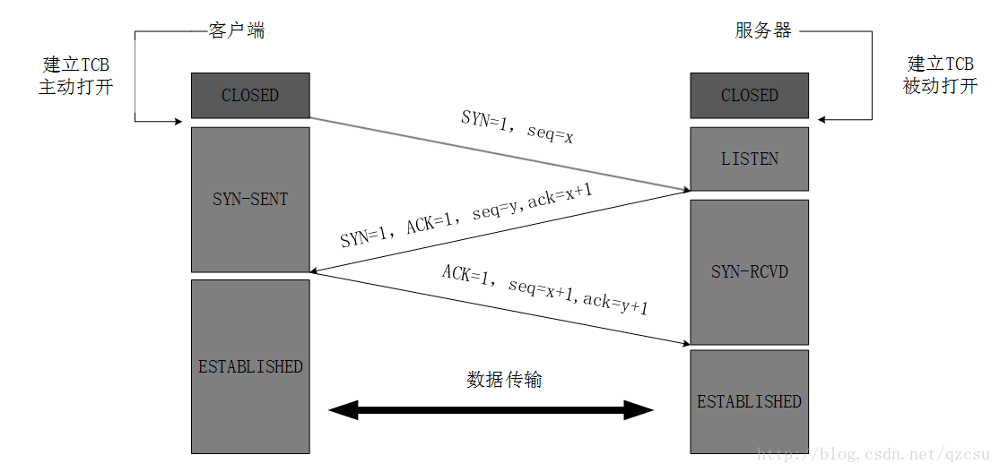
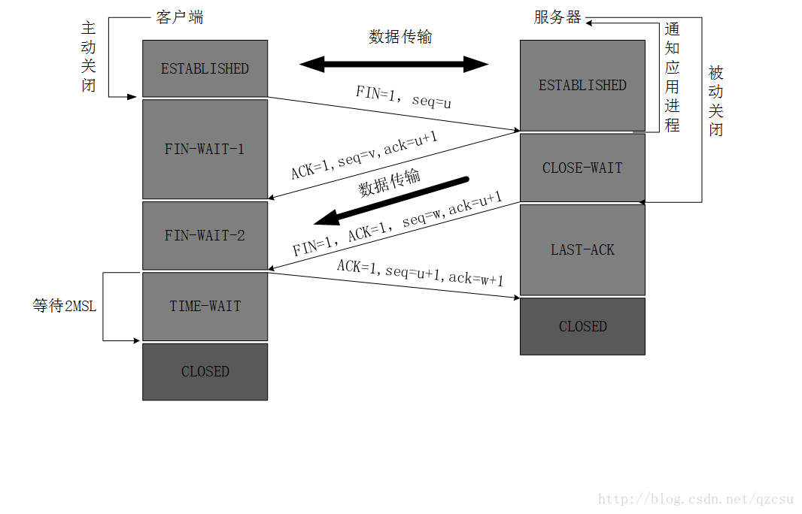
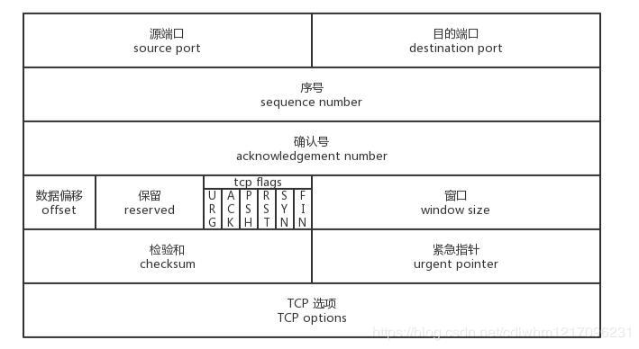
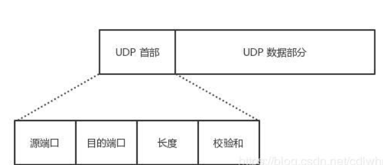

# 一、网络模型

**OSI分层 （7层）：**物理层、数据链路层、网络层、传输层、会话层、表示层、应用层。
**TCP/IP分层（4层）：**网络接口层、 网际层、运输层、 应用层。
**五层协议 （5层）：**物理层、数据链路层、网络层、运输层、 应用层。

物理层：

- **该层为上层协议提供了一个传输数据的可靠物理媒介**

- 数据的单位称为**比特**(bit)。
- 物理层的主要设备:中继器、集线器、适配器。
- 主要协议：IEEE802.3 

数据链路层

- **实现两个主机系统之间的数据传输透明**

- 数据的单位称为**帧**(frame)。
- 数据链路层主要设备:二层交换机、网桥。
- 主要协议：以太网协议ppp、MAC 

网络层

- **实现两个主机系统之间的数据传输透明,路由选择，连接的建立与终止等**，**它提供的服务使传输层不需要了解网络层的数据传输和交换技术**
- **数据包**
- 网络层主要设备:路由器
- 网络层协议的代表包括:IP、IPX、RIP、ARP、RARP、OSPF等。

传输层

- 进程之间的通信。提供端到端的可靠报文传递和错误恢复
- **TCP的叫段、UDP的叫数据报**
- TCP/UDP

会话层

- 建立、管理和终止会话
- 会话协议数据单元SPDU

表示层

- 对数据进行翻译、加密和压缩

应用层

- 允许访问OSI环境的手段
- TFTP，HHTP，SMTP,FTP,DN

在TCP/IP中会话层和表示层，应用层是应用层

# 二、TCP和UDP

## TCP和UCP的区别

|          | TCP                          | UDP                        |
| -------- | ---------------------------- | -------------------------- |
| 连接     | 有连接                       | 无连接                     |
| 可靠     | 可靠，使用流量控制和拥塞控制 | 不可靠，没有使用控制       |
| 有序     | 有序                         | 无序                       |
| 有界     | 无界                         | 有界                       |
| 重传机制 | 超时重传，快速重传           | 无                         |
| 连接对象 | 一对一                       | 一对一，一对多，多对多     |
| 传输方式 | 面向数据流                   | 面向报文                   |
| 首部开销 | 最小20字节，最大60字节       | 小，仅8字节                |
| 适用场景 | 可靠的应用传输（文件传输）   | 实时会议（视频会议，直播） |

是否有界

- **TCP通过字节流传输**TCP套接口有一个发送缓冲区，如果字节流太长时，TCP会将其拆分进行发送。当字节流太短时，TCP会等待缓冲区中的字节流达到一定程度时再构成报文发送出去，TCP发给对方的数据，对方在收到数据时必须给矛确认，只有在收到对方的确认时，本方TCP才会把TCP发送缓冲区中的数据删除。 而**UDP传输报文的方式是由应用程序**控制的，**应用层**交给UDP多长的报文，UDP照样发送，**既不拆分，也不合并，而是保留这些报文的边界**，即一次发送一个报文。有界与无界之分是根据接收报文来划分的，对于TCP协议，客户端连续发送数据，只要服务端的这个函数的缓冲区足够大，会一次性接收过来，即客户端是分好几次发过来，是有边界的，而服务端却一次性接收过来，所以证明是无边界的；而对于UDP协议，客户端连续发送数据，即使服务端的这个函数的缓冲区足够大，也只会一次一次的接收，发送多少次接收多少次，即客户端分几次发送过来，服务端就必须按几次接收，从而证明，这种UDP的通讯模式是有边界的,**UDP无缓存服务，信息确认由应用层完成**。

TCP黏包问题

- 如果发送的网络数据包太小，**对较小的数据包进行合并**，**服务器在接收到消息（数据流）的时候就无法区分哪些数据包是客户端自己分开发送的，这样产生了粘包**；

UDP无连接

- > 在发送端，应用层将数据传递给传输层的 UDP 协议，**UDP 只会给数据增加一个 UDP 头标识下是 UDP 协议**，然后就传递给网络层了.在接收端，网络层将数据传递给传输层，UDP 只去除 IP 报文头就传递给应用层，不会任何拼接操作。

## TCP连接

[TCP的各种机制](https://blog.csdn.net/Cecilia3333/article/details/80358201)

- 可靠性

  - **确认应答机制**（ACK）
  - **超时重传机制**
  - **校验和**

- 流量控制

  - 滑动窗口机制（ARQ)

    > **建立连接时，各端分配一个缓冲区用来存储接收的数据，并将缓冲区的尺寸发送给另一端。接收方发送的确认消息中包含了自己剩余的缓冲区尺寸。剩余缓冲区空间的数量叫做窗口。**滑动窗口协议既保证了分组无差错、有序接收，也实现了流量控制。主要的方式就是接收方返回的 ACK 中会包含自己的接收窗口的大小，并且利用大小来控制发送方的数据发送。

- 拥塞控制

  - 防止过多的数据注入到网络中，这样可以使网络中的路由器或链路不致过载

  - 具体实现

    > **慢启动**（Slow Start）发送方维护拥塞窗口变量cwnd，先用小数据试探网络拥塞，没问题后来断加倍。拥塞窗口的大小取决于网络的拥塞程度，并且动态的变化。
    > **拥塞避免**（Congestion voidance）：拥塞窗口缓慢增长，即每经过一个往返时间RTT就把发送方的拥塞窗口cwnd加1
    > **快速重传**（Fast Retransmit）：快重传要求接收方收到失序报文段后立即发出重复确认（为的是使发送方及早知道有报文段没有到达对方）而不要等到自己发送数据时捎带确认。快重传算法规定，发送方只要一连收到三个重复确认就应当立即重传对方尚未收到的报文段，而不必继续等待设置的重传计时器时间到期。
    > **快速恢复**（Fast Recovery）：当发送方连续收到三个重复确认时，就把慢开始门限ssthresh门限减半。接下来将cwnd设置为ssthresh的大小，然后执行拥塞避免算法

### 三次握手



- 第一次握手：客户端将标志位SYN置为1，表示请求同步（建立连接）。随机产生一个序号seq=x，并将该数据包发送给服务器端，客户端进入SYN_SENT状态，等待服务器端确认。
- 第二次握手：服务器端将标志位SYN置为1表示请求同步，ACK置为1表示收到请求。ack=x+1，用于给客户端和之前传送过来的seq校验。随机产生一个值seq=y，并将该数据包发送给客户端以确认连接请求，服务器端进入SYN_RCVD状态。
- 第三次握手：客户端收到确认后，检查ACK是否为1，ack是否为x+1，如果正确则将标志位ACK置为1，ack=y+1，seq=传过来的ack=x+1，并将该数据包发送给服务器端，并进入ESTABLISHED状态。服务器端检查ACK是否为1，ack是否为y+1，如果正确则连接建立成功服务器端进入ESTABLISHED状态，完成三次握手，随后客户端与服务器端之间可以开始传输数据了。假如第三次握手没有到达服务器端呢？但是这时客户端已进入ESTABLISHED状态。但是其实这种情况下，只要客户端向服务器端写数据，就会收到服务器端的RST（复位）应答，这时客户端就能知道出现问题了。

### 四次挥手 

###    

1）首先客户端想要释放连接，向服务器端发送一段TCP报文，其中：

- **标记位为FIN，表示“请求释放连接“；**

- **序号为Seq=U；**

- **随后客户端进入FIN-WAIT-1阶段，即半关闭阶段。并且停止在客户端到服务器端方向上发送数据，但是客户端仍然能接收从服务器端传输过来的数据。**

  注意：这里不发送的是正常连接时传输的数据(非确认报文)，而不是一切数据，所以客户端仍然能发送ACK确认报文。

（2）服务器端接收到从客户端发出的TCP报文之后，确认了客户端想要释放连接，随后服务器端结束ESTABLISHED阶段，进入CLOSE-WAIT阶段（半关闭状态）并返回一段TCP报文，其中：

- **标记位为ACK，表示“接收到客户端发送的释放连接的请求”；**
- **序号为Seq=V；**
- **确认号为Ack=U+1，表示是在收到客户端报文的基础上，将其序号Seq值加1作为本段报文确认号Ack的值；**
- **随后服务器端开始准备释放服务器端到客户端方向上的连接。客户端收到从服务器端发出的TCP报文之后，确认了服务器收到了客户端发出的释放连接请求，随后客户端结束FIN-WAIT-1阶段，进入FIN-WAIT-2阶段**

前"两次挥手"既让服务器端知道了客户端想要释放连接，也让客户端知道了服务器端了解了自己想要释放连接的请求。于是，可以确认关闭客户端到服务器端方向上的连接了

（3）服务器端自从发出ACK确认报文之后，经过CLOSED-WAIT阶段，做好了释放服务器端到客户端方向上的连接准备，再次向客户端发出一段TCP报文，其中：

- **标记位为FIN，ACK，表示“已经准备好释放连接了”。注意：这里的ACK并不是确认收到服务器端报文的确认报文。**

- **序号为Seq=W；**

- **确认号为Ack=U+1；表示是在收到客户端报文的基础上，将其序号Seq值加1作为本段报文确认号Ack的值。**

  随后服务器端结束CLOSE-WAIT阶段，进入LAST-ACK阶段。并且停止在服务器端到客户端的方向上发送数据，但是服务器端仍然能够接收从客户端传输过来的数据。

（4）客户端收到从服务器端发出的TCP报文，确认了服务器端已做好释放连接的准备，结束FIN-WAIT-2阶段，进入TIME-WAIT阶段，并向服务器端发送一段报文，其中：

- **标记位为ACK，表示“接收到服务器准备好释放连接的信号”。**

- **序号为Seq=U+1；表示是在收到了服务器端报文的基础上，将其确认号Ack值作为本段报文序号的值。**

- **确认号为Ack=W+1；表示是在收到了服务器端报文的基础上，将其序号Seq值作为本段报文确认号的值。**

  随后客户端开始在TIME-WAIT阶段等待2MSL

### 为什么TCP连接要建立三次连接？

为了防止失效的连接请求又传送到主机，因而产生错误。

如果使用的是两次握手建立连接，假设有这样一种场景，客户端发送了第一个请求连接并且没有丢失，只是因为在网络结点中滞留的时间太长了，由于TCP的客户端迟迟没有收到确认报文，以为服务器没有收到，此时重新向服务器发送这条报文，此后客户端和服务器经过两次握手完成连接，传输数据，然后关闭连接。此时此前滞留的那一次请求连接，网络通畅了到达了服务器，这个报文本该是失效的，但是，两次握手的机制将会让客户端和服务器再次建立连接，这将导致不必要的错误和资源的浪费。

### 为什么要4次挥手？

- 当主机A确认发送完数据且知道B已经接受完了，想要关闭发送数据口（当然确认信号还是可以发），就会发FIN给主机B。
- 主机B收到A发送的FIN，表示收到了，就会发送ACK回复。
- **但这是B可能还在发送数据，没有想要关闭数据口的意思，所以FIN与ACK不是同时发送的，而是等到B数据发送完了，才会发送FIN给主机A。**
- A收到B发来的FIN，知道B的数据也发送完了，回复ACK， A等待2MSL以后，没有收到B传来的任何消息，知道B已经收到自己的ACK了，A就关闭链接，B也关闭链接了。

### 为什么TIME_WAIT状态还需要等2*MSL（Max SegmentLifetime，最大分段生存期）秒之后才能返回到CLOSED状态呢？

因为虽然双方都同意关闭连接了，而且握手的4个报文也都发送完毕，按理可以直接回到CLOSED状态（就好比从SYN_SENT状态到ESTABLISH状态那样），但是我们必须假想网络是不可靠的，你无法保证你最后发送的ACK报文一定会被对方收到，就是说对方处于LAST_ACK状态下的SOCKET可能会因为超时未收到ACK报文，而重发FIN报文，所以这个TIME_WAIT状态的作用就是用来**重发可能丢失的ACK报文**。

### 如果已经建立了连接，但是客户端突然出现故障了怎么办？

TCP还设有一个保活计时器，显然，客户端如果出现故障，服务器不能一直等下去，白白浪费资源。服务器每收到一次客户端的请求后都会重新复位这个计时器，时间通常是设置为2小时，若两小时还没有收到客户端的任何数据，服务器就会发送一个探测报文段，以后每隔75分钟发送一次。若一连发送10个探测报文仍然没反应，服务器就认为客户端出了故障，接着就关闭连接。

TCP头部



UDP头部20位



一共64位

## 总结

### TCP与UDP的区别

- TCP面向连接、UDP是无连接的；
- TCP提供可靠的服务、也就是说，通过TCP连接传输的数据是无差错、不丢失、不重复且按序到达；UDP尽最大努力交付，即不保证可靠交付
  TCP的逻辑通信信息是全双工的可靠信息；UDP则是不可靠信息
- 每一条TCP连接只能是点对点的；UDP支持一对多、多对一、多对多的交互通信
- TCP面向字节流(可能会出现黏包问题)，实际上是TCP白数据看成一连串无结构的字节流；UDP是面向报文的(不会出现黏包问题)
- UDP没有拥塞控制，因此网络出现拥塞不会使源主机的发送速率降低(对实时应用很有用，如IP电话，实时视频会议等)
- TCP首部开销20字节；UDP的首部开销小，只有8字节

### 为什么UDP有时比TCP更有优势?

UDP以其简单、传输快的优势，在越来越多场景下取代了TCP,如实时游戏。

（1）**网速的提升给UDP的稳定性提供可靠网络保障，丢包率很低，如果使用应用层重传，能够确保传输的可靠性。**

（2）**TCP为了实现网络通信的可靠性，使用了复杂的拥塞控制算法，建立了繁琐的握手过程，由于TCP内置的系统协议栈中，极难对其进行改进。**

采用TCP，一旦发生丢包，TCP会将后续的包缓存起来，等前面的包重传并接收到后再继续发送，延时会越来越大，基于UDP对实时性要求较为严格的情况下，采用自定义重传机制，能够把丢包产生的延迟降到最低，尽量减少网络问题对游戏性造成影响。


# 三、HTTP

## HTTP特性

HTTP：是互联网上应用最为广泛的一种网络协议，是一个客户端和服务器端请求和应答的标准（TCP），用于从WWW服务器传输超文本到本地浏览器的传输协议，它可以使浏览器更加高效，使网络传输减少。

### HTTP 常见的状态码，有哪些？

*2xx*类状态码表示服务器**成功**处理了客户端的请求，也是我们最愿意看到的状态。

- 「**200 OK**」是最常见的成功状态码，表示一切正常。如果是非 `HEAD` 请求，服务器返回的响应头都会有 body 数据。
- 「**204 No Content**」也是常见的成功状态码，与 200 OK 基本相同，但响应头没有 body 数据。
- 「**206 Partial Content**」是应用于 HTTP 分块下载或断电续传，表示响应返回的 body 数据并不是资源的全部，而是其中的一部分，也是服务器处理成功的状态。

*3xx*类状态码表示客户端请求的资源发送了变动，需要客户端用新的 URL 重新发送请求获取资源，也就是**重定向**。

- 「**301 Moved Permanently**」表示永久重定向，说明请求的资源已经不存在了，需改用新的 URL 再次访问。

- 「**302 Moved Permanently**」表示临时重定向，说明请求的资源还在，但暂时需要用另一个 URL 来访问。

   301 和 302 都会在响应头里使用字段 `Location`，指明后续要跳转的 URL，浏览器会自动重定向新的 URL。

- 「**304 Not Modified**」不具有跳转的含义，表示资源未修改，重定向已存在的缓冲文件，也称缓存重定向，用于缓存控制。

*4xx* 类状态码表示客户端发送的**报文有误**，服务器无法处理，也就是错误码的含义。

- 「**400 Bad Request**」表示客户端请求的报文有错误，但只是个笼统的错误。
- 「**403 Forbidden**」表示服务器禁止访问资源，并不是客户端的请求出错。
- 「**404 Not Found**」表示请求的资源在服务器上不存在或未找到，所以无法提供给客户端。

*5xx*类状态码表示客户端请求报文正确，但是**服务器处理时内部发生了错误**，属于服务器端的错误码。

- 「**500 Internal Server Error**」与 400 类型，是个笼统通用的错误码，服务器发生了什么错误，我们并不知道。
- 「**501 Not Implemented**」表示客户端请求的功能还不支持，类似“即将开业，敬请期待”的意思。
- 「**502 Bad Gateway**」通常是服务器作为网关或代理时返回的错误码，表示服务器自身工作正常，访问后端服务器发生了错误。
- 「**503 Service Unavailable**」表示服务器当前很忙，暂时无法响应服务器，类似“网络服务正忙，请稍后重试”的意思。

### [报文格式](https://blog.csdn.net/aomize/article/details/78609301)

```text
常见HTTP首部字段
通用首部字段（请求报文与响应报文都会使用的首部字段）
    Date：创建报文时间
    Connection：连接的管理
    Cache-Control：缓存的控制
    Transfer-Encoding：报文主体的传输编码方式
请求首部字段（请求报文会使用的首部字段）
    Host：请求资源所在服务器
    Accept：可处理的媒体类型
    Accept-Charset：可接收的字符集
    Accept-Encoding：可接受的内容编码
    Accept-Language：可接受的自然语言
响应首部字段（响应报文会使用的首部字段）
    Accept-Ranges：可接受的字节范围
    Location：令客户端重新定向到的
    URI Server：HTTP服务器的安装信息
实体首部字段（请求报文与响应报文的的实体部分使用的首部字段）
    Allow：资源可支持的HTTP方法
    Content-Type：实体主类的类型
    Content-Encoding：实体主体适用的编码方式
    Content-Language：实体主体的自然语言
    Content-Length：实体主体的的字节数
    Content-Range：实体主体的位置范围，一般用于发出部分请求时使用

```


## GET 与 POST

### GET 和 POST 的区别？

`Get` 方法的含义是请求**从服务器获取资源**，这个资源可以是静态的文本、页面、图片视频等。 如，页面的请求

而`POST` 方法则是相反操作，它向 `URI` 指定的资源提交数据，数据就放在报文的 body 里。如，表单的提交。

### GET 和 POST 方法都是安全和幂等的吗？

- 在 HTTP 协议里，所谓的「安全」是指请求方法不会「破坏」服务器上的资源。
- 所谓的「幂等」，意思是多次执行相同的操作，结果都是「相同」的。

 **GET 方法就是安全且幂等的**，因为它是「只读」操作，无论操作多少次，服务器上的数据都是安全的，且每次的结果都是相同的。

**POST** 因为是「新增或提交数据」的操作，会修改服务器上的资源，所以是**不安全**的，且多次提交数据就会创建多个资源，所以**不是幂等**的。

## HTTP 特性

*1. 简单*

*2. 灵活和易于扩展*

*3. 应用广泛和跨平台*

缺点

*1. 无状态双刃剑*

无状态的**好处**，因为服务器不会去记忆 HTTP 的状态，所以不需要额外的资源来记录状态信息，这能减轻服务器的负担，能够把更多的 CPU 和内存用来对外提供服务。

无状态的**坏处**，既然服务器没有记忆能力，它在完成有关联性的操作时会非常麻烦

**Cookie**可以解决这个问题

2.*不安全*

- 通信使用明文（不加密），内容可能会被窃听。比如，**账号信息容易泄漏，那你号没了。**
- 不验证通信方的身份，因此有可能遭遇伪装。比如，**访问假的淘宝、拼多多，那你钱没了。**
- 无法证明报文的完整性，所以有可能已遭篡改。比如，**网页上植入垃圾广告，视觉污染，眼没了。**

### HTTP/1.1

**请求 - 应答**的通信方式

*1. 长连接*

HTTP/1.0 性能上的一个很大的问题，那就是每发起一个请求，都要新建一次 TCP 连接（三次握手），而且是串行请求，做了无畏的 TCP 连接建立和断开，增加了通信开销。

为了解决上述 TCP 连接问题，HTTP/1.1 提出了**长连接**的通信方式，也叫持久连接。这种方式的好处在于减少了 TCP 连接的重复建立和断开所造成的额外开销，减轻了服务器端的负载。

*2. 管道网络传输*

在同一个 TCP 连接里面，客户端可以发起多个请求，**只要第一个请求发出去了，不必等其回来，就可以发第二个请求出去，**可以**减少整体的响应时间。**

*3. 队头阻塞*

当顺序发送的请求序列中的一个请求因为某种原因被阻塞时，在后面排队的所有请求也一同被阻塞了，会招致客户端一直请求不到数据，这也就是「**队头阻塞**」。**好比上班的路上塞车**。


### 在浏览器中输入url到显示页面的过程

- **1.输入地址**
- **2.浏览器查找域名的 IP 地址**
- **3.浏览器向 web 服务器发送一个 HTTP 请求**
  - 浏览器会以一个随机端口向服务器的WEB程序（常用的有httpd,nginx等）80端口**发起TCP的连接请求**。
- **4.服务器的永久重定向响应**
- **5.浏览器跟踪重定向地址**
- **6.服务器处理请求**
- **7.服务器返回一个 HTTP 响应**　
- **8.浏览器显示 HTML**

### HTTP传输过程

- 建立TCP连接
- web浏览器发送请求 GET/index.jsp HTTP/1.1
- web浏览器发送请求头信息，如果为post请求，会提交请求体
- web服务器应答， HTTP/1.1 200 OK
- web服务器发送应答头信息
- web浏览器向服务器发送数据 根据Content-Type中所描述的格式
- web服务器关闭TCP连接

## HTTP 与 HTTPS

### HTTP 与 HTTPS 有哪些区别

1. HTTP 是超文本传输协议，信息是明文传输，存在安全风险的问题。HTTPS 则解决 HTTP 不安全的缺陷，在 TCP 和 HTTP 网络层之间加入了 SSL/TLS 安全协议，使得报文能够加密传输。
2. HTTP 连接建立相对简单， TCP 三次握手之后便可进行 HTTP 的报文传输。而 HTTPS 在 TCP 三次握手之后，还需进行 SSL/TLS 的握手过程，才可进入加密报文传输。
3. HTTP 的端口号是 80，HTTPS 的端口号是 443。
4. HTTPS 协议需要向 CA（证书权威机构）申请数字证书，来保证服务器的身份是可信的。

HTTPS 解决了，**窃听风险**，**篡改风险**，**冒充风险**

HTTP**S** 在 HTTP 与 TCP 层之间加入了 `SSL/TLS` 协议。

- **信息加密**：交互信息无法被窃取，但你的号会因为「自身忘记」账号而没。
- **校验机制**：无法篡改通信内容，篡改了就不能正常显示，但百度「竞价排名」依然可以搜索垃圾广告。
- **身份证书**：证明淘宝是真的淘宝网，但你的钱还是会因为「剁手」而没。

### HTTPS 是如何解决上面的三个风险的

- **混合加密**的方式实现信息的**机密性**，解决了窃听的风险。
  - **对称加密**和**非对称加密**
    - 在通信建立前采用**非对称加密**的方式交换「会话秘钥」，后续就不再使用非对称加密。
    - 在通信过程中全部使用**对称加密**的「会话秘钥」的方式加密明文数据。
  - **对称加密**只使用一个密钥，运算速度快，密钥必须保密，无法做到安全的密钥交换。
  - **非对称加密**使用两个密钥：公钥和私钥，公钥可以任意分发而私钥保密，解决了密钥交换问题但速度慢。
- **摘要算法**的方式来实现**完整性**，它能够为数据生成独一无二的「指纹」，指纹用于校验数据的完整性，解决了篡改的风险。
  - **摘要算法**用来实现**完整性**，能够为数据生成独一无二的「指纹」，用于校验数据的完整性，解决了篡改的风险。
- 将服务器公钥放入到**数字证书**中，解决了冒充的风险。

HTTPS  是如何建立连接的？其间交互了什么？

1、客户端获取主机证书

2、通过主机证书验证服务器的合法性，即是否是客户端想要连接的服务器：

通过证书中包含的签发机构，从根证书链中取得对应公钥，然后对目标域名进行签名，然后对比签名是否和证书中的一致；

如果CA不在证书链中，或者比对有一项不同则主机不被信任（或许是一个虚假主机，或许是不受信任的证书），如果选择信任则继续进行秘钥的磋商

3、传输秘钥的磋商，客户端随机生成传输秘钥，然后通过对证书中的公钥加密后传给服务器，

4、之后的http内容的加密则使用此密文进行加密。

## Http的发展

### HTTP/2

*1. 头部压缩*

HTTP/2 会**压缩头**（Header）如果你同时发出多个请求，他们的头是一样的或是相似的，那么，协议会帮你**消除重复的分**。

*2. 二进制格式*

HTTP/2 不再像 HTTP/1.1 里的纯文本形式的报文，而是全面采用了**二进制格式。**

头信息和数据体都是二进制，并且统称为帧（frame）：**头信息帧和数据帧**。

*3. 数据流*

HTTP/2 的数据包不是按顺序发送的，同一个连接里面连续的数据包，可能属于不同的回应。因此，必须要对数据包做标记，指出它属于哪个回应。

每个请求或回应的所有数据包，称为一个数据流（`Stream`）。

*4. 多路复用*

HTTP/2 是可以在**一个连接中并发多个请求或回应，而不用按照顺序一一对应**。

移除了 HTTP/1.1 中的串行请求，不需要排队等待，也就不会再出现「队头阻塞」问题，**降低了延迟，大幅度提高了连接的利用率**。

*5. 服务器推送*

HTTP/2 还在一定程度上改善了传统的「请求 - 应答」工作模式，服务不再是被动地响应，也可以**主动**向客户端发送消息。

### HTTP/3

HTTP/2 主要的问题在于：多个 HTTP 请求在复用一个 TCP 连接，下层的 TCP 协议是不知道有多少个 HTTP 请求的。

所以一旦发生了丢包现象，就会触发 TCP 的重传机制，这样在一个 TCP 连接中的**所有的 HTTP 请求都必须等待这个丢了的包被重传回来**。

- HTTP/1.1 中的管道（ pipeline）传输中如果有一个请求阻塞了，那么队列后请求也统统被阻塞住了
- HTTP/2 多请求复用一个TCP连接，一旦发生丢包，就会阻塞住所有的 HTTP 请求。

这都是基于 TCP 传输层的问题，所以 **HTTP/3 把 HTTP 下层的 TCP 协议改成了 UDP！** 

基于 UDP 的 **QUIC 协议** 可以实现类似 TCP 的可靠性传输。

- QUIC 有自己的一套机制可以保证传输的可靠性的。当某个流发生丢包时，只会阻塞这个流，**其他流不会受到影响**。
- TL3 升级成了最新的 `1.3` 版本，头部压缩算法也升级成了 `QPack`。
- HTTPS 要建立一个连接，要花费 6 次交互，先是建立三次握手，然后是 `TLS/1.3` 的三次握手。QUIC 直接把以往的 TCP 和 `TLS/1.3` 的 6 次交互**合并成了 3 次，减少了交互次数**。

# 四、IP


参考


https://notecc.ink/posts/50daec4.html
https://blog.csdn.net/iva_brother/article/details/90317645
https://mp.weixin.qq.com/s/amOya0M00LwpL5kCS96Y6w
https://blog.csdn.net/u011547347/article/details/83186514
https://baijiahao.baidu.com/s?id=1654225744653405133&wfr=spider&for=pc

