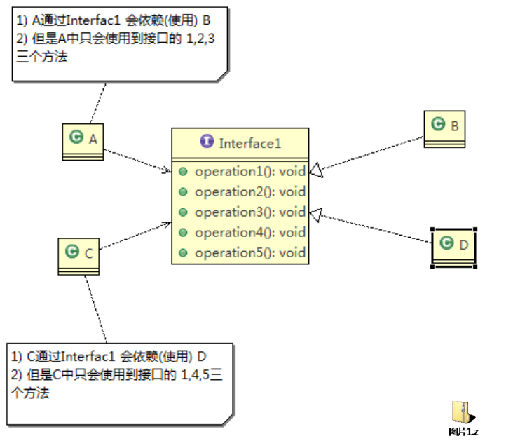
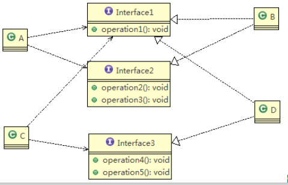
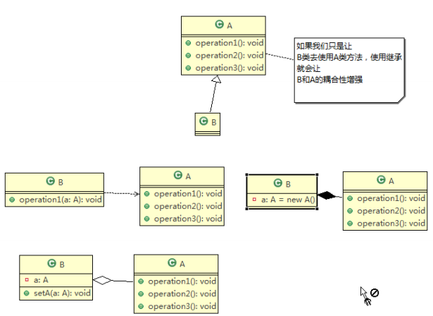
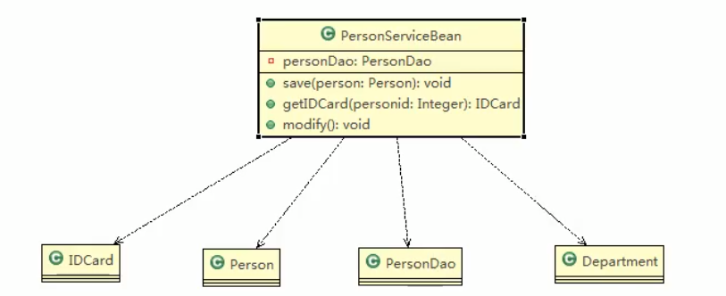
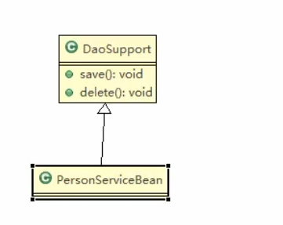
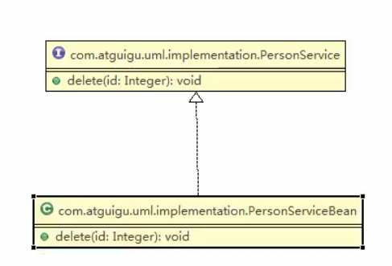
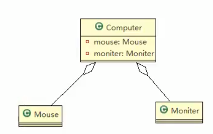
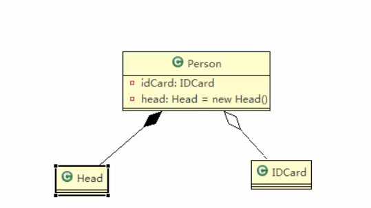

## 设计模式

面向对象（Object Oriented)） ->功能模块[设计模式+算法（数据结构] ->框架(使用多种设计模式) ->架构[服务器集群]

代码重用性、可扩展性，可读性、可靠性、高内聚低耦合

<!--more-->

## 七大原则

### 单一职责

一个类只负责一项职责，如A类负责两个不同职责，职责1需要改变A时，可能造成职责2错误，需要把A分为A1,A2 。 如UserDao应该仅仅操作user一张表。

### 接口隔离原则

客户端不应该依赖它不需要的接口，即一个类对另一个类的依赖应该建立在最小的接口上



​		将接口Interface1拆分为独立的几个接口，类A和类C分别与他们需要的接口建立依赖关系。也就是采用接口隔离原则



### 依赖倒转原则

1) 高层模块不应该依赖低层模块，二者都应该依赖其抽象

2) **抽象不应该依赖细节，细节应该依赖抽象**

3) 依赖倒转(倒置)的中心思想是面向**接口编程**

4) 依赖倒转原则是基于这样的设计理念：相对于细节的多变性，抽象的东西要稳定的多。以抽象为基础搭建的架构比以细节为基础的架构要稳定的多。在java中，抽象指的是接口或抽象类，细节就是具体的实现类

**依赖关系传递的三种方式** 接口传递、 构造方法传递、setter方式传递

```java
package principle.inversion.improve;
//方式1： 通过接口传递实现依赖
public class DependecyInversion {
   public static void main(String[] args) {
      //客户端无需改变
      Person person = new Person();
      person.receive(new Email());
      person.receive(new WeiXin());
   }
}

//定义接口
interface IReceiver {
   public String getInfo();
}

class Email implements IReceiver {
   public String getInfo() {
      return "电子邮件信息: hello,world";
   }
}

//增加微信
class WeiXin implements IReceiver {
   public String getInfo() {
      return "微信信息: hello,ok";
   }
}
class Person {
   //这里我们是对接口的依赖
   public void receive(IReceiver receiver) {
      System.out.println(receiver.getInfo());
   }
}

//方式2: 通过构造方法依赖传递
interface IOpenAndClose {
    public void open(); //抽象方法
}
interface ITV { //ITV接口
    public void play();
}
class OpenAndClose implements IOpenAndClose{
    public ITV tv; //成员
    public OpenAndClose(ITV tv){ //构造器
		this.tv = tv;
	}
	public void open(){
    	this.tv.play();
    }
}
// 方式3 , 通过setter方法传递
interface IOpenAndClose {
	public void open(); // 抽象方法
	public void setTv(ITV tv);
}

interface ITV { // ITV接口
	public void play();
}

class OpenAndClose implements IOpenAndClose {
	private ITV tv;

	public void setTv(ITV tv) {
		this.tv = tv;
	}

	public void open() {
		this.tv.play();
	}
}
```

变量的声明类型尽量是抽象类或接口, 这样我们的变量引用和实际对象间，就存在一个缓冲层，利于程序扩展和优化

继承时遵循里氏替换原则

### 里氏替换原则

继承包含这样一层含义：父类中凡是已经实现好的方法，实际上是在设定规范和契约，虽然它不强制要求所有的子类必须遵循这些契约，但是如果子类对这些已经实现的方法任意修改，就会对整个继承体系造成破坏。

继承在给程序设计带来便利的同时，也带来了弊端。比如使用继承会给程序带来侵入性，程序的可移植性降低，**增加对象间的耦合性**，如果一个类被其他的类所继承，则当这个类需要修改时，必须考虑到所有的子类，并且父类修改后，所有涉及到子类的功能都有可能产生故障

- 所有引用基类的地方必须能透明地使用其子类的对象。
- 在子类中**尽量**不要重写父类的方法
- 继承实际上让两个类耦合性增强了，**在适当的情况下，可以通过聚合，组合，依赖 来解决问题。**

```java
//创建一个更加基础的基类
class Base {
    //把更加基础的方法和成员写到Base类
}

// A类
class A extends Base {
    // 返回两个数的差
    public int func1(int num1, int num2) {
        return num1 - num2;
    }
}

// B类继承了A
// 增加了一个新功能：完成两个数相加,然后和9求和
class B extends Base {
    //如果B需要使用A类的方法,使用组合关系
    private A a = new A();
    //这里，重写了A类的方法, 可能是无意识
    public int func1(int a, int b) {
        return a + b;
    }
    public int func2(int a, int b) {
        return func1(a, b) + 9;
    }
    //我们仍然想使用A的方法
    public int func3(int a, int b) {
        return this.a.func1(a, b);
    }
}
```

### 开闭原则

- 一个软件实体如类，模块和函数应该对扩展开放(对提供方)，对修改关闭(对使用方)。用抽象构建框架，用实现扩展细节。
- 当软件需要变化时，尽量**通过扩展**软件实体的行为来实现变化，而**不是通过修改**已有的代码来实现变化。

```java
public class Ocp {
    public static void main(String[] args) {
        GraphicEditor graphicEditor = new GraphicEditor();
        graphicEditor.drawShape(new Rectangle());
        graphicEditor.drawShape(new Circle());
    }

}

//这是一个用于绘图的类 [使用方]
class GraphicEditor {
    //接收Shape对象，调用draw方法
    public void drawShape(Shape s) {
        //使用方的代码就不需要修
        s.draw();
    }
}

//Shape类，基类
abstract class Shape {
    int m_type;
    public abstract void draw();//抽象方法
}

class Rectangle extends Shape {
    Rectangle() {
        super.m_type = 1;
    }

    @Override
    public void draw() {
        System.out.println(" 绘制矩形 ");
    }
}

class Circle extends Shape {
    Circle() {
        super.m_type = 2;
    }
    @Override
    public void draw() {

        System.out.println(" 绘制圆形 ");
    }
}
```

### 迪米特法则

即一个类对自己依赖的类知道的越少越好。也就是说，对于被依赖的类不管多么复杂，都尽量将逻辑封装在类的内部。对外除了提供的public 方法，不对外泄露任何信息

只与直接的朋友通信

直接朋友：每个对象都会与其他对象有耦合关系，只要两个对象之间有耦合关系，我们就说这两个对象之间是朋友关系。耦合的方式很多，依赖，关联，组合，聚合等。其中，我们称**出现成员变量，方法参数，方法返回值中的类为直接的朋友**，而出现在局部变量中的类不是直接的朋友。也就是说，陌生的类最好不要以局部变量的形式出现在类的内部

- 迪米特法则的核心是**降低类之间的耦合**
- 但是注意：由于每个类都减少了不必要的依赖，因此迪米特法则只是要求降低类间(对象间)耦合关系， 并不是要求完全没有依赖关系

### 合成复用原则

尽量使用合成/聚合的方式，而不是使用继承



### 设计原则核心思想

- 找出应用中可能需要变化之处，把它们独立出来，不要和那些不需要变化的代码混在一起。
-  针对接口编程，而不是针对实现编程。
-  为了交互对象之间的松耦合设计而努力

## UML类图

UML——Unified modeling language UML (**统一建模语言**)

是一套符号的规定，就像数学符号和化学符号一样，这些符号用于描述软件模型中的各个元素和他们之间的关系

Rational  Rose来画类图

图分类：
1) 用例图(use case)
2) 静态结构图：类图、对象图、包图、组件图、部署图
3) 动态行为图：交互图（时序图与协作图）、状态图、活动图

类之间的关系：**依赖、泛化（继承）、实现、关联、聚合与组合**

#### **依赖关系**

只要是在**类中用到了对方**，那么他们之间就存在依赖关系。如果没有对方，连编绎都通过不了



#### 泛化关系

泛化关系实际上就是继承关系,他是**依赖关系的特例**



#### 实现关系

实现关系实际上就是A类实现B接口，他是**依赖关系的特例**



#### 关联关系

关联关系实际上就是**类与类之间的联系，他是依赖关系的特例**

关联具有导航性：即双向关系或单向关系

关系具有多重性：如“1”（表示有且仅有一个），“0...”（表示0个或者多个），“0，1”（表示0个或者一个），“n...m”(表示n到 m个都可以),“m...*”（表示至少m个）。

#### 聚合关系

表示的是**整体和部分**的关系，整体与部分可以分开。聚合关系是关联关系的特例，所以他具有关联的导航性与多重性。

如：一台电脑由键盘(keyboard)、显示器(monitor)，鼠标等组成；组成电脑的各个配件是可以从电脑上分离出来的，使用带空心菱形的实线来表示：



#### 组合关系

组合关系：也是整体与部分的关系，但是整体与部分不可以分开。 

再看一个案例：在程序中我们定义实体：Person与IDCard、Head, 那么 Head 和Person 就是 组合，IDCard 和 Person 就是聚合。

但是如果在程序中Person实体中定义了对IDCard进行**级联删除**，即删除Person时连同IDCard一起删除，那么IDCard 和 Person 就是组合了



## 设计模式类型

**1)** **创建型模式**：**单例模式**、抽象工厂模式、原型模式、建造者模式、**工厂模式**。

**2)** **结构型模式**：适配器模式、桥接模式、**装饰模式**、组合模式、外观模式、享元模式、**代理模式**。

**3)** **行为型模式**：模版方法模式、命令模式、访问者模式、迭代器模式、**观察者模式**、中介者模式、备忘录模式、解释器模式（Interpreter模式）、状态模式、策略模式、职责链模式(责任链模式)。