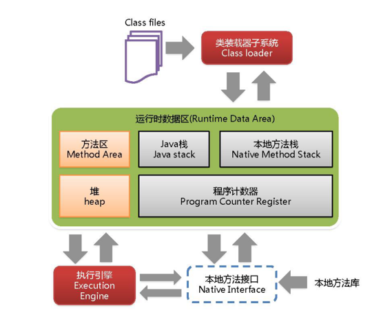
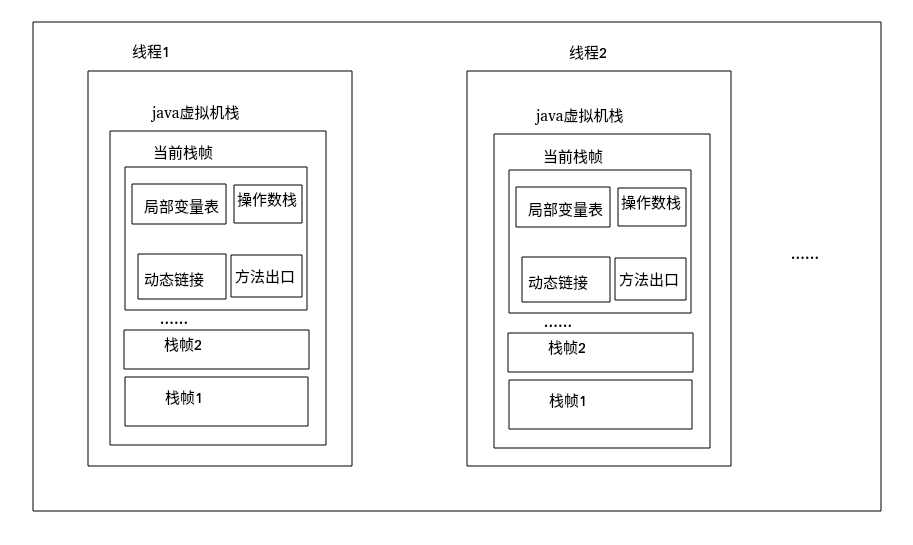
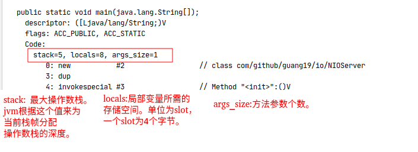
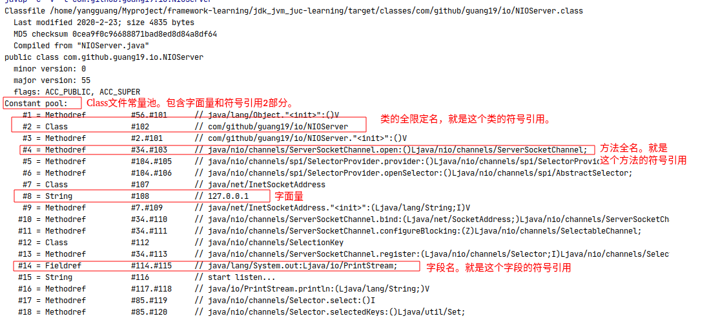
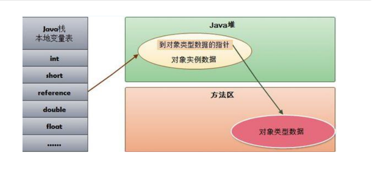
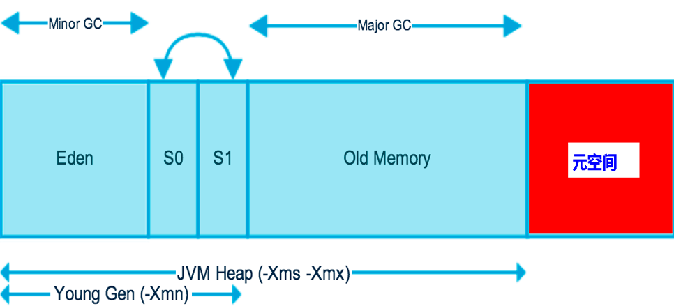
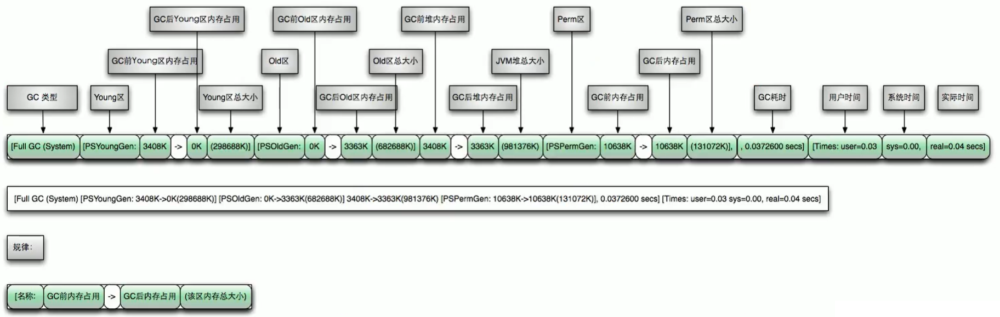
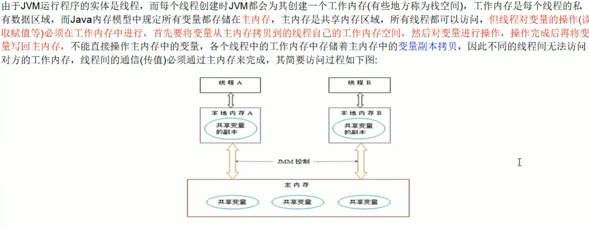

<!--more-->

灰色：线程私有

亮色：所有线程共享，存在垃圾回收

## 1.类加载器

.class结果类加载器 变成Class

jdk自己的类 是bootstrap 加载器  mull

自己编写的类走的是$AppClassLoader 加载器

sun.misc.Launcher   jvm调用的入口程序

#### 虚拟机自带的加载器

启动类 bootstrap

扩展类 extension

应用程序类 appclassloader

#### 用户自定义加载器

java.lang.ClassLoader的子类，用户自己实现

#### 双亲委派机制

一个类收到了类加载请求，他首先不会尝试自己去加载这个类，而是把这个请求委派给父类去完成，每一个层次类加载器都是如此，因此所有的加载请求都应该传送到启动类加载其中，只有当父类加载器反馈自己无法完成这个请求的时候（在它的加载路径下没有找到所需加载的Class），子类加载器才会尝试自己去加载。 

#### 沙箱安全

自定义string类，但是在加载自定义String类的时候会率先使用引导类加载器加载，而引导类加载器在加载的过程中会先加载jdk自带的文件（rt.jar包中java\lang\String.class），报错信息说没有main方法，就是因为加载的是rt.jar包中的string类。这样可以保证对java核心源代码的保护，这就是沙箱安全机制。

#### 判断两个类相同

在JVM中表示两个class对象是否为同一个类存在两个必要条件：

类的完整类名必须一致，包括包名。
加载这个类的ClassLoader（指ClassLoader实例对象）必须相同。
换句话说，在JvM中，即使这两个类对象（class对象）来源同一个Class文件，被同一个虚拟机所加载，但只要加载它们的ClassLoader实例对象不同，那么这两个类对象也是不相等的。

JVM必须知道一个类型是由启动加载器加载的还是由用户类加载器加载的。如果一个类型是由用户类加载器加载的，那么JVM会将这个类加载器的一个引用作为类型信息的一部分保存在方法区中。当解析一个类型到另一个类型的引用的时候，JVM需要保证这两个类型的类加载器是相同的。


## 2.本地方法接口/栈

本地接口的作用是融合不同的编程语言为 Java 所用，它的初衷是融合 C/C++程序

本地方法栈：它的具体做法是Native Method Stack中登记native方法，在Execution Engine 执行时加载本地方法库。

native是一个关键字，只有声明，没有实现

## 3.PC寄存器

记录了方法之间的调用和执行情况，用来存储指向下一条指令的地址

## 4.方法区

4.1各线程共享的运行时内存区域。它存储了每一个类的结构信息，例如运行时常量池（Runtime Constant Pool）、字段和方法数据、构造函数和普通方法的字节码内容。

4.2上面讲的是规范，在不同虚拟机里头实现是不一样的，最典型的就是jdk7**永久代**(PermGen space)和jdk8**元空间**(Metaspace)。

元空间使用的是本地内存，所以元空间仅受本地物理内存的限制。
元空间存储着已被加载的类的方法描述，字段描述，运行时常量池等信息。

**字符串常量池在jdk7已经从永久代转移到了堆内存之中。**

**无论是永久代还是元空间，都有可能发生OOM。**

## 5.stack

#### 5.1栈管运行，堆管存储 

栈（FILO）队列（FIFO）

e.printStateTrace()

是在线程创建时创建，它的生命期是跟随线程的生命期，线程结束栈内存也就释放，对于栈来说**不存在垃圾回收问题**，只要线程一结束该栈就Over，生命周期和线程一致，是线程私有的。

#### 5.2栈有哪些东西



8种基本类型的变量+对象的引用变量+实例方法都是在函数的栈内存中分配。

本地变量（Local Variables）:输入参数和输出参数以及方法内的变量；

栈操作（Operand Stack）:记录出栈、入栈的操作；

栈帧数据（Frame Data）:包括类文件、方法等等。

##### 5.2.1栈帧

**栈帧是用于支持Java方法运行时的数据结构。**
**栈帧包含了局部变量表，操作数栈，动态连接，方法出口等信息。**
**每个方法执行时，都会在java虚拟机栈中创建一个栈帧。**
**对方法的调用和返回，就对应着栈帧的入栈和出栈的过程。**

##### 5.2.2局部变量表

**局部变量表用于存储方法参数和方法内定义的局部变量。
局部变量表存放了各种已知的数据类型的变量。**
一个局部变量的类型可以是基本数据类型
(int,short,float,double,boolean,long,byte,char)或引用类型(reference)。
在Java代码被编译成class字节码后，方法Code属性的locals就确定了方法的局部变量表的大小。
局部变量表以slot为最小单位，一个slot代表4个字节，也就是32位长度的大小。

##### 5.2.3操作数栈

操作数栈是一个后进先出(LIFO)的数据结构。
**它存储的是方法在进行数据运算时的元素。**
和局部变量表一样，操作数栈的每个元素的类型也可以是基本数据类型和引用类型。
操作数栈的深度不会超过 Code属性的stack值。

使用javap -c 反编译class文件后可以得到的字节码指令如下:



##### 5.2.4动态连接

````text
了解动态连接首先需要了解符号引用和直接引用
````

- 符号引用: 符号引用存于Class文件常量池。分为类的全限定名，方法名和描述符，字段名和描述符。

- 直接引用: 指向目标的指针，可以简单理解为目标的内存地址(如指向类的字段的内存地址)。

Class文件常量池如下(javap -c 反编译class文件后的字节码):



**在虚拟机栈中，每个栈帧都包含了一个该栈帧所属方法的符号引用，
持有这个符号引用的目的是为了支持方法调用过程中的动态连接。
这些符号引用有的一部分会在JVM类解析阶段就会转为直接引用，这部分转换成为静态解析。
还有一部分会在运行时转为直接引用，这部分称为动态连接。**

##### 5.2.5方法出口

当方法执行时，有2种方式可以退出该方法。

1. 正常退出: 当方法执行时，执行到return指令，该方法就会正常退出。
   一般来说，方法正常退出时，调用线程的程序计数器的值可以作为方法返回的地址，
   栈帧中可能会保存这个计数器的值。

2. 异常退出: 在方法执行过程中遇到了异常，并且方法内部没有处理这个异常，就会导致方法退出。
   方法异常退出时，返回地址需要通过异常处理器表来确定的，栈帧中不会保存这部分值。

**无论何种退出方式，在方法退出后，都需要回到方法被调用的位置，程序才能继续执行。**

StackOverFlowError 是错误

#### 5.3 堆+栈+方法区的交互关系

栈+堆+方法区关系



HotSpot是使用指针的方式来访问对象：
Java堆中会存放访问类元数据的地址，
reference存储的就直接是对象的地址

## 6.堆Heap


#### 6.1Young Generation Space  新生区                    Young/New

##### 6.1.1伊甸园

##### 6.1.2幸存者0区 from

##### 6.1.3幸存者1区 to

GC之后交互交换

#### 6.2Tenure generation space  养老区                     Old/ Tenure


当伊甸园的空间用完时，程序又需要创建对象，JVM的垃圾回收器将对伊甸园区进行垃圾回收**(Minor GC**)，将伊甸园区中的不再被其他对象所引用的对象进行销毁。然后将伊甸园中的剩余对象移动到幸存 0区。若幸存 0区也满了，再对该区进行垃圾回收，然后移动到 1 区。那如果1 区也满了呢？再移动到养老区。若养老区也满了，那么这个时候将产生MajorGC（**FullGC**），进行养老区的内存清理。若养老区执行了Full GC之后发现依然无法进行对象的保存，就会产生OOM异常“OutOfMemoryError”。
**如果出现java.lang.OutOfMemoryError: Java heap space异常，说明Java虚拟机的堆内存不够。原因有二：**
**（1）Java虚拟机的堆内存设置不够，可以通过参数-Xms、-Xmx来调整。**
**（2）代码中创建了大量大对象，并且长时间不能被垃圾收集器收集（存在被引用）。**

Minor GC 复制  -> 清空 -> 互换（from区和to区每次GC之后会交换，谁空谁是to区）

1.Eden、from复制到to区 年龄+1

Eden慢第一次GC 把活着的对象拷贝到 from区，第二次GC时把Eden和from一起GC ,存活的对象到to区，并把年龄+1    

2.清空Eden、from

清空Eden和from的对象，就是复制之后交换，谁空谁是to

3.to和from交换

to和from交换，to成为下一次GC的from区，部分对象会在from和to直接复制，到15次后如果还是存活，就存入到老年代

#### 6.3Permanent Space              永久区                         Perm  但永久代已被元空间代替,在方法区

## 7 jvm调优



元空间与永久代之间最大的区别在于：
永久带使用的JVM的堆内存，但是java8以后的元空间并不在虚拟机中而是使用本机物理内存。

| 默认物理内存        | 功能                    |
| ------------------- | ----------------------- |
| -Xms                | 默认物理内存1/64 初始值 |
| -Xmx                | 默认物理内存1/4  最大值 |
| -XX:+PrintGCDetails | 输出GC日志              |

-Xms 1/64 默认物理内存

-Xmx 1/4

生产中把两个值设置成一样，防止内存忽高忽低，不稳定

-Xms1024m -Xmx1024m -XX:+PrintGCDetails

## 8 GC




JVM进行GC时，大部分回收新生代
普通GC (minor GC)：只针对新时代 非常频繁，一般回收速度较快

全局GC(magor GC or Full Gc)：MajorGC 老年代的垃圾收集，至少伴随一次MinorGC，速度上慢10倍

元空间不GC

system.gc()；通知gc进程 ，但不一定执行。

## 9 JMM

volatile 保证可见性，不**保证原子性**

java memory model java内存模型



JMM内存模型

1.可见性

2.原子性

3.有序性

